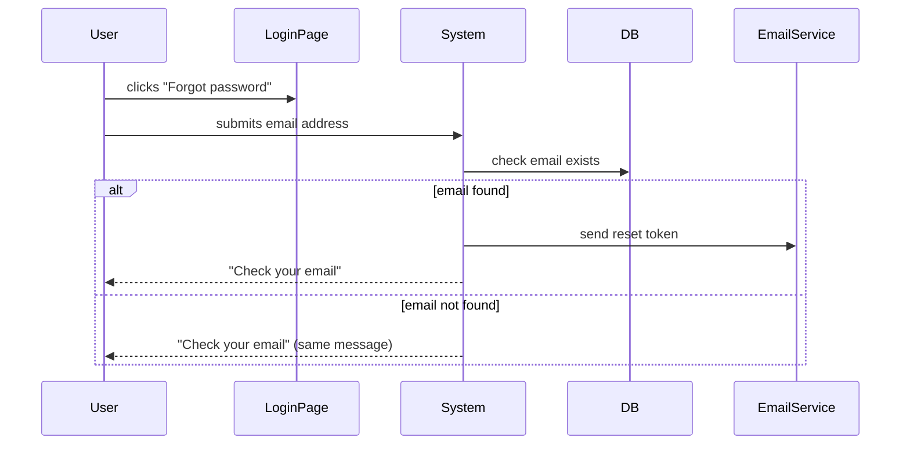

# Document Types

Taproot uses three layers, each represented by a markdown file. Every layer answers a different question:

| Layer | File | Question |
|-------|------|----------|
| Intent | `intent.md` | *Why* does this feature exist, and for whom? |
| Behaviour | `usecase.md` | *What* does the system do — observable, testable actions? |
| Implementation | `impl.md` | *How* is this built — code, tests, design decisions? |

This separation matters because the layers evolve at different rates. Business goals (intents) are stable. Specific use cases (behaviours) change when users give feedback. Implementations change every sprint. Keeping them separate means a code refactor doesn't invalidate a behaviour spec, and a scope change doesn't orphan an implementation.

---

## Intent (`intent.md`)

An intent captures a business goal — the *why* behind a feature. It is written from a business perspective, not a technical one. The question it answers is: "Why are we building this at all, and how will we know it's done?"

An intent contains:

- **Goal** — one or two sentences on what outcome the feature delivers for the business or user
- **Stakeholders** — who cares about this and why; their priorities often conflict, and naming them makes trade-offs explicit
- **Success Criteria** — concrete, checkable statements; these become the acceptance criteria for the entire feature tree below this intent
- **Constraints** — scope boundaries: things this feature must not do, or must be compatible with. Constraints are not the same as NFR criteria — they define the intent's boundaries, not quality thresholds on specific behaviours (e.g. "must not reveal whether an email is registered" is a constraint; "all endpoints must respond within 500ms" is a cross-cutting NFR and belongs in `quality-gates/`)
- **Behaviours** — auto-maintained list of child behaviour specs (managed by `taproot update`)
- **Status** — lifecycle state: `draft` → `active` → `achieved` → `deprecated`

```markdown
# Intent: Password Reset Without Support Contact

## Goal
Enable users to reset their password without contacting support,
while preventing unauthorized account access.

## Stakeholders
- Product: Jane — reduce support ticket volume by 30%
- Security: team — prevent account takeover via reset flow

## Success Criteria
- [ ] Users can request a reset link via email
- [ ] Reset links expire after 15 minutes
- [ ] Failed attempts are rate-limited to prevent brute force

## Constraints
- Must not reveal whether an email address is registered (prevent enumeration)

## Behaviours <!-- taproot-managed -->
- [Request Password Reset](./request-reset/usecase.md)
- [Validate Reset Token](./validate-token/usecase.md)

## Status
- **State:** active
- **Created:** 2024-01-15
```

---

## Behaviour (`usecase.md`)

A behaviour is one observable thing the system does — from the perspective of an actor trying to accomplish something. It is written in UseCase format: preconditions, main flow, alternate flows, postconditions.

A behaviour spec is the contract between the intent (business goals) and the implementation (code). If you write the spec well, you can implement it without asking the product owner any more questions. If you write the code first and add a spec later, it reveals whether the code actually does what was intended.

A behaviour contains:

- **Actor** — who or what triggers this behaviour (a user, a scheduled job, another service)
- **Preconditions** — what must be true before this can happen
- **Main Flow** — the steps in the happy path, written as active-voice actions (subject + verb + object)
- **Alternate Flows** — named variations: what if the user cancels? what if a network call fails?
- **Postconditions** — what is true after successful completion (these should map to success criteria in the parent intent)
- **Error Conditions** — unrecoverable failures with specific triggers and specific system responses
- **Flow** — a Mermaid diagram of the main flow; the human-readable visual contract
- **Related** — other behaviours that share an actor, have precondition overlap, or must precede/follow this one
- **Implementations** — auto-maintained list of child impl records (managed by `taproot update`)
- **Status** — lifecycle state: `proposed` → `specified` → `implemented` → `tested` → `deprecated` (or `deferred` to park without deleting)

```markdown
# Behaviour: Request Password Reset

## Actor
Registered user who has forgotten their password

## Preconditions
- User account exists and is not locked
- User is not currently logged in

## Main Flow
1. User navigates to the login page and clicks "Forgot password"
2. User enters their email address and submits
3. System validates the email address format
4. System checks whether the email exists in the database
5. System generates a time-limited reset token and sends an email
6. System displays a "Check your email" confirmation page

## Alternate Flows

### Email not registered
- **Trigger:** Email address not found in the database at step 4
- **Steps:**
  1. System displays the same "Check your email" confirmation (prevent enumeration)
  2. No email is sent

### Rate limit exceeded
- **Trigger:** More than 3 reset requests from the same email within an hour
- **Steps:**
  1. System returns 429 and displays a "Try again later" message

## Postconditions
- A reset token exists in the database, expiring in 15 minutes
- A reset email has been sent to the provided address (if the account existed)

## Error Conditions
- **Email service unavailable:** System shows an inline error, does not expose service details, preserves the form so the user can retry

## Flow


## Related
- `./validate-token/usecase.md` — must follow this flow; consumes the token generated here

## Acceptance Criteria

**AC-1: Reset email sent**
- Given the user has a registered account and is not logged in
- When they submit their email address on the forgot-password form
- Then the system sends a reset email and displays "Check your email"

**AC-2: Unregistered email — same confirmation shown**
- Given the email address is not registered
- When the user submits it on the forgot-password form
- Then the system displays "Check your email" without sending an email

**AC-3: Rate limit exceeded**
- Given the user has already requested 3 resets in the last hour
- When they submit the form again
- Then the system returns a 429 response and displays "Try again later"

**NFR-1: Reset email delivery time**
- Given normal mail service conditions
- When the system sends a password reset email
- Then the email is delivered within 60 seconds (p95)
```

NFR criteria (`**NFR-N:**`) express *how well* the system must perform a behaviour — quality constraints with measurable thresholds. They live in the same `## Acceptance Criteria` section, after the functional ACs. The `NFR-` prefix is distinct from `AC-` so IDs never collide.

A measurable threshold is one of:
- A number with a unit (`200ms`, `60%`, `500 concurrent users`)
- A named standard (`WCAG 2.1 AA`, `PCI DSS 4.0`)
- A testable boolean condition (`account is locked`, `notification email is sent`)

ISO 25010 provides a useful taxonomy for NFR categories: **performance efficiency**, **reliability**, **security**, **maintainability**, **portability**, **compatibility**, **interaction capability**. Teams are not required to use these names — any consistent label works.

```markdown
## Implementations <!-- taproot-managed -->
- [Email Trigger](./email-trigger/impl.md)

## Status
- **State:** implemented
- **Created:** 2024-01-20
- **Last reviewed:** 2024-03-01
```

---

## Implementation (`impl.md`)

An implementation record is the traceability bridge between a behaviour spec and actual code. It is not a technical spec — that belongs in code comments or ADRs. Instead it answers: "Where in the codebase does this behaviour live, what decisions were made, and is it still current?"

An implementation contains:

- **Behaviour** — relative path to the parent `usecase.md`
- **Design Decisions** — choices made during implementation that aren't obvious from the code; the *why* behind architectural choices
- **Source Files** — the files that constitute this implementation; used by `sync-check` to detect staleness
- **Commits** — linked by `taproot link-commits` automatically from conventional commit messages
- **Tests** — test files that verify this behaviour; used by DoD checks
- **DoD Resolutions** — recorded outcomes of Definition of Done checks
- **Status** — lifecycle state: `planned` → `in-progress` → `complete` → `needs-rework`

```markdown
# Implementation: Email Trigger

## Behaviour
../usecase.md

## Design Decisions
- Generic error message regardless of email existence (prevent enumeration attacks)
- Rate limit: 3 requests per email per hour, enforced via Redis with TTL
- Token stored as a bcrypt hash — raw token only in the email, never logged

## Source Files
- `src/auth/password-reset.ts`
- `src/auth/password-reset-email.ts`
- `src/auth/reset-token.ts`

## Commits
- `a1b2c3d` — Add password reset request endpoint
- `f4e5d6c` — Add rate limiting to reset requests

## Tests
- `test/auth/password-reset.test.ts`
- `test/auth/reset-token.test.ts`

## Status
- **State:** complete
- **Created:** 2024-02-01
- **Last verified:** 2024-03-01
```

---

## Nesting

Behaviours can contain sub-behaviours. Use sub-behaviours when a single UseCase has distinct phases with different actors, different preconditions, or enough complexity to warrant separate testing. Sub-behaviours are still leaves relative to their parent behaviour but can have their own implementations.

Implementations are always leaves — they never contain child folders.

```
taproot/
└── password-reset/
    ├── intent.md
    ├── request-reset/
    │   ├── usecase.md
    │   └── email-trigger/
    │       └── impl.md
    └── validate-token/
        ├── usecase.md
        ├── token-validation/
        │   └── impl.md
        └── rate-limit-check/      ← sub-behaviour
            ├── usecase.md
            └── redis-check/
                └── impl.md
```

## Document States

Each document has a `State` field that tracks its lifecycle. States are validated by `taproot validate-format` and enforced by the pre-commit hook.

| State | Intent | Behaviour | Implementation |
|-------|--------|-----------|----------------|
| `draft` | Being written, not ready for dev | — | — |
| `active` | Feature in progress | — | — |
| `proposed` | — | Idea, not yet specified | — |
| `specified` | — | Fully specced, ready to implement | — |
| `implemented` | — | Code exists | — |
| `tested` | — | Tests passing and reviewed | — |
| `planned` | — | — | Scoped, not started |
| `in-progress` | — | — | Being implemented |
| `complete` | — | — | Done; DoD passed |
| `needs-rework` | — | — | Implementation failed DoD |
| `achieved` | All behaviours complete | — | — |
| `deprecated` | No longer relevant | No longer relevant | — |
| `deferred` | — | Not pursuing for now | Not pursuing for now |

The pre-commit hook uses state transitions to enforce workflow gates: you cannot declare an implementation without the parent behaviour being in `specified` state, and you cannot mark an implementation complete without passing Definition of Done checks.

**Deferred items** are consciously parked — `deferred` is not a synonym for `proposed` (not started) or `needs-rework` (broken). It means "we explored or attempted this and decided to stop for now." Deferred behaviours are excluded from `taproot plan` candidates, and deferred implementations are excluded from `check-orphans` errors (missing source files, missing test files). Both are reported in a separate Parked section by `tr-status`. Use `deprecated` (not `deferred`) on intents.
