# Taproot

<p align="center">
  
</p>

**AI-driven specs, enforced at commit time. Code without traceability doesn't merge.**

AI coding agents generate code fast — but six months later, nobody knows *why* a module exists, who asked for it, or whether it's still needed. The requirement lived in a chat window. The chat window is gone.

Taproot keeps requirements as first-class files in your repo. The agent writes the spec, writes the code, and git refuses to accept one without the other.

## Quick Start

```bash
npx @imix-js/taproot init        # installs agent adapter + pre-commit hook
```

Then in your agent:

```
/tr-ineed user authentication    # describe a requirement → spec written + placed
/tr-implement taproot/auth/      # implement it: code + tests + traceability, committed
```

That's the loop. Spec first, code second, git enforces both.

**Planning a batch of work:**

```
/tr-plan                         # build a prioritised plan from backlog + unimplemented specs
/tr-plan-execute                 # run through it — autonomous items execute; HITL items pause for you
```

Describe ten requirements, review the plan, walk away. When you return, everything autonomous is done and the human decisions are waiting.

---

```
/tr-guide     ← onboarding walkthrough
/tr-status    ← health dashboard: coverage, orphans, stale specs
/tr-discover  ← reverse-engineer an existing codebase into taproot
```

Full workflow guide: [docs/workflows.md](docs/workflows.md)

## How enforcement works

`taproot init` installs a pre-commit hook. It runs automatically on every `git commit` — no commands to invoke:

| Commit type | Gate | What it checks |
|---|---|---|
| Declaring a new impl (`impl.md` only) | **DoR** — Definition of Ready | Behaviour spec is `specified`; required sections present; custom conditions in `settings.yaml` |
| Committing source code | **DoD** — Definition of Done | Tests pass; all configured conditions resolved and recorded |
| Committing specs (`intent.md`, `usecase.md`) | **Truth check** | Staged specs are consistent with `taproot/global-truths/` |

Code that fails these checks doesn't reach the repo.

## Concepts

> Already know what Intent, Behaviour, and Implementation mean? [Jump to Why it matters ↓](#why-it-matters)

**Intent** — the business goal behind a feature, written from a user perspective.
Example: `password-reset` — *Allow users to recover access to their account*

**Behaviour** — one observable, testable thing the system does for a specific actor.
Example: `request-reset` — *User submits their email; system sends a reset link*

**Implementation** — the code that satisfies a behaviour, with a traceable link back to the spec.
Example: `email-trigger/impl.md` lists the source files and the commit that built them

**Global truth** — a project-wide fact enforced at every commit (business rule, entity definition, project convention), stored in `taproot/global-truths/`.
Example: *prices are always exclusive of VAT* — a spec that contradicts this is blocked before it merges

**Backlog** — a lightweight scratchpad for ideas and deferred work captured mid-session, stored in `taproot/agent/backlog.md` — separate from the requirement hierarchy.
Example: `/tr-backlog "consider a caching layer"` captures the thought without interrupting flow

<details>
<summary>Further reading</summary>

- **Intent, Behaviour, Implementation** — [docs/concepts.md](docs/concepts.md)
- **Global truths** — [`taproot/global-truths/`](taproot/global-truths/)
- **Backlog, DoR, DoD, sync-check** — [docs/workflows.md](docs/workflows.md)

</details>

## Why it matters

- **Ask "why does this code exist?"** and get a structured answer — intent, actor, acceptance criteria — not a two-year-old git blame
- **AI agents generate better code** because they have the business goal alongside the technical context
- **Requirements always show current state** — when a spec changes, it's refined in place. No amendment chains, no "change request #4 layered on top of #3 layered on top of #2". The document is always the truth as it stands today.
- **Changes are safer** — trace any file back to its behaviour spec and understand what breaks if you touch it
- **Nothing drifts silently** — `taproot sync-check` flags source files modified after their spec was last reviewed
- **Vague specs are caught at commit time** — DoD/DoR gates block incomplete implementations before they merge

**How requirements are stored:**

```
taproot/
├── password-reset/        ← Intent: why this exists and for whom
│   ├── intent.md
│   └── request-reset/     ← Behaviour: what the system does
│       ├── usecase.md
│       └── email-trigger/ ← Implementation: how it's built
│           └── impl.md
```

Plain Markdown files, no database, git-versioned with your code. Any agent that can read files can use taproot.

## Taproot tracks itself

Taproot's own requirements are managed with Taproot. [`taproot/OVERVIEW.md`](taproot/OVERVIEW.md) shows 18 intents, 53 behaviours, and 53 implementations — all complete — covering everything from validation rules to agent skill architecture to this README.

It's a working example of what a mature hierarchy looks like in practice.

## Docs

- [Workflows](docs/workflows.md) — common patterns: new feature, bug fix, onboarding, discovery
- [Document types & examples](docs/concepts.md)
- [CLI reference](docs/cli.md)
- [Agent setup & tiers](docs/agents.md)
- [Configuration & CI](docs/configuration.md)
- [Patterns](docs/patterns.md)

## License

MIT
