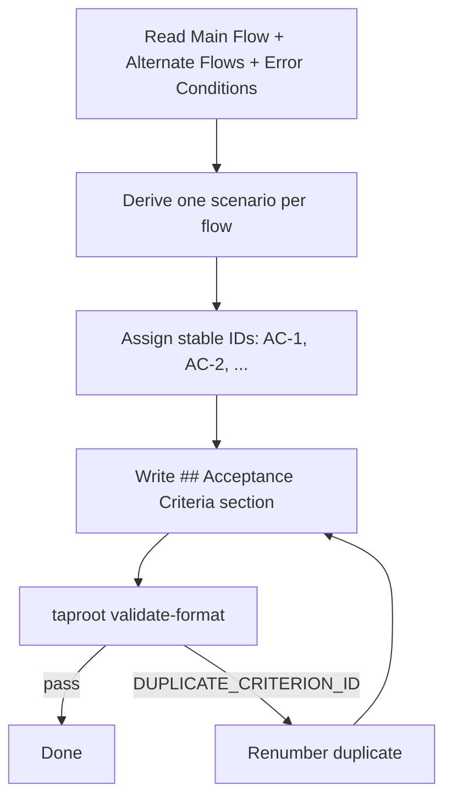

# Behaviour: Specify Acceptance Criteria in Behaviour Specs

## Actor
Developer or agent authoring a `usecase.md` — either via `/tr-behaviour` or by editing directly

## Preconditions
- A `usecase.md` exists with at least a `## Main Flow` section
- The author wants to make the spec verifiable without opening test files

## Main Flow
1. Author (or `/tr-behaviour`) reads the `## Main Flow`, `## Alternate Flows`, and `## Error Conditions` sections of `usecase.md`
2. Author derives one Gherkin scenario per flow: the main flow, each named alternate flow, and each error condition
3. Author assigns a stable ID to each scenario: `AC-1`, `AC-2`, … incrementing from the highest existing ID in the file (or starting at `AC-1` if none exist)
4. Author writes the `## Acceptance Criteria` section before `## Status`:

   ```markdown
   ## Acceptance Criteria

   **AC-1: Happy path — reset email sent**
   - Given the user has a registered account and is not logged in
   - When they submit their email address on the forgot-password form
   - Then the system sends a reset email and displays "Check your email"

   **AC-2: Unregistered email — same confirmation shown**
   - Given the email address is not registered
   - When the user submits it on the forgot-password form
   - Then the system displays "Check your email" without sending an email

   **AC-3: Rate limit exceeded**
   - Given the user has already requested 3 resets in the last hour
   - When they submit the form again
   - Then the system returns a 429 response and displays "Try again later"
   ```

5. Author runs `taproot validate-format` to confirm the section is present and IDs are well-formed

## Alternate Flows

### `/tr-behaviour` generates criteria automatically
- **Trigger:** Developer invokes `/tr-behaviour` to create a new `usecase.md`
- **Steps:**
  1. After writing the main flow, alternate flows, and error conditions, the skill derives one scenario per flow
  2. Skill assigns IDs starting at `AC-1`
  3. Skill writes the `## Acceptance Criteria` section as part of the document
  4. Skill notes: "I've generated N acceptance criteria — review them and adjust the Given/When/Then wording before committing"

### Adding criteria to an existing spec without them
- **Trigger:** Developer runs `/tr-refine` or edits a `usecase.md` that has no `## Acceptance Criteria` section
- **Steps:**
  1. Author reads the existing flows and derives scenarios
  2. IDs start at `AC-1` (no existing IDs to continue from)
  3. Author inserts the section before `## Status`

### Rewording an existing criterion
- **Trigger:** The scenario wording is unclear or has drifted from the implementation
- **Steps:**
  1. Author updates the `Given / When / Then` text of the criterion
  2. **The ID is never changed** — AC-3 remains AC-3 even if the scenario is completely rewritten
  3. Author does not renumber subsequent criteria

## Postconditions
- The `usecase.md` contains a `## Acceptance Criteria` section with one Gherkin scenario per flow
- Each scenario has a stable ID (`AC-N`) that will not change in future edits
- `taproot validate-format` passes on the updated file

## Error Conditions
- **Duplicate criterion IDs in the same file:** `validate-format` reports `DUPLICATE_CRITERION_ID` — author must renumber the duplicate to the next available ID
- **Non-sequential IDs (e.g. AC-1, AC-3 with no AC-2):** permitted — gaps are expected when criteria are added over time; `validate-format` does not require contiguity

## Flow


## Related
- `taproot/acceptance-criteria/verify-coverage/usecase.md` — verify-coverage consumes the criterion IDs written by this behaviour
- `taproot/requirements-hierarchy/initialise-hierarchy/usecase.md` — the usecase.md format is extended by this behaviour
- `taproot/hierarchy-integrity/validate-format/usecase.md` — validate-format is extended to check for presence and well-formedness of the section

## Status
- **State:** specified
- **Created:** 2026-03-19
- **Last reviewed:** 2026-03-19

## Notes
- IDs are immutable once assigned. If a scenario is retired, mark it `~~AC-N: deprecated~~` rather than removing or renumbering it — this prevents orphaned test references from appearing valid.
- The Gherkin syntax here is intentionally lightweight: `Given / When / Then` bullet points, not full `.feature` file syntax. The goal is readability in markdown, not framework compatibility.
- One scenario per named flow is the minimum. A complex main flow may warrant multiple scenarios (e.g. one for each significant branch within the flow itself).
