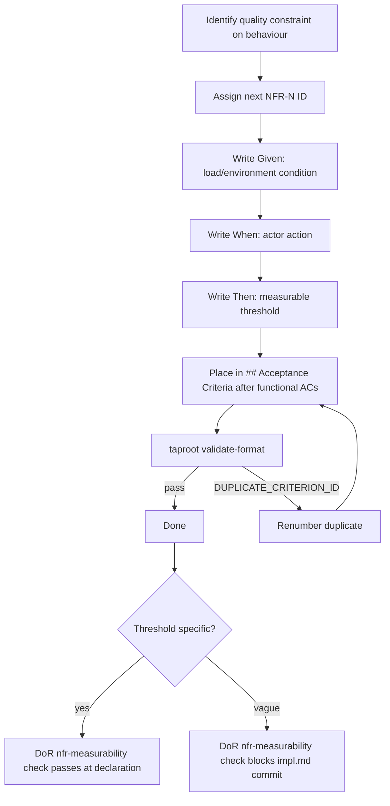

# Behaviour: Specify NFR Acceptance Criteria in Behaviour Specs

## Actor
Developer or agent authoring a `usecase.md` that has quality constraints — either via `/tr-behaviour` or by editing directly

## Preconditions
- A `usecase.md` exists with at least a `## Main Flow` section
- The behaviour has at least one non-functional quality constraint (performance, security, reliability, accessibility, or other ISO 25010 attribute)

## Scope
NFR criteria capture *how well* the system must perform a behaviour — quality constraints with measurable thresholds. They are distinct from functional ACs (`**AC-N:**`), which capture *what* the system does.

ISO 25010 provides the suggested taxonomy of quality attribute categories:
- **Performance efficiency** — response time, throughput, resource utilisation
- **Reliability** — availability, fault tolerance, recoverability
- **Security** — confidentiality, integrity, authentication, authorisation
- **Maintainability** — testability, modularity, analysability
- **Portability** — adaptability, installability
- **Compatibility** — interoperability, co-existence
- **Interaction capability** — learnability, accessibility, error prevention

Teams are not required to use ISO 25010 category names — use whatever taxonomy fits the domain.

## Main Flow
1. Author identifies a quality constraint on the behaviour: a property about *how well* the system must perform it, not *what* it does
2. Author assigns the next available `NFR-N` ID (starting at `NFR-1` if none exist; incrementing from the highest existing `NFR-N` in the file)
3. Author writes the criterion in the `## Acceptance Criteria` section using the NFR Gherkin pattern:
   - **Given** — the environmental or load condition under which the constraint applies (e.g. "500 concurrent users", "authenticated session", "mobile network")
   - **When** — the actor action that triggers measurement
   - **Then** — the measurable threshold that must be satisfied (specific number, percentage, standard reference, or testable condition)
4. Author places `**NFR-N:**` entries in the `## Acceptance Criteria` section alongside functional `**AC-N:**` entries, after the functional criteria
5. Author runs `taproot validate-format` to confirm IDs are well-formed

## Alternate Flows

### `/tr-behaviour` generates NFR criteria automatically
- **Trigger:** Developer invokes `/tr-behaviour` and identifies quality constraints during the dialogue
- **Steps:**
  1. Skill asks: "Are there quality constraints on this behaviour — performance targets, security requirements, accessibility standards?"
  2. For each constraint identified, skill derives an NFR criterion using the Given/When/Then pattern
  3. Skill assigns NFR-N IDs starting at `NFR-1`
  4. Skill appends NFR criteria after functional AC criteria in `## Acceptance Criteria`
  5. Skill notes: "I've generated N NFR criteria — confirm the thresholds are specific and measurable before committing"

### Adding NFR criteria to an existing spec
- **Trigger:** Developer runs `/tr-refine` or edits a `usecase.md` that has functional ACs but no NFR criteria
- **Steps:**
  1. Author identifies the quality constraints that apply to this behaviour
  2. IDs start at `NFR-1` (no existing NFR-N IDs to continue from)
  3. Author inserts NFR criteria after the last functional AC in the `## Acceptance Criteria` section

### Rewording an existing NFR criterion
- **Trigger:** A threshold is incorrect or wording is unclear
- **Steps:**
  1. Author updates the `Given / When / Then` text, including the threshold value
  2. **The ID is never changed** — `NFR-2` remains `NFR-2` even if threshold is revised
  3. Author does not renumber subsequent NFR criteria

## Postconditions
- The `usecase.md` contains `**NFR-N:**` entries in its `## Acceptance Criteria` section for every quality constraint on the behaviour
- Each NFR criterion has a stable `NFR-N` ID that will not change in future edits
- Each Then clause contains a specific measurable threshold, percentage, or standard reference — not a vague qualifier
- `taproot validate-format` passes on the updated file

## Error Conditions
- **Vague NFR threshold ("must be fast", "must be secure")**: the `check-if-affected-by: quality-gates/nfr-measurability` DoR gate catches this at declaration time and blocks the impl.md commit until the threshold is made specific
- **Duplicate NFR-N IDs in the same file**: `validate-format` reports `DUPLICATE_CRITERION_ID` — author renumbers the duplicate to the next available NFR-N
- **NFR-N ID collision with AC-N ID**: not possible — the `NFR-` prefix is distinct from `AC-`

## Flow

## Related
- `taproot/acceptance-criteria/specify-acceptance-criteria/usecase.md` — defines the AC-N ID format and immutability rules that NFR-N mirrors
- `taproot/acceptance-criteria/verify-coverage/usecase.md` — must be extended to scan for `NFR-\d+` patterns alongside `AC-\d+` in test files
- `taproot/quality-gates/` — `nfr-measurability` gate (to be defined) enforces measurability of NFR criteria at DoR time

## Acceptance Criteria

**AC-1: NFR criterion written for a behaviour**
- Given a `usecase.md` with a quality constraint (e.g. response time target)
- When the author writes an `**NFR-1:**` entry with Given/When/Then
- Then the Then clause contains a specific measurable threshold and `taproot validate-format` passes

**AC-2: `/tr-behaviour` prompts for NFR criteria**
- Given a developer invokes `/tr-behaviour` to create a new `usecase.md`
- When the skill finishes writing the functional flows
- Then the skill asks whether quality constraints apply and, if yes, generates `**NFR-N:**` entries with measurable thresholds

**AC-3: NFR criteria placed after functional ACs**
- Given a `usecase.md` with `**AC-1:**` through `**AC-3:**`
- When the author adds NFR criteria
- Then `**NFR-1:**` appears after `**AC-3:**` in the `## Acceptance Criteria` section

**AC-4: NFR IDs are immutable**
- Given a `usecase.md` with `**NFR-1:**` assigned
- When the author updates the threshold value
- Then the ID remains `NFR-1` and `taproot validate-format` reports no errors

**AC-5: Duplicate NFR IDs detected**
- Given a `usecase.md` where `**NFR-2:**` appears twice
- When the author runs `taproot validate-format`
- Then a `DUPLICATE_CRITERION_ID` error is reported

**NFR-1: Performance example — search under load**
- Given the system is under a standard load of 500 concurrent users
- When a user submits a search query
- Then results are returned within 200ms (p95) and CPU utilisation does not exceed 60%

## Implementations <!-- taproot-managed -->
- [validate-format + behaviour skill + docs](./cli-command/impl.md)

## Status
- **State:** specified
- **Created:** 2026-03-21
- **Last reviewed:** 2026-03-21

## Notes
- `**NFR-N:**` and `**AC-N:**` share the same `## Acceptance Criteria` section but use distinct ID prefixes. They do not share a sequence — a file can have `AC-1, AC-2, NFR-1, NFR-2` without conflict.
- The `**NFR-1:**` example at the bottom of the Acceptance Criteria section is itself an NFR criterion — it demonstrates the pattern and is a verifiable quality target for this behaviour's own test coverage.
- Measurability guidance: a threshold is specific if it contains a number + unit (200ms, 60%), a named standard (WCAG 2.1 AA, PCI DSS 4.0), or a testable boolean condition (account locked, notification sent). "Reasonable", "fast", "secure" are not specific.
- Teams that already have a quality attribute taxonomy are not required to adopt ISO 25010 naming — any consistent category label works.
