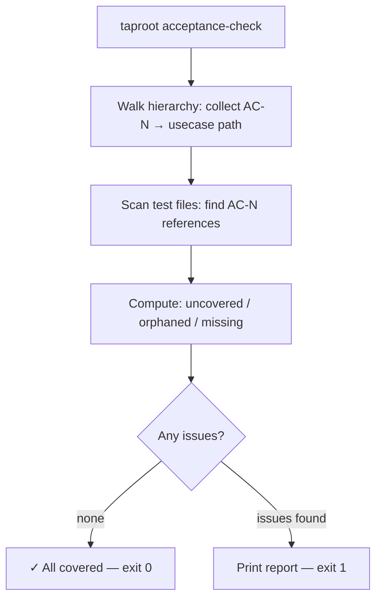

# Behaviour: Verify Acceptance Criteria Coverage

## Actor
Developer or CI pipeline running `taproot acceptance-check`

## Preconditions
- A taproot hierarchy exists with at least one `usecase.md`
- At least one test directory exists (`test/`, `tests/`, `spec/`, or configured path)

## Main Flow
1. Actor runs `taproot acceptance-check [--path taproot/] [--tests <dir>]`
2. Command walks the hierarchy and collects all criterion IDs from every `## Acceptance Criteria` section in every `usecase.md` — building a map of `ID → usecase path`
3. Command scans all test files in the configured test directories, searching each file's content for criterion ID patterns (e.g. `AC-\d+`)
4. Command computes three sets:
   - **Uncovered:** criterion IDs present in specs but not found in any test file
   - **Orphaned:** criterion IDs found in test files but not defined in any `usecase.md`
   - **Missing sections:** `usecase.md` files that have child implementation folders but no `## Acceptance Criteria` section
5. Command prints a report and exits non-zero if any uncovered or orphaned criteria exist

   ```
   taproot acceptance-check

   ✓ 12 criteria covered across 4 behaviours

   ✗ Uncovered criteria (defined in spec, missing from tests):
     AC-4  taproot/password-reset/request-reset/usecase.md
     AC-7  taproot/user-onboarding/register-account/usecase.md

   ✗ Orphaned references (in tests, not defined in any spec):
     AC-99  test/auth/password-reset.test.ts:47

   ⚠ Missing ## Acceptance Criteria sections:
     taproot/agent-context/trace-hierarchy/usecase.md

   2 uncovered, 1 orphaned, 1 missing section
   ```

## Alternate Flows

### All criteria covered
- **Trigger:** Every criterion ID found in a spec also appears in a test file, and no test references an undefined ID
- **Steps:**
  1. Command prints: `✓ N criteria covered across M behaviours`
  2. Exits 0

### `--path` scopes to a subtree
- **Trigger:** Actor provides `--path taproot/password-reset/`
- **Steps:**
  1. Command collects criteria only from `usecase.md` files under the given path
  2. Still scans all test files for references (a test for a scoped behaviour may live outside the path)
  3. Reports only uncovered/orphaned/missing within the scoped subtree

### `--tests` overrides test directory
- **Trigger:** Test files are not in the default locations (`test/`, `tests/`, `spec/`)
- **Steps:**
  1. Command scans the provided directory instead of the defaults
  2. Behaviour otherwise unchanged

### Dry run / CI mode
- **Trigger:** Actor runs with `--format json`
- **Steps:**
  1. Command outputs a JSON report instead of the human-readable format
  2. Exit code behaviour unchanged (non-zero on uncovered or orphaned)

## Postconditions
- Actor has a report of which criteria are verified by tests, which are not, and which specs are missing criteria entirely
- Exit code is 0 only when all criteria are covered and no orphaned references exist

## Error Conditions
- **No test directory found:** Command warns `"No test directory found — checked test/, tests/, spec/. Use --tests <dir> to specify."` and exits 1
- **No `usecase.md` files found under path:** Command reports `"No behaviour specs found under <path>"` and exits 0 (not an error — empty hierarchy is valid)

## Flow


## Related
- `taproot/acceptance-criteria/specify-acceptance-criteria/usecase.md` — produces the criterion IDs this behaviour verifies
- `taproot/requirements-compliance/check-orphans/usecase.md` — sibling check: check-orphans finds missing source files; acceptance-check finds missing test coverage
- `taproot/hierarchy-integrity/validate-format/usecase.md` — validate-format checks section presence; acceptance-check checks cross-file coverage

## Acceptance Criteria

**AC-1: Collects AC-N IDs from ## Acceptance Criteria sections**
- Given a `usecase.md` with `**AC-1:**` and `**AC-2:**` in its `## Acceptance Criteria` section
- When `collectCriteria` runs
- Then it returns both IDs in order

**AC-2: Skips deprecated criteria (strikethrough ~~**AC-N)**
- Given a `usecase.md` with `~~**AC-1: Deprecated**~~` and active `**AC-2:**`
- When `collectCriteria` runs
- Then only `AC-2` is returned; `AC-1` is excluded

**AC-3: Returns empty when no ## Acceptance Criteria section exists**
- Given a `usecase.md` with no `## Acceptance Criteria` section
- When `collectCriteria` runs
- Then an empty array is returned

**AC-4: Finds AC-N references in test files with file and line info**
- Given a test file containing `AC-1` and `AC-3` references
- When `scanTestFiles` runs on that directory
- Then both IDs are found, each with the correct line number

**AC-5: Ignores non-test files**
- Given a directory containing `helpers.ts` and `README.md` with AC-N mentions (but no `*.test.ts` files)
- When `scanTestFiles` runs
- Then no references are returned

**AC-6: Scans nested test directories**
- Given test files in `unit/` and `integration/` subdirectories
- When `scanTestFiles` runs on the parent
- Then references from both subdirectories are found

**AC-7: Reports usecase.md with impl child but no AC section as missing**
- Given a `usecase.md` with an impl child folder and no `## Acceptance Criteria` section
- When `collectMissingSections` runs
- Then that `usecase.md` path is returned as a missing section

**AC-8: Does not report usecase.md that has an AC section**
- Given a `usecase.md` with an impl child folder and a valid `## Acceptance Criteria` section
- When `collectMissingSections` runs
- Then that path is not returned

**AC-9: Does not report usecase.md with no impl children**
- Given a `usecase.md` with no child impl folders
- When `collectMissingSections` runs
- Then that path is not returned regardless of whether an AC section is present

**AC-10: Returns covered when all spec IDs appear in tests**
- Given specs with `AC-1` and `AC-2`, and a test file containing both
- When `runAcceptanceCheck` runs
- Then both IDs are in `covered`, `uncovered` is empty, and `orphaned` is empty

**AC-11: Detects uncovered criteria**
- Given specs with `AC-1` and `AC-2`, and a test file containing only `AC-1`
- When `runAcceptanceCheck` runs
- Then `AC-2` is in `uncovered` and `AC-1` is in `covered`

**AC-12: Detects orphaned test references**
- Given a spec with `AC-1` and a test file containing `AC-1` and `AC-99`
- When `runAcceptanceCheck` runs
- Then `AC-99` is in `orphaned` and `AC-1` is not

**AC-13: Returns empty report for empty hierarchy**
- Given a hierarchy with no `usecase.md` files
- When `runAcceptanceCheck` runs
- Then `uncovered`, `orphaned`, and `covered` are all empty

## Implementations <!-- taproot-managed -->
- [CLI Command](./cli-command/impl.md)

## Status
- **State:** implemented
- **Created:** 2026-03-19
- **Last reviewed:** 2026-03-20

## Notes
- Criterion ID matching is grep-based: the string `AC-N` must appear verbatim in the test file content. Common patterns: `it('AC-1: happy path ...')`, `describe('AC-3')`, `// covers AC-2`. Any occurrence counts.
- The check deliberately does not parse test ASTs or integrate with test frameworks — this keeps it framework-agnostic and fast enough for pre-commit use.
- Orphaned references are a signal of either a typo (AC-99 instead of AC-9) or a deleted criterion. Both are errors worth surfacing.
- Missing sections are a warning, not an error, when the `usecase.md` has no child impl folders yet — the spec may still be in `proposed` or `specified` state with no tests written.
