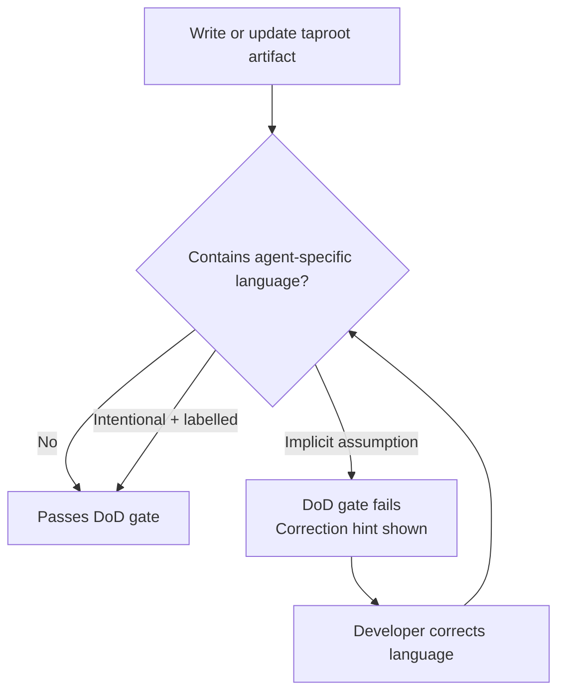

# UseCase: Agent-Agnostic Language Standard

## Actor
Developer writing or reviewing a taproot spec, skill, or documentation file

## Preconditions
- A taproot spec (`intent.md`, `usecase.md`, `impl.md`), skill file (`skills/*.md`), or documentation file is being created or updated

## Scope
This standard applies to:
- `skills/*.md` files (shared across all agents)
- `taproot/` hierarchy docs (specs, impl.md, notes)

It does NOT apply to adapter files (`.claude/commands/`, `.gemini/commands/`) — these are intentionally agent-specific and should use agent-native language.

## Main Flow

### Phase 1 — Authoring (Developer)
1. Developer writes or updates a taproot artifact
2. Developer avoids agent-specific names in shared content — uses generic terms:
   - "the agent" or "any agent" instead of "Claude" or "Claude Code"
   - "the agent's context file" instead of "CLAUDE.md"
   - "always-loaded files" instead of naming a specific file
   - "agent invocation mechanism" instead of "slash command" or `/tr-` prefix
3. When behaviour IS agent-specific, developer makes it explicit — labels it as applying only to a named agent or tier:
   - "Claude Code: ..." for Claude-specific behaviour
   - "Tier 1 only: ..." only when tier membership accurately scopes the restriction (not as a proxy for "Claude Code")
   - Adapter files (`.claude/commands/`, `.gemini/commands/`) are the canonical home for agent-specific instructions
4. Developer verifies the artifact contains no implicit Claude assumptions:
   - `@{project-root}` path syntax (Claude Code-specific) — automated check
   - References to `CLAUDE.md` as if universally present — automated check
   - Skill steps that only work with Claude's tool set — **human review only, not automated**
4b. If a violation is found during review, developer corrects the language before staging the commit

### Phase 2 — Gate (Automated DoD)
5. Artifact is committed — the DoD runner fires (wired via `check-if-affected-by: agent-integration/agent-agnostic-language` in `.taproot/settings.yaml`) and checks compliance on any commit touching a shared spec or skill file

## Alternate Flows
- **Agent-specific behaviour is intentional**: developer labels the section explicitly ("Claude Code only") and records why in the impl.md DoD resolution — condition passes
- **Skill file references a Claude-specific mechanism**: the reference is moved to the Claude adapter file (`.claude/commands/tr-*.md`) and the skill itself uses generic language

## Postconditions
- The artifact uses generic language for all shared content
- Agent-specific sections are clearly labelled with the target agent or tier
- A developer using Gemini, Cursor, or any other agent can read the artifact without hitting Claude-specific assumptions
- `check-if-affected-by: agent-integration/agent-agnostic-language` is present in `.taproot/settings.yaml` (wired as part of implementing this behaviour)

## Error Conditions
- **Implicit Claude assumption found**: DoD check fails with the specific violation; developer corrects the language before committing

## Flow

## Related
- `./agent-support-tiers/usecase.md` — tiers define which agents are "first-class"; language standard ensures specs don't promote Claude to first-class implicitly
- `../skill-architecture/context-engineering/usecase.md` — C-7 constraint governs always-loaded file footprint; language standard governs what those files say. These two concerns are bidirectionally dependent: context-engineering decides which files are always-loaded, and this standard constrains what shared always-loaded files may say about agents.

## Acceptance Criteria

**AC-1: Shared skill files use generic agent language**
- Given any file in `skills/*.md`
- When the file is reviewed for agent bias
- Then it contains no bare "Claude" or "Claude Code" references outside of adapter-specific notes

**AC-2: Agent-specific sections are labelled**
- Given a spec or skill that documents Claude-specific behaviour
- When the section is read
- Then it is prefixed with "Claude Code:" (for agent-specific behaviour) or "Tier 1 only:" (only when tier membership accurately scopes it) or equivalent explicit label

**AC-3: DoD condition enforces compliance**
- Given the DoD runner is wired with `check-if-affected-by: agent-integration/agent-agnostic-language`
- When an implementation modifies a shared spec or skill file
- Then the DoD runner checks for agent-specific language and requires a resolution note

**AC-4: Implicit Claude path syntax is not in shared skill steps**
- Given any step in a `skills/*.md` file
- When the step is read
- Then it does not contain `@{project-root}` (Claude Code path syntax) — that syntax belongs in `.claude/commands/` adapter files only

## Notes

**Automated vs. human checks**
The DoD gate can reliably automate string-match checks:
- `@{project-root}` — Claude Code-specific path syntax
- References to `CLAUDE.md` as a universal constant

Semantic checks — e.g., "does this skill step implicitly assume Claude's tool set?" — require human review and are not automated.

**Bootstrap paradox exemption**
This spec itself uses "CLAUDE.md" as an example name. Descriptive or exemplary use of agent-specific names (e.g. in specs that define the standard itself) is exempt. Only prescriptive use — writing "the agent reads CLAUDE.md" as a universal instruction — is prohibited.

**Migration and scope of enforcement**
Existing violations in files not recently touched are tracked but not blocking. The DoD check only fires when a file's `impl.md` is touched in a commit. Files untouched since this standard was introduced are exempt until next modified.

## Implementations <!-- taproot-managed -->
- [Settings Wiring](./settings-wiring/impl.md)

## Status
- **State:** implemented
- **Created:** 2026-03-21
- **Last reviewed:** 2026-03-21
