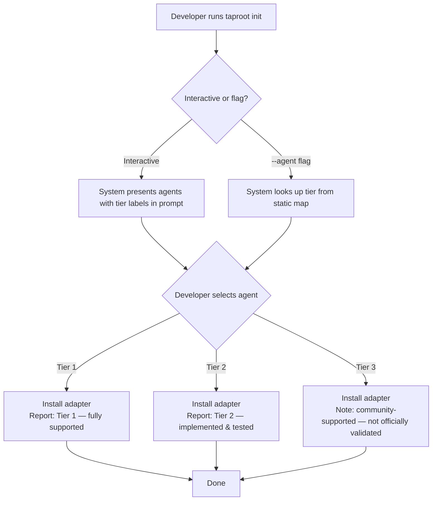

# UseCase: Agent Support Tiers

## Actor
Developer selecting an AI coding agent to use with taproot

## Preconditions
- taproot CLI is installed
- At least one agent adapter is available
- Tier assignments are hardcoded in the CLI source as a static map (e.g., `src/adapters/index.ts`)

## Main Flow
1. Developer considers integrating taproot with an AI coding agent
2. Developer runs `taproot init` interactively or uses `taproot init --agent <name>`
3. System presents each agent with its support tier label:
   - **Tier 1 — First-class** (Claude): fully tested, all features supported, covered in CI
   - **Tier 2 — Implemented & tested** (Gemini): adapter works, basic end-to-end validation done
   - **Tier 3 — Community** (Cursor, Copilot, Windsurf, Generic): adapter generated, not validated end-to-end
   - For the interactive prompt, the tier appears in the choice label (e.g., "Claude Code (Tier 1 — fully supported)")
   - For `--agent <name>`, the tier line is printed in the install output after completion
4. Developer selects an agent, informed by its tier
5. System installs the adapter and reports the tier alongside the installed paths
   - Tier 3 installs include an acknowledgment note: "Community-supported: adapter generated but not officially validated end-to-end. Feedback and fixes welcome." (informational only — no confirmation prompt required)
6. The taproot README includes a static tier table maintained alongside the agent list in the CLI source

## Alternate Flows
- **Unknown tier for a new agent**: if a new agent is added without an explicit tier assignment, the system defaults to Tier 3 and logs a warning

## Postconditions
- Developer knows the support level of their chosen agent before committing to it
- The installed adapter output includes a tier label
- Tier classification is visible in README/docs alongside the agent table

## Error Conditions
- **Unknown tier for a new agent**: if a new agent is added without an explicit tier assignment in the static map, the system defaults to Tier 3 and logs a warning

## Notes
- Tier promotion/demotion (e.g., Gemini graduating to Tier 1, or a community adapter being promoted to Tier 2) is out of scope for this use case. This is a future concern — the static map would be updated in source and a new release cut.

## Flow

## Related
- `./generate-agent-adapter/usecase.md` — adapter generation is the mechanism; tiers classify the quality of that mechanism
- `./update-adapters-and-skills/usecase.md` — updates apply to all tiers; tier label may change as agents are promoted

## Acceptance Criteria

**AC-1: init prompt shows tier label for each agent**
- Given a developer runs `taproot init` interactively
- When the agent selection prompt is presented
- Then each agent option includes its tier label (e.g., "Claude Code (Tier 1 — fully supported)")

**AC-2: Tier 1 agent install confirms full support**
- Given a developer selects Claude
- When `taproot init --agent claude` completes
- Then the output includes a "Tier 1" or "fully supported" indicator

**AC-3: Tier 2 agent install confirms implemented & tested**
- Given a developer selects Gemini
- When `taproot init --agent gemini` completes
- Then the output includes a "Tier 2 — implemented & tested" label

**AC-4: Tier 3 agent install shows community-support note**
- Given a developer selects Cursor, Copilot, Windsurf, or Generic
- When `taproot init --agent <name>` completes
- Then the output notes that the agent is community-supported and not officially validated (informational note, no confirmation prompt)

**AC-5: Tier classification is documented**
- Given the taproot README or docs
- When a developer reads the agent support section
- Then a tier table lists all currently supported agents with their tier and what each tier means

**AC-6: Default tier for unknown agents is Tier 3**
- Given a new agent adapter is added without explicit tier assignment in the static map
- When `taproot init --agent <new-agent>` runs
- Then the system defaults to Tier 3 and logs a warning

## Status
- **State:** specified
- **Created:** 2026-03-21
- **Last reviewed:** 2026-03-21
