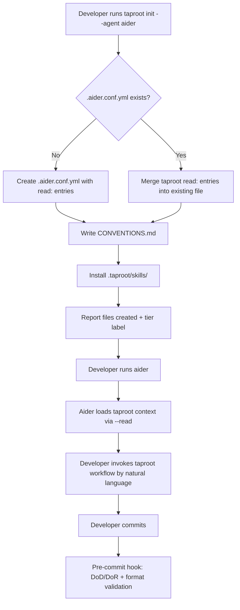

# Behaviour: Aider Adapter

## Actor
Developer using Aider as their primary AI coding agent in a taproot project

## Preconditions
- taproot CLI is installed
- A taproot hierarchy exists (or `taproot init` is being run for the first time)
- Developer has selected Aider as their agent (`taproot init --agent aider`)

## Main Flow
1. Developer runs `taproot init --agent aider`
2. System generates two adapter files:
   - **`.aider.conf.yml`** — Aider config file with `read:` entries pointing to `.taproot/skills/` and `CONVENTIONS.md`, so every Aider session automatically loads taproot context
   - **`CONVENTIONS.md`** — Taproot workflow instructions for Aider: commit tag format, DoD/DoR process, behaviour-per-spec rule, and the full list of taproot workflows with one-line descriptions
3. System installs skill definitions to `.taproot/skills/` (same as other agents)
4. System reports the created files and notes Aider's support tier
5. Developer launches an Aider session — Aider reads `.aider.conf.yml`, loads `.taproot/skills/` and `CONVENTIONS.md` as context automatically
6. Developer invokes taproot workflows by natural language within the Aider session (e.g. "implement the behaviour at taproot/my-intent/my-behaviour/")
7. Developer commits — the pre-commit hook fires identically to other agents: DoD/DoR gates, format validation, spec quality checks

## Alternate Flows

### Re-run on existing installation
- **Trigger:** Developer runs `taproot init --agent aider` on a project that already has an Aider adapter installed
- **Steps:**
  1. System overwrites `.aider.conf.yml` and `CONVENTIONS.md` with the latest versions (idempotent)
  2. System reports "Aider adapter updated"

### `.aider.conf.yml` already exists with custom settings
- **Trigger:** Project has an existing `.aider.conf.yml` with developer-authored settings (model, API keys, other flags)
- **Steps:**
  1. System reads the existing file and merges the taproot `read:` entries without duplicating them or removing developer settings
  2. If a `read:` key already exists, system appends missing taproot paths; if absent, system adds the key
  3. System confirms: "Merged taproot config into existing `.aider.conf.yml`"

### Aider not installed
- **Trigger:** `aider` command is not found in PATH when `taproot init --agent aider` is run
- **Steps:**
  1. System installs adapter files regardless
  2. System appends a note in the output: "Aider not found in PATH — install Aider before using this adapter (https://aider.chat)"

### `taproot update` with Aider adapter installed
- **Trigger:** Developer runs `taproot update` after installing the Aider adapter
- **Steps:**
  1. System refreshes `.taproot/skills/` with latest skill definitions
  2. System regenerates `CONVENTIONS.md` from the latest skill list
  3. System re-merges `.aider.conf.yml` to ensure `read:` entries are current

## Postconditions
- `.aider.conf.yml` exists with `read:` entries for `.taproot/skills/` and `CONVENTIONS.md`
- `CONVENTIONS.md` exists at the project root with taproot workflow instructions
- `.taproot/skills/` contains all current taproot skill definitions
- Aider sessions launched in this project load taproot context automatically without additional flags
- The pre-commit hook enforces DoD/DoR and spec quality on every commit, regardless of agent

## Error Conditions
- **`.aider.conf.yml` is not valid YAML:** System reports "Cannot merge — `.aider.conf.yml` is not valid YAML. Fix the file and re-run `taproot init --agent aider`." Stops without writing.
- **`CONVENTIONS.md` is not writable:** System reports the permission error and stops.

## Flow

## Related
- `../generate-agent-adapter/usecase.md` — generate-agent-adapter is the CLI mechanism that triggers this adapter installation; aider-adapter defines the Aider-specific output format
- `../update-adapters-and-skills/usecase.md` — `taproot update` refreshes the Aider adapter files alongside other agent adapters
- `../agent-support-tiers/usecase.md` — Aider is assigned a support tier (Tier 2 — Implemented & tested) surfaced during `taproot init`
- `../agent-agnostic-language/usecase.md` — skill files loaded via `--read` must use agent-agnostic language to work correctly in Aider context

## Acceptance Criteria

**AC-1: taproot init installs Aider adapter files**
- Given a taproot project exists and the developer runs `taproot init --agent aider`
- When the command completes
- Then `.aider.conf.yml` contains `read:` entries for `.taproot/skills/` and `CONVENTIONS.md`, and `CONVENTIONS.md` exists at the project root

**AC-2: Aider session loads taproot context automatically**
- Given `.aider.conf.yml` has been installed by `taproot init`
- When the developer launches `aider` in the project directory
- Then Aider reads `.taproot/skills/` and `CONVENTIONS.md` without additional flags

**AC-3: Pre-commit hook fires for Aider commits**
- Given the Aider adapter is installed and the pre-commit hook is configured
- When Aider makes a commit (via `git commit`)
- Then the pre-commit hook runs DoD/DoR and format validation identically to Claude Code commits

**AC-4: Merge preserves existing .aider.conf.yml settings**
- Given `.aider.conf.yml` exists with developer-authored settings
- When `taproot init --agent aider` is run again
- Then the developer's settings are preserved and only taproot `read:` entries are added or updated

**AC-5: taproot update refreshes Aider adapter**
- Given the Aider adapter is installed
- When the developer runs `taproot update`
- Then `.taproot/skills/` and `CONVENTIONS.md` are refreshed to the latest versions

**AC-6: Invalid YAML stops merge with clear error**
- Given `.aider.conf.yml` contains invalid YAML
- When `taproot init --agent aider` is run
- Then the system reports a clear error and stops without modifying the file

## Implementations

- [cli-command](./cli-command/impl.md)

## Status
- **State:** implemented
- **Created:** 2026-03-25
- **Last reviewed:** 2026-03-25

## Notes
- Aider has no native slash-command plugin system (unlike Claude Code's `.claude/commands/`); taproot workflows are invoked via natural language within the Aider session, with skill files loaded as context via `--read`
- `CONVENTIONS.md` plays the same role as `CLAUDE.md` for Claude Code — it gives Aider the workflow context it needs without requiring agent-specific syntax in the canonical skill files
- Tier 2 (Implemented & tested) is the initial assignment; Tier 1 (First-class) requires CI coverage and end-to-end validation
- The `.aider.conf.yml` merge strategy ensures this adapter is non-destructive on existing Aider configurations
