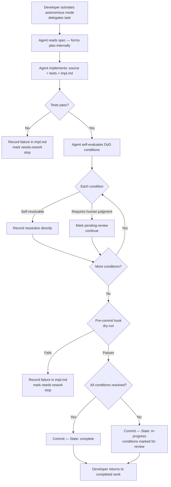

# Behaviour: Autonomous Agent Execution

## Actor
Developer (or orchestrator) who delegates a taproot task to an agent and steps away — returning to completed work rather than supervising each step

## Preconditions
- Agent has been invoked in autonomous mode — activated via one of:
  - `--autonomous` flag on the skill invocation
  - `TAPROOT_AUTONOMOUS=1` environment variable
  - `autonomous: true` in `.taproot/settings.yaml`
- At least one behaviour spec exists with `State: specified` and no complete `impl.md`

## Main Flow
1. Developer activates autonomous mode and delegates a taproot task (e.g. "implement `agent-integration/autonomous-execution`")
2. Agent reads the behaviour spec and forms an implementation plan internally — does not pause for plan approval
3. Agent proceeds through all skill steps without mid-flow confirmation prompts:
   - Writes source files, test files, and `impl.md`
   - Runs tests — if they fail, records the failure and stops (see Error Conditions)
4. Agent self-evaluates each DoD condition by reading the spec and the implementation:
   - For each self-resolvable condition: records the resolution directly in `impl.md`
   - For each condition requiring genuine human judgment: records it as unresolved with the question text and a `<!-- autonomous: pending-review -->` marker in `impl.md`
5. Agent runs the pre-commit hook dry-run — if it fails, records the failure and stops (see Error Conditions)
6. Agent commits using the taproot commit convention, marking the impl `complete` if all DoD conditions resolved, or `in-progress` if any remain pending-review
7. Developer returns to find the implementation committed — either fully resolved or with clearly marked conditions awaiting their review

## Alternate Flows

### All DoD conditions self-resolvable
- **Trigger:** Every DoD condition can be evaluated by reading the spec and implementation alone
- **Steps:**
  1. Agent resolves all conditions, commits with `State: complete`
  2. Developer returns to a fully completed implementation — no review needed

### Some DoD conditions require human judgment
- **Trigger:** One or more `check:` questions have no deterministic answer from the code alone
- **Steps:**
  1. Agent resolves all self-resolvable conditions
  2. Marks unresolvable conditions with `<!-- autonomous: pending-review -->` and the question text
  3. Commits with `State: in-progress`
  4. Developer returns, reads the markers, resolves each condition manually, and re-runs `taproot dod`

### Developer returns mid-execution and wants to resume interactive mode
- **Trigger:** Developer is present and wants to review a step before it completes
- **Steps:**
  1. Developer can interrupt at any point — autonomous mode does not prevent interaction
  2. If the developer provides direction, the agent incorporates it and continues
  3. If the developer disables autonomous mode mid-session, subsequent steps resume confirmation prompts

## Postconditions
- The implementation is committed with no pending mid-flow confirmation prompts
- All DoD conditions are either resolved or marked `<!-- autonomous: pending-review -->` with the question text
- The impl state is `complete` (all resolved) or `in-progress` (some pending-review)
- The developer has a clear, scannable list of any conditions still requiring their attention

## Error Conditions
- **Tests fail:** Agent records the test output in `impl.md`, does not commit, marks impl `needs-rework` — developer returns to a failing test report with the full output
- **Pre-commit hook rejects commit:** Agent records the hook failure output in `impl.md`, does not commit, marks impl `needs-rework` — developer returns to the rejection reason without needing to reproduce the failure
- **Spec is ambiguous or incomplete:** Agent cannot determine from the spec what to implement (missing AC, underspecified main flow) — agent records the ambiguity, does not proceed with a guess, marks impl `needs-rework` with the specific question that could not be answered
- **DoD condition fails (not tests-passing):** A `run:` condition exits non-zero — agent records the output, does not commit, marks impl `needs-rework`

## Flow

## Related
- `../parallel-agent-execution/usecase.md` — parallel execution governs multi-agent shared file safety; autonomous execution governs single-agent non-interactive flow; the two compose
- `../../human-integration/pause-and-confirm/usecase.md` — autonomous mode bypasses pause-and-confirm; both must coexist so autonomous mode for one agent does not affect interactive sessions for another
- `../../quality-gates/definition-of-done/usecase.md` — DoD self-resolution is central to autonomous execution; conditions must be agent-evaluable for autonomous mode to succeed
- `../../skill-architecture/commit-awareness/usecase.md` — autonomous agents must use the commit skill; ad-hoc git commands in autonomous mode are a spec violation
- `../../skill-architecture/context-engineering/usecase.md` — skill context footprint must be small enough that an autonomous agent can load what it needs without hitting context limits mid-execution

## Acceptance Criteria

**AC-1: Single agent completes implementation without confirmation prompts**
- Given a behaviour spec with `State: specified` and clear acceptance criteria
- When an agent invokes `/tr-implement` with autonomous mode activated
- Then the implementation completes end-to-end — plan, code, tests, DoD evaluation, commit — without any mid-flow pause for developer confirmation

**AC-2: Self-resolvable DoD conditions are recorded without prompting**
- Given a DoD condition verifiable by reading the source and spec (e.g. `check-if-affected-by`, `check-if-affected`)
- When the agent evaluates it in autonomous mode
- Then the condition is recorded as resolved in `impl.md` with a resolution note — no confirmation prompt is surfaced

**AC-3: Unresolvable DoD condition is marked, not blocking**
- Given a `check:` condition with no deterministic answer from the code alone
- When the agent encounters it in autonomous mode
- Then the condition is marked `<!-- autonomous: pending-review -->` in `impl.md` with the question text, the agent continues evaluating remaining conditions, and the impl is committed with `State: in-progress`

**AC-4: Test failure stops execution with a clear report**
- Given the agent's tests fail during autonomous execution
- When the failure occurs
- Then the agent records the full test output in `impl.md`, marks the impl `needs-rework`, and does not commit — the developer returns to a readable failure report

**AC-5: Pre-commit hook rejection stops execution with the hook output**
- Given the pre-commit hook dry-run rejects the commit
- When the rejection occurs
- Then the agent records the hook output in `impl.md`, marks the impl `needs-rework`, and does not commit a partial state

**AC-6: Autonomous mode activation is explicit — three valid mechanisms**
- Given an agent running a taproot skill without `--autonomous` flag, `TAPROOT_AUTONOMOUS=1`, or `autonomous: true` in settings
- When the skill runs
- Then confirmation prompts are shown as normal — autonomous mode is not inferred from context

## Notes

**Self-resolvable vs. human-judgment conditions**
A DoD condition is self-resolvable if the agent can determine pass/fail by reading the source code, the spec, and the existing `impl.md` without needing context the developer has not provided. `check-if-affected-by: X` and `check-if-affected: X` are self-resolvable. Open-ended `check:` questions may or may not be — when uncertain, the agent should mark them `pending-review` rather than guess.

**`pending-review` is a marker convention, not a state**
The `<!-- autonomous: pending-review -->` marker is written inside the `## DoD Resolutions` section of `impl.md` as an HTML comment alongside the unresolved condition. It is not an `impl_state` value — the impl state is `in-progress`. This avoids requiring a new entry in `.taproot/settings.yaml` `allowed_impl_states`.

**Autonomous mode and interactive mode must coexist**
Setting `autonomous: true` in `.taproot/settings.yaml` applies to all invocations in that repository. For per-invocation control, the `--autonomous` flag or `TAPROOT_AUTONOMOUS=1` env var is preferred. Two developers using the same repo — one interactive, one headless CI agent — must be able to operate simultaneously without one's mode affecting the other's session.

## Implementations <!-- taproot-managed -->
- [Skill Files + Config Support](./skill-and-config/impl.md)

## Status
- **State:** specified
- **Created:** 2026-03-21
- **Last reviewed:** 2026-03-21
