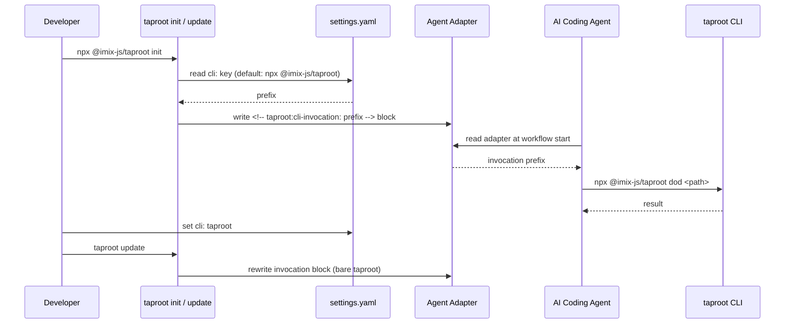

# Behaviour: CLI Invocation Prefix

## Actor
AI coding agent — executing a taproot skill step that includes a CLI command (e.g. `taproot dod`, `taproot link-commits`, `taproot overview`).

## Preconditions
- Taproot has been initialised in the project (`taproot init` has run)
- An agent adapter file exists (e.g. `.claude/CLAUDE.md` for Claude Code)
- The agent is about to execute a taproot CLI command as part of a skill step

## Main Flow
1. Developer runs `npx @imix-js/taproot init` (or `taproot init` if globally installed)
2. `taproot init` reads the `cli:` key from `.taproot/settings.yaml`; if absent or unset, defaults to `npx @imix-js/taproot`
3. `taproot init` writes a machine-readable invocation block into the agent adapter file:
   ```
   <!-- taproot:cli-invocation: npx @imix-js/taproot -->
   When running taproot commands in this project, replace bare `taproot` with: `npx @imix-js/taproot`
   Example: `npx @imix-js/taproot dod taproot/some-intent/some-behaviour/impl-name/impl.md`
   ```
4. Agent reads the adapter file at the start of any taproot workflow and notes the invocation prefix
5. Agent uses the documented prefix for every CLI step in a skill — wherever a skill step reads `taproot <subcommand>`, the agent substitutes `<prefix> <subcommand>`
6. `taproot update` re-reads `settings.yaml` and rewrites the invocation block in the adapter with the current `cli:` value (idempotent via the `<!-- taproot:cli-invocation -->` marker)

## Alternate Flows

### Developer configures a custom CLI prefix
- **Trigger:** Developer adds `cli: taproot` (or any valid invocation) to `.taproot/settings.yaml`
- **Steps:**
  1. Developer sets `cli: taproot` in `.taproot/settings.yaml` (e.g. because taproot is globally installed)
  2. Developer runs `taproot update`
  3. `taproot update` reads the new `cli:` value and rewrites the invocation block in the adapter
  4. Agent reads the updated adapter and uses bare `taproot` for all CLI steps

### Project-local install
- **Trigger:** Developer adds `cli: ./node_modules/.bin/taproot` to `.taproot/settings.yaml` (taproot installed as a `devDependency`)
- **Steps:**
  1. Developer sets the key and runs `taproot update`
  2. Adapter is rewritten; agent uses `./node_modules/.bin/taproot <subcommand>`

## Postconditions
- The agent adapter contains a machine-readable `<!-- taproot:cli-invocation: <prefix> -->` block documenting the correct invocation prefix
- Agents reading the adapter have an unambiguous, project-specific instruction for how to invoke the taproot CLI
- The block is kept current: `taproot update` rewrites it whenever `settings.yaml` changes
- The `generate-agent-adapter` behaviour's adapter output is extended to include this block

## Error Conditions
- **Adapter missing invocation block** (old adapter, pre-dating this behaviour): Agent has no explicit instruction. Safe fallback: agent uses `npx @imix-js/taproot <subcommand>`. Agent also advises the developer to run `taproot update` to install the block.
- **`cli:` value points to an unavailable command**: The system writes whatever is configured — it performs no availability check. If the agent later runs the command and it fails, the developer must correct the `cli:` value in `settings.yaml` and re-run `taproot update`.

## Flow


## Related
- `./generate-agent-adapter/usecase.md` — produces the adapter file; the invocation block is written into the same file. **This behaviour extends `generate-agent-adapter`'s output contract** — the adapter's content must now include the invocation block.
- `./update-adapters-and-skills/usecase.md` — `taproot update` refreshes the invocation block; this behaviour adds a responsibility to the update flow
- `taproot/requirements-hierarchy/configure-hierarchy/usecase.md` — the `cli:` key is a new `settings.yaml` option this behaviour introduces

## Acceptance Criteria

**AC-1: Adapter includes invocation block after init**
- Given a project where `npx @imix-js/taproot init` has just run and `settings.yaml` has no `cli:` key
- When the agent reads the generated adapter file
- Then it contains `<!-- taproot:cli-invocation: npx @imix-js/taproot -->` and the human-readable instruction referencing `npx @imix-js/taproot`

**AC-2: Adapter documents custom prefix when cli: is configured**
- Given `.taproot/settings.yaml` contains `cli: taproot` and `taproot update` has run
- When the adapter file is read
- Then it contains `<!-- taproot:cli-invocation: taproot -->` and the instruction references bare `taproot`

**AC-3: taproot update rewrites the invocation block idempotently**
- Given the adapter already has a `<!-- taproot:cli-invocation: npx @imix-js/taproot -->` block
- When `taproot update` runs (with `cli:` unchanged in settings.yaml)
- Then the adapter still contains exactly one invocation block with the same prefix

**AC-4: Agent falls back to npx when adapter has no invocation block**
- Given an adapter file with no `<!-- taproot:cli-invocation -->` block (generated before this behaviour was implemented)
- When an agent is about to run a taproot CLI command
- Then the agent uses `npx @imix-js/taproot <subcommand>` as the safe fallback and advises the developer to run `taproot update`

**AC-5: taproot update rewrites block after cli: change**
- Given the adapter has `<!-- taproot:cli-invocation: npx @imix-js/taproot -->` and the developer has since set `cli: taproot` in settings.yaml
- When `taproot update` runs
- Then the block is rewritten to `<!-- taproot:cli-invocation: taproot -->` and the instruction is updated accordingly

## Implementations <!-- taproot-managed -->
- [Multi-surface — config type + adapter injection + CONFIGURATION.md](./multi-surface/impl.md)

## Status
- **State:** implemented
- **Created:** 2026-03-25
- **Last reviewed:** 2026-03-25

## Notes
- **Why `npx @imix-js/taproot` as the default:** It works in every scenario — clean machines, CI, team projects where contributors have different local setups. After the first `npx` invocation, the package is cached locally; subsequent calls do not re-download. The only reason to override is developer preference for faster/offline invocation.
- **Skill files stay as-is:** Skill files (in `skills/`) reference bare `taproot` commands throughout. The adapter-level instruction teaches the agent to substitute the correct prefix at runtime. Skill files do not need to be rewritten.
- **Machine-readable marker:** The `<!-- taproot:cli-invocation: <prefix> -->` comment lets `taproot update` find and replace the block idempotently, without parsing the surrounding human-readable text.
- **`cli:` is a new settings.yaml key** — the `configure-hierarchy` behaviour and `CONFIGURATION.md` should be updated to document it.
