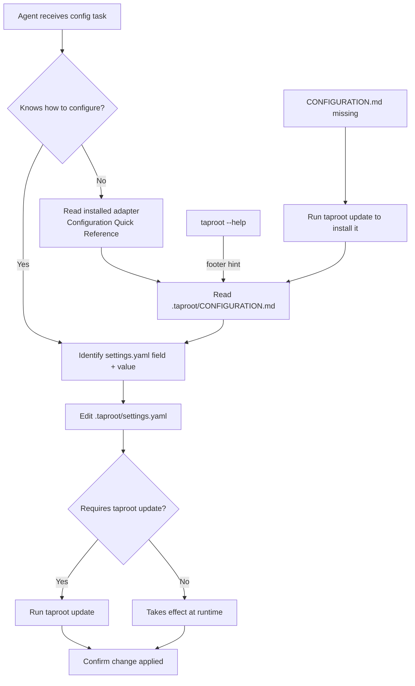

# Behaviour: Configuration Discoverability

## Actor
AI coding agent — given a natural-language configuration task ("configure taproot for German", "add vocabulary overrides for book authoring") by the developer

## Preconditions
- taproot is initialised in the project (`taproot/` directory exists, `.taproot/settings.yaml` present)
- At least one agent adapter has been installed (`taproot init --agent <name>`)

## Main Flow
1. Agent receives a configuration task from the developer (e.g. "konfiguriere taproot auf deutsch um")
2. Agent reads its installed adapter file (e.g. `.claude/commands/`, `.cursor/rules/taproot.md`) — the adapter includes a **Configuration Quick Reference** section listing available `settings.yaml` options and their effect
3. Agent reads `.taproot/CONFIGURATION.md` — installed and kept current by `taproot update` — which documents all `settings.yaml` fields with examples, valid values, and the CLI commands needed to apply changes
4. Agent identifies the correct `settings.yaml` field and value for the requested task (e.g. `language: de`)
5. Agent edits `.taproot/settings.yaml` with the required change
6. Agent runs `taproot update` to apply the configuration change (language pack substitution, vocabulary overrides, adapter regeneration)
7. Agent confirms the change is applied and reports back to the developer

## Alternate Flows

### Agent uses `taproot --help` as first discovery surface
- **Trigger:** Agent runs `taproot --help` before reading adapter or CONFIGURATION.md
- **Steps:**
  1. `taproot --help` output includes a footer: `"Configuration: edit .taproot/settings.yaml — see .taproot/CONFIGURATION.md for all options"`
  2. Agent reads `.taproot/CONFIGURATION.md` and proceeds from Main Flow step 4

### Configuration file not yet installed
- **Trigger:** `.taproot/CONFIGURATION.md` does not exist (taproot was initialised before this feature shipped)
- **Steps:**
  1. Agent runs `taproot update`
  2. `taproot update` installs `.taproot/CONFIGURATION.md` alongside skill files
  3. Agent proceeds from Main Flow step 3

### Unknown configuration option requested
- **Trigger:** Developer asks for a configuration that does not exist in taproot (e.g. "set default branch to main")
- **Steps:**
  1. Agent reads CONFIGURATION.md and does not find a matching field
  2. Agent reports: "This setting is not available in taproot's `settings.yaml`. Available configuration options are: [lists options from CONFIGURATION.md]"

## Postconditions
- `.taproot/settings.yaml` reflects the requested configuration
- `taproot update` has been run where required — skill files and adapters reflect the new configuration

## Error Conditions
- **CONFIGURATION.md missing after `taproot update`**: `taproot update` reports a warning if it cannot write CONFIGURATION.md (permissions error, disk full); configuration changes in `settings.yaml` still take effect at runtime
- **Invalid `settings.yaml` value**: `taproot update` aborts with a validation error identifying the offending field and listing valid values — no files are modified

## Flow

## Related
- `./generate-agent-adapter/usecase.md` — adapter generation must include the Configuration Quick Reference section
- `./update-adapters-and-skills/usecase.md` — `taproot update` installs and refreshes CONFIGURATION.md alongside skills
- `../../taproot-adaptability/language-support/usecase.md` — primary configuration task this behaviour enables agents to discover
- `../../taproot-adaptability/domain-vocabulary/usecase.md` — secondary configuration task (vocabulary overrides)
- `../../requirements-hierarchy/configure-hierarchy/usecase.md` — `settings.yaml` is the shared configuration surface

## Acceptance Criteria

**AC-1: Agent completes language configuration using only local files**
- Given taproot is initialised with a Claude adapter and `.taproot/CONFIGURATION.md` is present
- When the developer asks the agent to "configure taproot for German"
- Then the agent edits `settings.yaml` with `language: de` and runs `taproot update` — without reading any URL or external documentation

**AC-2: `taproot --help` surface points to CONFIGURATION.md**
- Given a project with taproot installed
- When an agent (or developer) runs `taproot --help`
- Then the output includes a reference to `.taproot/settings.yaml` and `.taproot/CONFIGURATION.md`

~~**AC-3: deprecated**~~ — moved to `update-adapters-and-skills/usecase.md` (CONFIGURATION.md installation is taproot update's responsibility)

~~**AC-4: deprecated**~~ — moved to `update-adapters-and-skills/usecase.md` (CONFIGURATION.md refresh on upgrade is taproot update's responsibility)

~~**AC-5: deprecated**~~ — now AC-15 in `generate-agent-adapter/usecase.md` (adapter content is generate-adapter's responsibility)

**AC-6: Unknown config option produces helpful response**
- Given an agent reads CONFIGURATION.md
- When the developer requests a configuration option not present in CONFIGURATION.md
- Then the agent reports the unavailability and lists the available options sourced from CONFIGURATION.md

## Notes
- **Design intent**: the entire configuration task must be completable using only locally-installed files. No external URLs or documentation should be needed. This is the driving constraint for the three discovery surfaces (adapter quick reference, CONFIGURATION.md, `--help` footer).
- **CONFIGURATION.md content requirement**: CONFIGURATION.md must document which `settings.yaml` changes require `taproot update` to take effect vs. which are read at runtime (validators, commithook) — this is the agent's signal to know when to run `taproot update` before confirming task completion.

## Implementations <!-- taproot-managed -->
- [CLI Command — configuration discoverability](./cli-command/impl.md)

## Status
- **State:** implemented
- **Created:** 2026-03-24
- **Last reviewed:** 2026-03-24
