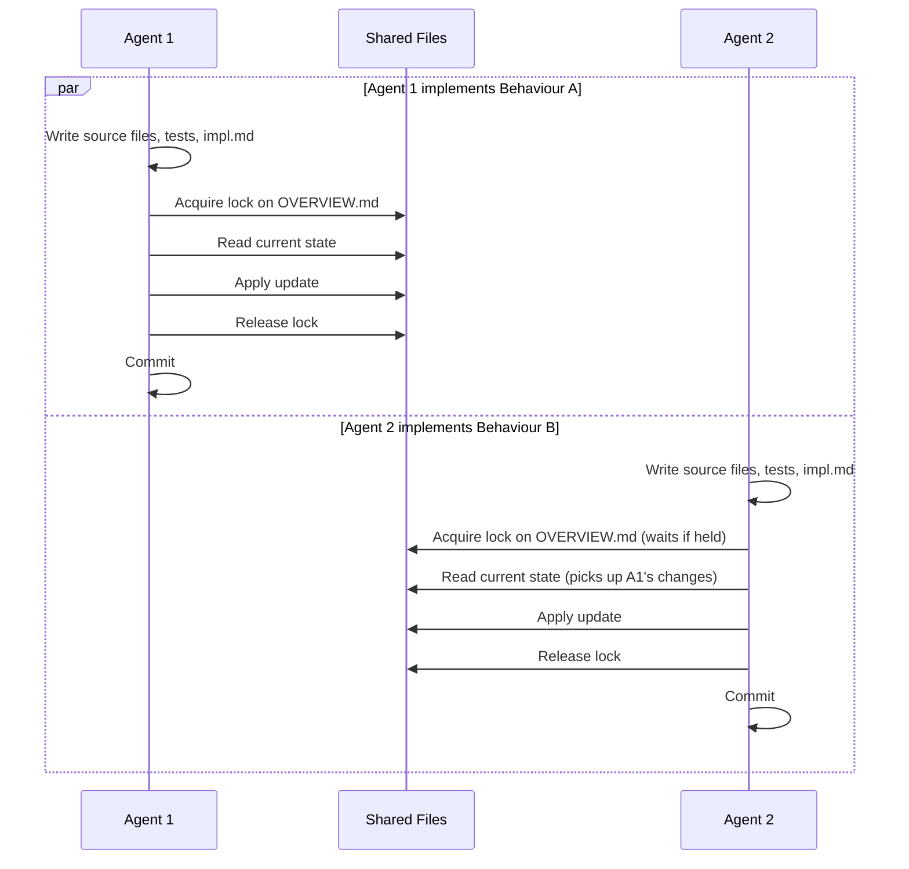

# Behaviour: Parallel Agent Execution

## Actor
Developer or orchestrator running multiple taproot implementation tasks in parallel across the same codebase

## Preconditions
- At least two behaviour specs exist with `State: specified` and no complete `impl.md`
- Multiple agents have been assigned different implementation tasks in the same repository
- No two agents have been assigned the same behaviour (same-behaviour collision is an error condition, not a supported flow)

## Main Flow
1. Each agent begins implementing its assigned behaviour independently
2. When an agent needs to write a shared file (`OVERVIEW.md`, parent `intent.md` link sections, `CONTEXT.md`), it acquires a write lock on that file
3. Agent reads the current state of the shared file after acquiring the lock — picking up any changes written by other agents since the last read
4. Agent applies its update to the shared file
5. Agent releases the lock immediately after writing
6. Each agent commits its implementation independently using the taproot commit convention
7. After all agents complete, the repository reflects each agent's changes with no data loss and a consistent hierarchy

## Alternate Flows

### Lock contention — another agent holds the write lock
- **Trigger:** Agent attempts to acquire a write lock that another agent currently holds
- **Steps:**
  1. Agent waits for the lock to be released (implementation determines timeout and retry strategy)
  2. Lock is released; agent acquires it, reads the current file state, applies its update, and releases
  3. Both agents' changes are present in the final file

### Idempotent update — change already present
- **Trigger:** Agent acquires the lock and reads the shared file; its intended change is already present (applied by another agent)
- **Steps:**
  1. Agent detects the idempotency condition
  2. Agent skips the write, releases the lock, and continues without error

### Git push conflict — fast-forward rejected
- **Trigger:** A second agent tries to push after the first agent's commit has advanced the remote branch
- **Steps:**
  1. Agent's push is rejected by the remote
  2. Agent pulls, rebases its commit on top of the new state, and re-pushes
  3. If rebase produces a conflict on a shared file, agent resolves it by merging both agents' changes and re-commits

## Postconditions
- Each assigned behaviour has a complete `impl.md` committed independently by its agent
- Shared files (`OVERVIEW.md`, parent `intent.md` link sections, `CONTEXT.md`) reflect all agents' changes with no data lost
- The hierarchy is structurally consistent — `taproot validate-structure` passes

## Error Conditions
- **Same-behaviour collision:** Two agents detect they are implementing the same behaviour (same `impl.md` path already exists or is being created) — the later agent aborts, does not overwrite, and records a collision note for developer review
- **Lock acquisition timeout:** Agent cannot acquire a write lock within the implementation-defined timeout — agent records which file could not be updated, does not commit a partial state, and marks the impl `needs-rework`
- **Orphaned lock:** An agent process crashes while holding a lock — the lock expires after the implementation-defined TTL; other agents may proceed after expiry
- **Unresolvable rebase conflict:** Agent cannot automatically resolve a merge conflict on a shared file — agent aborts the rebase, preserves both versions in a conflict file, and marks the impl `needs-rework` for developer review

## Flow

## Related
- `../autonomous-execution/usecase.md` — autonomous mode governs how a single agent runs without human prompts; parallel execution governs how multiple agents share files safely
- `../agent-agnostic-language/usecase.md` — skills must use generic language so any agent can execute them in parallel
- `../../skill-architecture/context-engineering/usecase.md` — skill context footprint affects how much shared state agents load; smaller footprint reduces collision surface
- `../../skill-architecture/commit-awareness/usecase.md` — each parallel agent must use the commit skill rather than ad-hoc git commands to ensure consistent commit format and hook execution
- `../../human-integration/pause-and-confirm/usecase.md` — pause-and-confirm is incompatible with parallel execution; parallel agents must not surface interactive prompts

## Acceptance Criteria

**AC-1: Two agents update OVERVIEW.md without data loss**
- Given two agents simultaneously implementing two different behaviours that both update `OVERVIEW.md`
- When both agents attempt to write `OVERVIEW.md` within the same time window
- Then both agents' updates are present in the final `OVERVIEW.md` with no data lost and no file corruption

**AC-2: Lock contention resolves without agent failure**
- Given Agent B attempts to acquire a write lock currently held by Agent A
- When Agent A releases the lock
- Then Agent B acquires the lock, reads Agent A's changes, applies its own update, and releases — no data is lost

**AC-3: Idempotent update is skipped cleanly**
- Given Agent B acquires a write lock and finds its intended change already applied by Agent A
- When Agent B detects the idempotency condition
- Then Agent B releases the lock without writing and continues its implementation without error

**AC-4: Same-behaviour collision is detected and aborted**
- Given two agents are assigned the same behaviour spec
- When the second agent attempts to create or write the `impl.md` that the first agent is already writing
- Then the second agent aborts, does not overwrite, and records a collision note — no silent data loss

**AC-5: Lock timeout produces recoverable failure, not silent corruption**
- Given an agent cannot acquire a write lock within the implementation-defined timeout
- When the timeout expires
- Then the agent marks the impl `needs-rework`, records which file could not be updated, and does not commit a partial or inconsistent state

## Notes

**⚠ Spec needs refinement before implementation — see backlog**
Research (2026-03-26, `research/parallel-agent-execution.md`) found that this spec was written for the *shared-filesystem* model (Claude Code sub-agents without worktrees) but the *worktree* model (Claude Code `-w`, Cursor, Codex) is now the default for parallel work. In the worktree model, in-flight file conflicts don't arise — the concern shifts to post-merge regeneration of derived files (OVERVIEW.md, CONTEXT.md). The spec needs a refinement pass to acknowledge both models before the advisory-lock implementation is scoped.

**Locking mechanism is an implementation decision**
This spec defines the locking *contract* (acquire before write, release immediately after, read current state after acquiring, TTL for orphaned locks) but not the mechanism. Valid implementations include: advisory lock files, git-based coordination, or OS-level file locks. The implementation must honour the contract regardless of mechanism.

**CONTEXT.md**
`taproot/CONTEXT.md` is generated by `taproot coverage --format context` and is a shared output alongside `OVERVIEW.md`. It must be treated as a shared file subject to the same locking contract.

**Relationship to autonomous-execution**
Parallel execution and autonomous execution are independent concerns. Agents can run autonomously without parallel execution (single agent, no human prompts). Agents can run in parallel without autonomous mode (two interactive agents working different behaviours). The combination (multiple autonomous agents in parallel) is the common production case but is not specified here — it falls out of composing both behaviours.

## Status
- **State:** specified
- **Created:** 2026-03-21
- **Last reviewed:** 2026-03-21
