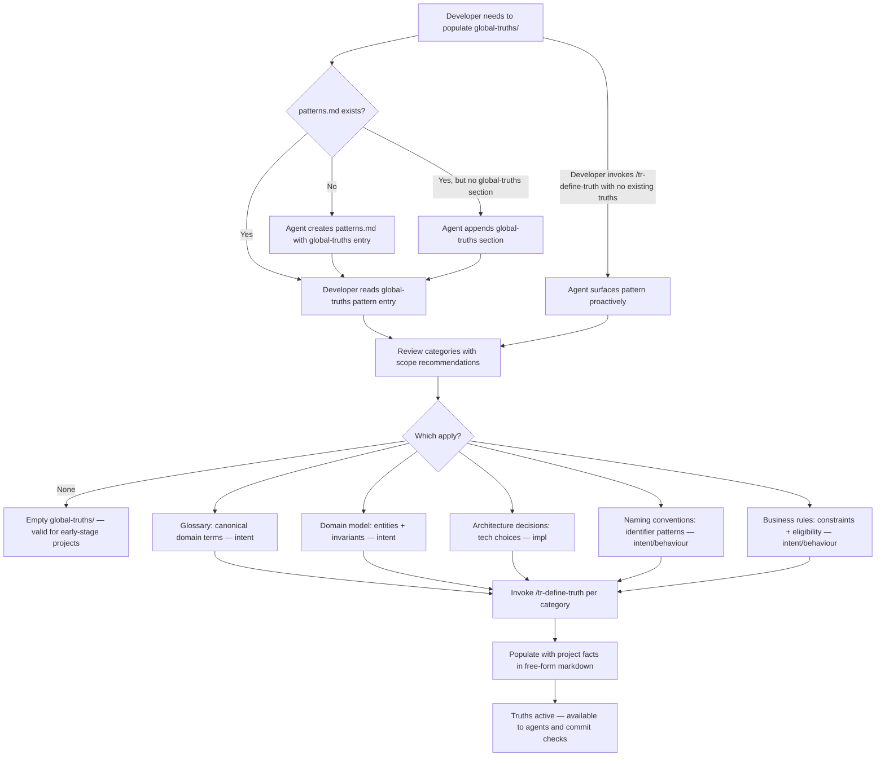

# Behaviour: Guide Truth Capture

## Actor
Developer — setting up `taproot/global-truths/` for the first time, or adding truths to an existing project and unsure what facts are worth formalising

## Preconditions
- A `taproot/` hierarchy exists in the project
- The developer wants to populate `taproot/global-truths/` but is unsure what kinds of facts belong there

## Main Flow
1. Developer opens `.taproot/docs/patterns.md` to find guidance on what kinds of facts belong in `taproot/global-truths/`
2. Developer reads the global-truths pattern entry
3. Developer reviews the five example truth type categories — each with a recommended default scope and concrete example: glossary terms (intent), domain model facts (intent), architecture decisions (impl), naming conventions (intent or behaviour), business rules (intent or behaviour)
4. Developer identifies which categories apply to their project
5. For each applicable category, developer invokes `/tr-define-truth` to create a scoped truth file
6. Developer populates each truth file with their project's facts in free-form markdown

## Alternate Flows

### Agent proactively surfaces guidance for empty global-truths
- **Trigger:** Developer invokes `/tr-define-truth` for the first time in a project with no existing truth files
- **Steps:**
  1. Agent reads the global-truths pattern entry from `.taproot/docs/patterns.md`
  2. Agent presents the truth type categories and asks: "Which of these apply to your project?"
  3. Developer selects applicable categories
  4. Agent creates a blank scoped truth file for each selected category via the `define-truth` flow
  5. Developer populates the files

### Agent-assisted domain modelling
- **Trigger:** Developer asks the agent to help structure their domain model, glossary, or architecture decisions
- **Steps:**
  1. Agent reads the global-truths pattern entry for context
  2. Agent conducts a lightweight elicitation: "Walk me through the key entities in your domain — names, relationships, and any rules that are always true"
  3. Agent proposes a scope (intent vs behaviour vs impl) for each elicited fact based on how broadly it applies across specs
  4. Agent drafts the truth file content and presents it to the developer for review
  5. Developer edits as needed, confirms, and agent saves the files via `/tr-define-truth`

### Developer unsure whether a fact is worth capturing
- **Trigger:** Developer has a candidate fact but is unsure if it is too narrow or ephemeral to formalise as a truth
- **Steps:**
  1. Developer consults the "when NOT to capture" guidance in the pattern entry
  2. Developer applies the exclusion criteria: a fact is too narrow if it —
     - appears in only one spec
     - describes how something is implemented (not what is true)
     - is ephemeral or likely to change frequently
     - can be derived by reading the code directly
  3. If any criterion applies — developer keeps the fact as a note in the relevant `usecase.md` rather than formalising it as a truth
  4. If the fact is stable, cross-spec, and would prevent misinterpretation — developer captures it in `global-truths/`

### Developer determines no categories apply
- **Trigger:** Developer reviews all five categories and concludes none currently apply to their project
- **Steps:**
  1. Developer closes the pattern entry without creating any truth files
  2. `taproot/global-truths/` remains empty — this is valid for early-stage projects
  3. Developer may revisit once the domain stabilises

### `.taproot/docs/patterns.md` absent
- **Trigger:** The patterns file does not yet exist when the developer or agent needs to reference the global-truths pattern
- **Steps:**
  1. Agent creates `.taproot/docs/patterns.md` with the global-truths section
  2. Flow continues from step 2 of the main flow
  3. No error is surfaced to the developer

### `patterns.md` exists but global-truths section is absent
- **Trigger:** `.taproot/docs/patterns.md` exists but contains no global-truths pattern entry
- **Steps:**
  1. Agent appends the global-truths section to the existing file
  2. Flow continues from step 2 of the main flow

## Postconditions
- Developer has a populated `taproot/global-truths/` with at least one truth file per applicable category
- Each truth file is scoped correctly (intent-level for cross-cutting facts; behaviour-level for narrower rules; impl-level for architecture and technology decisions)
- The captured facts are available to agents via `apply-truths-when-authoring` and validated at commit via `enforce-truths-at-commit`
- If no categories applied, `taproot/global-truths/` may remain empty — this is a valid outcome for early-stage projects with no stable domain model yet

## Error Conditions
- **Developer captures overly granular facts** (a single-use implementation detail): Agent flags: "This fact appears specific to one spec — consider whether it belongs as a note in the relevant `usecase.md` rather than a global truth."
- **Truth file created outside `taproot/global-truths/`**: Agent warns the file will not be discovered; correct location is `taproot/global-truths/`. Covered by `define-truth` error conditions.

## Flow

## Related
- `./define-truth/usecase.md` — provides the mechanics for creating and scoping truth files; this behaviour provides the content guidance ("what to put in them")
- `./discover-truths/usecase.md` — discovers implicit truths from existing specs; this behaviour guides explicit truth creation when starting fresh
- `./apply-truths-when-authoring/usecase.md` — truths captured here are applied by agents when authoring subsequent specs
- `taproot/human-integration/pattern-hints/usecase.md` — surfaces this behaviour's pattern entry automatically when a developer expresses a need that matches truth-capture

## Acceptance Criteria

**AC-1: Developer guided on truth types from patterns.md**
- Given `.taproot/docs/patterns.md` contains the global-truths pattern entry with five truth type categories
- When a developer reads the entry to understand what to capture
- Then they can identify at least three applicable categories for their project without further guidance

**AC-2: Pattern entry covers all five truth type categories with scope and examples**
- Given `.taproot/docs/patterns.md` exists
- When the developer reads the global-truths pattern section
- Then the entry describes at least glossary, domain model, architecture decisions, naming conventions, and business rules — each with a recommended default scope and at least one concrete example — and makes clear these are starting categories, not an exhaustive list

**AC-3: Agent proactively surfaces guidance on first define-truth invocation**
- Given `taproot/global-truths/` exists but contains no truth files
- When the developer invokes `/tr-define-truth` for the first time in the project
- Then the agent presents the truth type categories with scope recommendations, asks which apply, and creates blank scoped files for each selected category before proceeding with define-truth

**AC-4: Agent-assisted domain modelling produces truth files**
- Given a developer asks the agent to help structure their domain model or glossary
- When the agent completes the elicitation and the developer confirms the draft
- Then at least one truth file is created in `taproot/global-truths/` containing the elicited domain facts, scoped appropriately

**AC-5: Developer identifies overly narrow facts**
- Given a developer is creating a truth file via `/tr-define-truth` and the candidate fact appears in only one spec
- When the agent evaluates the candidate against the exclusion criteria
- Then the agent flags the fact as potentially too narrow and suggests keeping it as a note in the relevant `usecase.md`

**AC-6: patterns.md absent — agent creates entry before proceeding**
- Given `.taproot/docs/patterns.md` does not exist
- When the developer or agent needs to reference the global-truths pattern
- Then the agent creates the file with the global-truths entry before proceeding, without surfacing an error

**AC-7: No applicable categories — empty global-truths/ accepted**
- Given a developer reviews all five truth type categories
- When the developer determines none currently apply to their early-stage project
- Then the flow ends without error and `taproot/global-truths/` remains empty

**AC-8: Architecture decisions captured at impl scope**
- Given a developer asks where to record their software architecture (tech stack, infrastructure choices, patterns in use)
- When the developer reads the global-truths pattern entry
- Then the entry directs them to create an impl-scoped truth file in `taproot/global-truths/`

## Status
- **State:** proposed
- **Created:** 2026-03-27
- **Last reviewed:** 2026-03-27

## Notes
- The five categories (glossary, domain model, architecture decisions, naming conventions, business rules) are a starting point, not an exhaustive constraint — any stable, cross-spec fact is a valid truth
- Default scope recommendations per category: glossary → intent; domain model → intent; architecture decisions → impl; naming conventions → intent or behaviour; business rules → intent or behaviour. These are defaults — developers choose the scope that fits their project
- This behaviour pairs with `discover-truths`: discovery finds implicit truths in existing specs; this behaviour guides explicit truth creation when starting from scratch
- The pattern entry in `.taproot/docs/patterns.md` is the primary output artefact — it must be present for AC-1 through AC-8 to be testable
- Agent-assisted domain modelling is particularly valuable at project start, before any specs exist (when `discover-truths` has insufficient signal)
- Exclusion criteria for "when NOT to capture": single-spec facts, implementation details (how not what), ephemeral decisions, facts derivable directly from code
