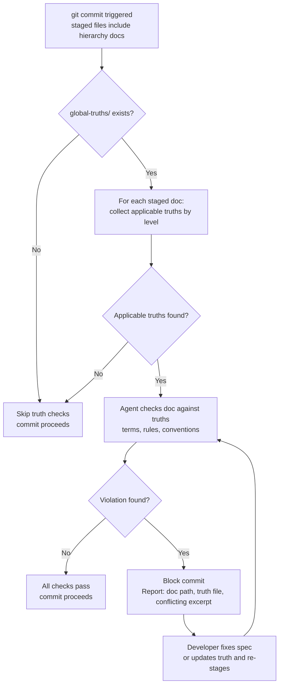

# Behaviour: Enforce Truths at Commit

## Actor
Pre-commit hook — triggered automatically when a contributor commits any hierarchy document (`intent.md`, `usecase.md`, or `impl.md`)

## Preconditions
- `taproot/global-truths/` exists and contains at least one truth file
- A commit includes one or more staged hierarchy documents
- The pre-commit hook is installed (`taproot init --with-hooks`)

## Main Flow

1. Pre-commit hook detects one or more staged hierarchy documents
2. For each staged document, hook determines its level (intent, behaviour, or implementation)
3. Hook collects all truth files applicable to that level using the same scope-resolution rules as `apply-truths-when-authoring`:
   - Intent-scoped truths apply to all levels
   - Behaviour-scoped truths apply to behaviour and impl
   - Impl-scoped truths apply to impl only
   - Unscoped files default to intent scope
4. Hook (via agent) checks each staged document against applicable truths for semantic consistency:
   - Are defined terms used consistently with their definitions?
   - Are stated business rules respected in acceptance criteria and main flow?
   - Are project conventions followed?
5. If all checks pass: hook succeeds, commit proceeds
6. If a violation is found: hook fails, commit is blocked, violation is reported with the specific truth and the conflicting excerpt

## Alternate Flows

### No applicable truths for staged documents
- **Trigger:** `global-truths/` exists but contains no truths applicable to the staged document levels
- **Steps:**
  1. Hook skips truth checks for those documents
  2. Commit proceeds normally

### global-truths/ does not exist
- **Trigger:** Project has no `taproot/global-truths/` folder
- **Steps:**
  1. Hook skips all truth enforcement
  2. Commit proceeds normally

### Multiple staged documents — partial violation
- **Trigger:** Two documents are staged; one passes, one violates a truth
- **Steps:**
  1. Hook reports the violation for the failing document
  2. Commit is blocked entirely — developer must fix the violation before re-committing
  3. The passing document is not re-checked on retry (it has not changed)

### Developer disagrees with the truth (truth is wrong)
- **Trigger:** Hook blocks a commit because of a truth conflict, but the developer believes the truth is outdated
- **Steps:**
  1. Developer updates the truth file in `global-truths/`
  2. Developer stages the updated truth file alongside the hierarchy document
  3. Hook re-runs; with the updated truth, the document now passes
  4. Commit proceeds

## Postconditions
- Every committed hierarchy document is consistent with all applicable truths
- Any semantic drift between a staged spec and an applicable truth is blocked before it enters the repository
- Truth violations are reported with enough detail to locate and fix them

## Error Conditions
- **Truth file unreadable**: hook skips that truth file, logs a warning in commit output: "`global-truths/<file>` could not be read — truth check skipped for this file." Commit is not blocked by an unreadable truth file.
- **Hook times out during agent check**: hook aborts the truth check and allows the commit with a warning: "Truth consistency check timed out — commit allowed. Run `/tr-ineed` to review truths manually."

## Flow

## Related
- `../define-truth/usecase.md` — truths checked here are defined there
- `../apply-truths-when-authoring/usecase.md` — write-time complement; ideally catches drift before commit, reducing hook failures
- `../../hierarchy-integrity/pre-commit-enforcement/usecase.md` — this behaviour extends the pre-commit hook with truth consistency checks

## Acceptance Criteria

**AC-1: Commit blocked when spec contradicts an applicable truth**
- Given `taproot/global-truths/business-rules_behaviour.md` states "prices are always exclusive of VAT"
- When a developer commits a `usecase.md` that specifies a VAT-inclusive price
- Then the commit is blocked with a message identifying the truth file and the conflicting excerpt

**AC-2: Commit proceeds when all specs are consistent with truths**
- Given applicable truths exist and all staged specs use terms and rules consistently with them
- When the developer commits
- Then the hook passes and the commit succeeds

**AC-3: No global-truths/ — commit always proceeds**
- Given `taproot/global-truths/` does not exist
- When a developer commits any hierarchy document
- Then truth checks are skipped and the commit proceeds normally

**AC-4: Developer resolves violation by updating the truth**
- Given a commit was blocked due to a truth conflict
- When the developer updates the truth file and stages it alongside the hierarchy document
- Then the hook re-runs with the updated truth and the commit proceeds if consistent

**AC-5: Only applicable truths checked per document level**
- Given `taproot/global-truths/` contains both `glossary_intent.md` and `tech-choices_impl.md`
- When a `usecase.md` is committed
- Then only `glossary_intent.md` is checked; `tech-choices_impl.md` is not

**AC-6: Unreadable truth file produces warning but does not block commit**
- Given a truth file in `global-truths/` is malformed or unreadable
- When a commit triggers truth checks
- Then the unreadable file is skipped with a warning and the commit is not blocked by it

## Status
- **State:** specified
- **Created:** 2026-03-26
- **Last reviewed:** 2026-03-26
