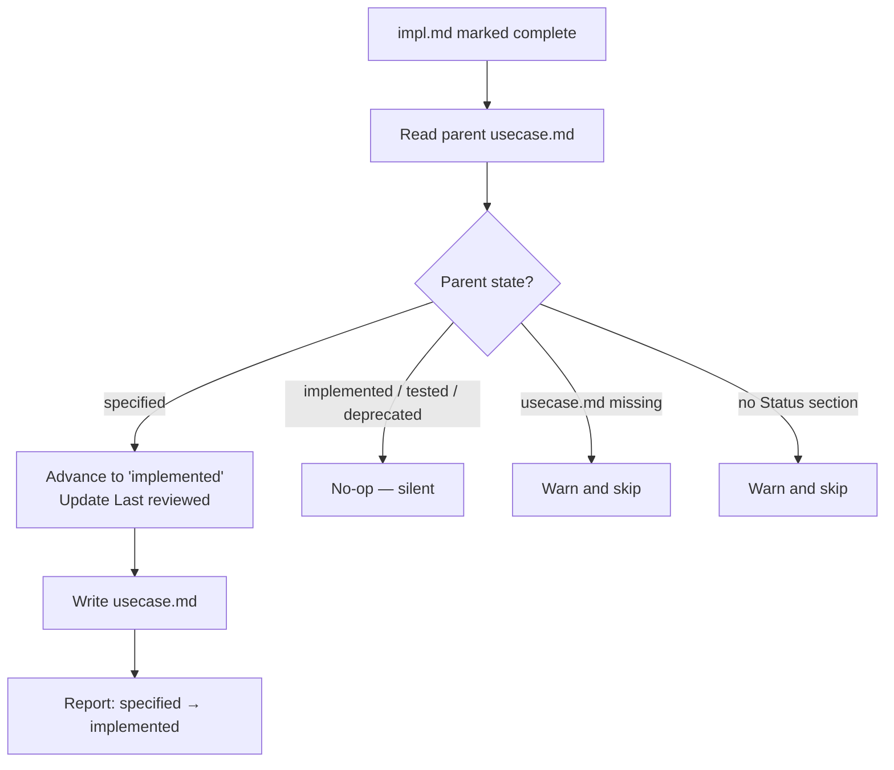

# Behaviour: Cascade Impl Status to Parent UseCase

## Actor
`taproot dod` CLI (when marking an `impl.md` complete) and the `tr-implement` skill (step 5a, when adding the implementation link to `usecase.md`)

## Preconditions
- An `impl.md` has been marked `complete` (DoD passed)
- A parent `usecase.md` exists at `../usecase.md` relative to the impl folder
- The parent `usecase.md` has a `## Status` section with a `**State:**` field

## Main Flow
1. After marking `impl.md` state `complete`, actor reads the parent `usecase.md`
2. Actor reads the `**State:**` field from the parent `## Status` section
3. If parent state is `specified`: actor advances it to `implemented` and updates `**Last reviewed:**` to today
4. Actor writes the updated `usecase.md`
5. Actor reports the state change: `"advanced usecase state: specified → implemented"`

## Alternate Flows

### Parent state is already `implemented` or beyond
- **Trigger:** Parent `usecase.md` state is `implemented`, `tested`, or `deprecated`
- **Steps:**
  1. Actor takes no action — does not downgrade or modify the state
  2. No message reported (silent no-op)

### Multiple impls under the same usecase
- **Trigger:** A second (or later) impl under the same usecase is marked `complete`
- **Steps:**
  1. Actor reads parent state — finds it already `implemented`
  2. No-op (falls into the alternate flow above)

### Impl marked `needs-rework` after being `complete`
- **Trigger:** An impl's state is changed back from `complete` to `needs-rework`
- **Steps:**
  1. No cascade — the usecase state is **not** reversed
  2. Rationale: reverting the usecase state is a human decision; another impl under the same behaviour may still be complete

### Parent `usecase.md` not found
- **Trigger:** `../usecase.md` does not exist relative to the impl folder
- **Steps:**
  1. Actor logs a warning: `"impl.md has no parent usecase.md — state cascade skipped"`
  2. Cascade is skipped; impl is still marked complete

## Postconditions
- If parent state was `specified`: it is now `implemented`
- If parent state was already `implemented` or beyond: it is unchanged
- The `impl.md` `complete` marking is unaffected by the cascade result

## Error Conditions
- **`usecase.md` has no `## Status` section**: actor logs a warning and skips the cascade; `validate-format` will surface the missing section on the next validation run

## Flow

## Related
- `taproot/hierarchy-integrity/validate-format/usecase.md` — validate-format can detect stale state (impl complete but usecase still `specified`); this behaviour fixes it proactively rather than reporting it
- `taproot/quality-gates/definition-of-done/usecase.md` — DoD is the trigger for this cascade; this behaviour is a postcondition of DoD passing
- `taproot/hierarchy-integrity/pre-commit-enforcement/usecase.md` — the pre-commit hook runs DoD but does not cascade state; cascade happens in the dod CLI, not the hook

## Implementations <!-- taproot-managed -->
- [Multi-Surface — dod CLI + tr-implement skill](./multi-surface/impl.md)

## Acceptance Criteria

**AC-1: Advances usecase state from specified to implemented**
- Given an `impl.md` whose parent `usecase.md` has `state: specified`
- When `cascadeUsecaseState` is called after DoD passes
- Then the usecase state is updated to `implemented` and the function returns `"specified → implemented"`

**AC-2: Does not modify usecase already in implemented state**
- Given a `usecase.md` already in `state: implemented`
- When `cascadeUsecaseState` is called
- Then the usecase file is unchanged and the function returns null

**AC-3: Handles gracefully when usecase.md does not exist**
- Given an `impl.md` with no sibling `usecase.md` in the parent directory
- When `cascadeUsecaseState` is called
- Then no exception is thrown and the function returns null

**AC-4: Cascades usecase state when DoD passes**
- Given an `impl.md` in `in-progress` state with a parent `usecase.md` in `specified` state
- When `taproot dod` runs all conditions pass
- Then `usecaseCascade` is `"specified → implemented"` and the usecase file contains `**State:** implemented`

**AC-5: Does not cascade in dry-run mode**
- Given an `impl.md` with a parent `usecase.md` in `specified` state
- When `taproot dod --dry-run` runs
- Then the usecase file is unchanged (still `specified`)

**AC-6: Does not cascade when DoD fails**
- Given an `impl.md` with a parent `usecase.md` in `specified` state
- When `taproot dod` runs and a condition fails
- Then `usecaseCascade` is undefined and the usecase file remains `specified`

## Status
- **State:** implemented
- **Created:** 2026-03-19
- **Last reviewed:** 2026-03-19

## Notes
- The cascade is intentionally one-directional: impl `complete` → usecase `implemented`. There is no automatic reverse cascade (impl `needs-rework` does not revert usecase to `specified`) because multiple impls may exist under one usecase, and the revert decision belongs to a human.
- The cascade applies only when the parent state is exactly `specified`. It does not touch `tested` or `deprecated` states.
- This behaviour is implemented in two places: `taproot dod` (CLI) and `tr-implement` step 5a (skill). Both must apply the cascade to ensure consistency regardless of which path completes the impl.
