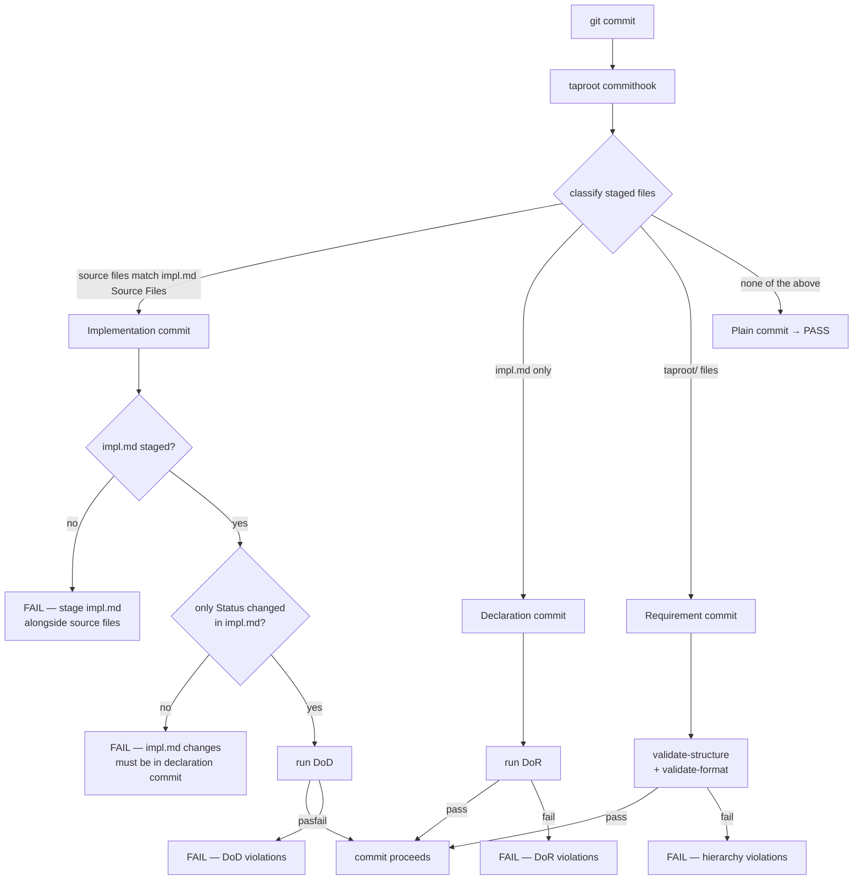

# UseCase: Pre-commit Enforcement

## Actor
Git — triggered automatically when any contributor (human or agent) runs `git commit`

## Preconditions
- `taproot init --with-hooks` has been run, installing `.git/hooks/pre-commit`
- The hook file contains a single delegation: `taproot commithook`

## Main Flow
1. Contributor stages changes and runs `git commit`
2. Git invokes `.git/hooks/pre-commit`
3. Hook runs `taproot commithook`
4. `taproot commithook` inspects staged files and classifies the commit:
   - **Implementation commit** — one or more staged files appear in the `## Source Files` section of any `impl.md` in the hierarchy (reverse lookup):
     - If the matching `impl.md` is also staged: verify only the Status section changed in `impl.md`, then run DoD (`taproot dod`)
     - If the matching `impl.md` is NOT staged: FAIL — "Stage `impl.md` alongside your source files. No implementation commit should proceed without its traceability record."
   - **Declaration commit** — staged files include `impl.md` but no source files matched by reverse lookup: run DoR checks against the parent `usecase.md`
   - **Requirement commit** — staged files include `taproot/` hierarchy files (`intent.md`, `usecase.md`) but no matched source files and no `impl.md`: run `taproot validate-structure` and `taproot validate-format`
   - **Plain commit** — staged files include none of the above: no taproot checks run, commit proceeds immediately
5. If all applicable checks pass (exit 0): commit proceeds normally
6. If any check fails (exit 1): git aborts the commit and prints the full violation report with corrections

## Alternate Flows
### Mixed commit (hierarchy files + impl.md)
- **Trigger:** Staged files include both `intent.md`/`usecase.md` and `impl.md` without source files
- **Steps:**
  1. Both Requirement and Declaration tiers run
  2. All violations from both tiers are collected and reported together
  3. Commit blocked if either tier fails

### CI enforcement
- **Trigger:** CI pipeline runs taproot checks on a PR or merge
- **Steps:**
  1. CI runs `taproot commithook --ci` (or equivalent) as a read-only check against the full branch diff
  2. Does not block local commits — only blocks merges
  3. Same classification logic applies

### Existing pre-commit hook
- **Trigger:** `.git/hooks/pre-commit` already exists when `taproot init --with-hooks` is run
- **Steps:**
  1. `taproot commithook` is appended to the existing hook rather than replacing it
  2. Existing checks still run first

## Postconditions
- On success: commit is written; hierarchy is valid, DoR or DoD was satisfied as appropriate
- On failure: commit is blocked; contributor has a full list of failures with corrections

## Error Conditions
- **Source files committed without impl.md**: `FAIL — Stage impl.md alongside your source files. No implementation commit should proceed without its traceability record.` (triggered when reverse lookup matches source files but impl.md is absent from staging)
- **`impl.md` changed beyond Status section in implementation commit**: `FAIL — implementation commits may only update the Status section of impl.md. Stage other impl.md changes in a separate declaration commit`
- **DoR fails**: errors from definition-of-ready (missing usecase, not specified, format violations, missing Mermaid/Related)
- **DoD fails**: errors from definition-of-done (failing shell conditions, unresolved agent checks)
- **taproot CLI not installed**: hook fails with "command not found" — contributor must install taproot globally
- **Hook not executable**: git skips the hook silently — `taproot init --with-hooks` sets the executable bit, but it may be lost on some systems

## Flow

## Notes
- **Reverse lookup for source file detection:** `taproot commithook` walks all `impl.md` files in the hierarchy, parses their `## Source Files` sections, and builds a map of `file path → impl.md path`. Any staged file whose path appears in this map is classified as an implementation source file. Files not tracked by any impl.md (e.g. `.gitignore`, CI configs, docs not listed in a `## Source Files` section) are never classified as implementation source files and pass through as plain commits.
- **Multiple impl.md matches:** if staged source files span multiple impl.md files, each matching impl.md must be staged and its DoD must pass. Partial staging (some impl.md files staged, others not) blocks the commit.

## Acceptance Criteria

**AC-1: Passes when no taproot files are staged (plain commit)**
- Given only non-taproot files staged (e.g. `src/foo.ts`)
- When `taproot commithook` runs
- Then exit code is 0

**AC-2: Passes for source files not tracked in any impl.md**
- Given a file like `.gitignore` staged but not referenced by any `impl.md`
- When `taproot commithook` runs
- Then exit code is 0

**AC-3: Passes when valid hierarchy files are staged (requirement commit)**
- Given a valid `intent.md` staged under `taproot/`
- When `taproot commithook` runs
- Then exit code is 0

**AC-4: Fails when staged hierarchy files have format errors**
- Given an `intent.md` with missing required sections staged
- When `taproot commithook` runs
- Then exit code is 1

**AC-5: Passes when impl.md references a specified usecase (declaration commit)**
- Given an `impl.md` staged alone whose parent `usecase.md` has `state: specified`, a Flow section, and a Related section
- When `taproot commithook` runs
- Then exit code is 0

**AC-6: Fails when parent usecase is not in specified state**
- Given an `impl.md` staged whose parent `usecase.md` has `state: proposed`
- When `taproot commithook` runs
- Then exit code is 1

**AC-7: Fails when parent usecase has no Flow section**
- Given an `impl.md` staged whose parent `usecase.md` has no `## Flow` section
- When `taproot commithook` runs
- Then exit code is 1

**AC-8: Fails when parent usecase has no Related section**
- Given an `impl.md` staged whose parent `usecase.md` has no `## Related` section
- When `taproot commithook` runs
- Then exit code is 1

**AC-9: Passes when only Status section changed in impl.md alongside its tracked source file**
- Given a tracked source file and its `impl.md` (Status section only changed) both staged
- When `taproot commithook` runs
- Then exit code is 0

**AC-10: Fails when impl.md changes beyond Status section alongside its tracked source**
- Given a tracked source file and its `impl.md` (non-Status content changed) both staged
- When `taproot commithook` runs
- Then exit code is 1

**AC-11: Fails when tracked source file is staged without its impl.md**
- Given a source file tracked by an `impl.md` staged alone (impl.md not staged)
- When `taproot commithook` runs
- Then exit code is 1

**AC-12: Fails when new impl.md and its tracked source are staged without a prior declaration**
- Given a new `impl.md` and its tracked source file staged together without a prior declaration commit
- When `taproot commithook` runs
- Then exit code is 1

**AC-13: taproot init --with-hooks installs pre-commit hook containing taproot commithook**
- Given a project with a `.git/hooks/` directory
- When the actor runs `taproot init --with-hooks`
- Then `.git/hooks/pre-commit` is created containing `taproot commithook` (not the old validate-structure calls)

## Related
- `../validate-format/usecase.md` — Requirement tier delegates format checking here
- `../../implementation-quality/definition-of-ready/usecase.md` — Declaration tier invokes DoR
- `../../implementation-quality/definition-of-done/usecase.md` — Implementation tier invokes DoD

## Implementations <!-- taproot-managed -->
- [CLI Command — taproot commithook](./cli-command/impl.md)
- [Git Hook — pre-commit enforcement](./git-hook/impl.md)

## Status
- **State:** implemented
- **Created:** 2026-03-19
- **Last reviewed:** 2026-03-20
