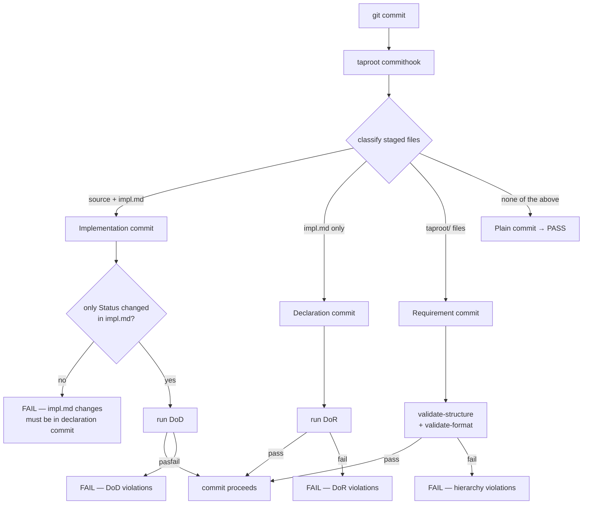

# UseCase: Pre-commit Enforcement

## Actor
Git — triggered automatically when any contributor (human or agent) runs `git commit`

## Preconditions
- `taproot init --with-hooks` has been run, installing `.git/hooks/pre-commit`
- The hook file contains a single delegation: `taproot commithook`

## Main Flow
1. Contributor stages changes and runs `git commit`
2. Git invokes `.git/hooks/pre-commit`
3. Hook runs `taproot commithook`
4. `taproot commithook` inspects staged files and classifies the commit:
   - **Implementation commit** — staged files include `impl.md` AND source code files: verify only the Status section changed in `impl.md`, then run DoD (`taproot dod`)
   - **Declaration commit** — staged files include `impl.md` but no source code files: run DoR checks against the parent `usecase.md`
   - **Requirement commit** — staged files include `taproot/` hierarchy files (`intent.md`, `usecase.md`) but no `impl.md`: run `taproot validate-structure` and `taproot validate-format`
   - **Plain commit** — staged files include none of the above: no taproot checks run, commit proceeds immediately
5. If all applicable checks pass (exit 0): commit proceeds normally
6. If any check fails (exit 1): git aborts the commit and prints the full violation report with corrections

## Alternate Flows
### Mixed commit (hierarchy files + impl.md)
- **Trigger:** Staged files include both `intent.md`/`usecase.md` and `impl.md` without source files
- **Steps:**
  1. Both Requirement and Declaration tiers run
  2. All violations from both tiers are collected and reported together
  3. Commit blocked if either tier fails

### CI enforcement
- **Trigger:** CI pipeline runs taproot checks on a PR or merge
- **Steps:**
  1. CI runs `taproot commithook --ci` (or equivalent) as a read-only check against the full branch diff
  2. Does not block local commits — only blocks merges
  3. Same classification logic applies

### Existing pre-commit hook
- **Trigger:** `.git/hooks/pre-commit` already exists when `taproot init --with-hooks` is run
- **Steps:**
  1. `taproot commithook` is appended to the existing hook rather than replacing it
  2. Existing checks still run first

## Postconditions
- On success: commit is written; hierarchy is valid, DoR or DoD was satisfied as appropriate
- On failure: commit is blocked; contributor has a full list of failures with corrections

## Error Conditions
- **`impl.md` changed beyond Status section in implementation commit**: `FAIL — implementation commits may only update the Status section of impl.md. Stage other impl.md changes in a separate declaration commit`
- **DoR fails**: errors from definition-of-ready (missing usecase, not specified, format violations, missing Mermaid/Related)
- **DoD fails**: errors from definition-of-done (failing shell conditions, unresolved agent checks)
- **taproot CLI not installed**: hook fails with "command not found" — contributor must install taproot globally
- **Hook not executable**: git skips the hook silently — `taproot init --with-hooks` sets the executable bit, but it may be lost on some systems

## Flow

## Related
- `../validate-format/usecase.md` — Requirement tier delegates format checking here
- `../../implementation-quality/definition-of-ready/usecase.md` — Declaration tier invokes DoR
- `../../implementation-quality/definition-of-done/usecase.md` — Implementation tier invokes DoD

## Implementations <!-- taproot-managed -->
- [CLI Command — taproot commithook](./cli-command/impl.md)
- [Git Hook — pre-commit enforcement](./git-hook/impl.md)

## Status
- **State:** specified
- **Created:** 2026-03-19
- **Last reviewed:** 2026-03-19
