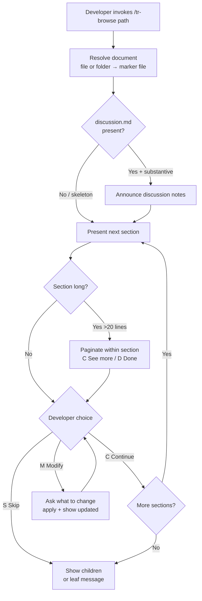

# Behaviour: Browse Hierarchy Item

## Actor
Developer — in the terminal, wanting to read a hierarchy document (intent.md, usecase.md, or impl.md) section by section without leaving the CLI or opening an external editor.

## Preconditions
- A taproot hierarchy exists under `taproot/`
- The developer knows the path to the document they want to read (or the folder containing it)

## Main Flow
1. Developer invokes `/tr-browse <path>` — path may point to a document directly (`taproot/foo/bar/usecase.md`) or to the folder (`taproot/foo/bar/`)
2. Agent resolves the target document:
   - If path points to a file directly (`intent.md`, `usecase.md`, or `impl.md`): use it as-is
   - If path points to a folder: look for `intent.md`, then `usecase.md`, then `impl.md` at that exact folder level (not in subfolders). Child impl folders are treated as children to be listed at step 8 — they are not the target document.
3. Agent checks whether `discussion.md` exists alongside the document
4. If `discussion.md` is present and has substantive content, agent announces: *"📝 Discussion notes found — I'll include context from them where relevant"*
5. Agent presents the first section (heading + body), formatted to fit a terminal screen.
   Discussion context is anchored as follows — if present and substantive, a `> How we got here:` block is included:
   - For `usecase.md`: before the `## Main Flow` section
   - For `impl.md`: alongside `## Design Decisions`
   - For `intent.md`: alongside `## Goal`
6. Developer chooses:
   - `[C] Continue` — agent presents the next section; repeat from step 5
   - `[M] Modify` — agent asks: *"What would you like to change in this section?"*
   - `[S] Skip to children` — agent jumps directly to step 8, skipping remaining sections
7. If `[M]`: Developer states the change. Agent applies it, shows the updated section, and returns to step 6
8. After all sections are presented (or `[S]` is chosen), agent shows what's below:
   - For an intent: lists child behaviours by name and path
   - For a behaviour: lists implementations by name and path
   - For an impl: *"No children — this is a leaf implementation"*

## Alternate Flows

### [M] — developer changes mind
- **Trigger:** Developer selected `[M]` but decides no edit is needed
- **Steps:**
  1. Agent asks *"What would you like to change?"*
  2. Developer says "never mind" or equivalent
  3. Agent confirms: *"No changes — continuing"* and presents `[C] Continue | [M] Modify | [S] Skip to children`

### Section body is long
- **Trigger:** A section body exceeds approximately 20 lines
- **Steps:**
  1. Agent presents the first ~20 lines, then offers: `[C] See more | [D] Done with this section`
  2. `[C]`: Agent presents the next ~20 lines; repeat until the section is exhausted
  3. `[D]`: Agent treats the section as complete and presents `[C] Continue | [M] Modify | [S] Skip to children`

### [M] on a taproot-managed section
- **Trigger:** Developer selects `[M]` while viewing `## Commits` or `## DoD Resolutions` in an `impl.md`
- **Steps:**
  1. Agent warns: *"⚠ This section is managed by `taproot link-commits` / `taproot dod` — manual edits may be overwritten on the next run. Continue?"*
  2. If developer confirms: agent proceeds with the [M] modify flow as normal
  3. If developer declines: agent returns to `[C] Continue | [M] Modify | [S] Skip to children`

### Document has no discussion.md or discussion.md is skeleton-only
- **Trigger:** `discussion.md` is absent or contains only template headings with no substantive content
- **Steps:**
  1. Agent skips the discussion notes without comment — no announcement, no placeholder
  2. Sections are presented without any `> How we got here:` block

### impl.md — leaf node with no children
- **Trigger:** Developer browses an `impl.md`
- **Steps:**
  1. Sections are presented as normal, including `## DoD Resolutions` and `## DoR Resolutions`
  2. If `discussion.md` is present and substantive, its content appears alongside `## Design Decisions` as a `> How we got here:` block
  3. At the end: *"No children — this is a leaf implementation"*

## Postconditions
- Developer has read every section of the document (or as many as they chose to view)
- Any sections modified via `[M]` are saved to the file
- Developer knows what's below without having opened any additional files
- To go deeper into any listed child, the developer calls `/tr-browse <child-path>`

## Error Conditions
- **Path does not exist**: Agent reports *"No file found at `<path>` — check the path and try again"* and stops
- **Path exists but contains no hierarchy document**: Agent reports *"No intent.md, usecase.md, or impl.md found at `<path>`"* and stops

## Flow

## Related
- `./human-readable-report/usecase.md` — generates a full project health dashboard; browse is for reading a single document in depth
- `./hierarchy-sweep/usecase.md` — applies a uniform task across many items; browse is interactive and single-document
- `../hierarchy-integrity/validate-format/usecase.md` — validates document structure; browse shows it as-is without validation
- `../requirements-compliance/record-decision-rationale/usecase.md` — defines what discussion.md contains; browse surfaces it as contextual notes
- `../agent-context/trace-hierarchy/usecase.md` — navigates the hierarchy for agents; browse is the human-facing equivalent
- **`/tr-review` skill** — agent stress-tests a spec by challenging it; browse is the human-driven reading equivalent, no agent critique

## Acceptance Criteria

**AC-1: Section-by-section navigation**
- Given a valid `usecase.md` path
- When the developer invokes `/tr-browse <path>`
- Then each section is presented one at a time with `[C] Continue`, `[M] Modify`, and `[S] Skip to children` options, and the developer advances at their own pace

**AC-2: Modify flow**
- Given the developer is viewing a section
- When they select `[M]`
- Then the agent asks what to change, applies the stated change, and shows the updated section before offering `[C]`, `[M]`, and `[S]` again

**AC-3: Children shown at end**
- Given a behaviour with two implementations
- When the developer reaches the end of the `usecase.md` walkthrough (or selects `[S]`)
- Then both implementations are listed by name and path, with no automatic traversal

**AC-4: discussion.md context anchored for usecase.md**
- Given a `discussion.md` exists alongside a `usecase.md` with substantive content
- When the developer browses the document
- Then the agent announces the discussion notes at the start, and a `> How we got here:` block appears before the `## Main Flow` section

**AC-5: Path not found**
- Given an invalid path
- When the developer invokes `/tr-browse <path>`
- Then the agent reports the exact path it looked for and stops

**AC-6: Leaf impl.md shows no children**
- Given an `impl.md` path with no sub-items
- When the developer reaches the end of the walkthrough
- Then the agent states *"No children — this is a leaf implementation"*

**AC-7: discussion.md anchored to Design Decisions for impl.md**
- Given a `discussion.md` exists alongside an `impl.md` with substantive content
- When the developer browses the `impl.md`
- Then the discussion content is shown as a `> How we got here:` block alongside `## Design Decisions`

**AC-8: Modify then change mind**
- Given the developer selects `[M]` on a section
- When they respond with "never mind" or equivalent
- Then the agent confirms no changes were made and returns to the section navigation options

## Implementations <!-- taproot-managed -->
- [Agent Skill](./agent-skill/impl.md)

## Status
- **State:** specified
- **Created:** 2026-03-25
- **Last reviewed:** 2026-03-25

## Notes
- "Browse" is intentionally distinct from `/tr-review` (agent stress-test) — browse is the developer reading the spec themselves, with the agent as a display and editing assistant only
- The [M] modify flow is open-ended: the agent does not pre-empt what needs changing. The developer drives the edit.
- The ~20-line threshold for section pagination is a guideline, not a hard rule — the agent uses judgment to avoid outputting a wall of text in a single turn.
- To go deeper into a listed child after browsing, the developer calls `/tr-browse <child-path>` — no automatic traversal.
