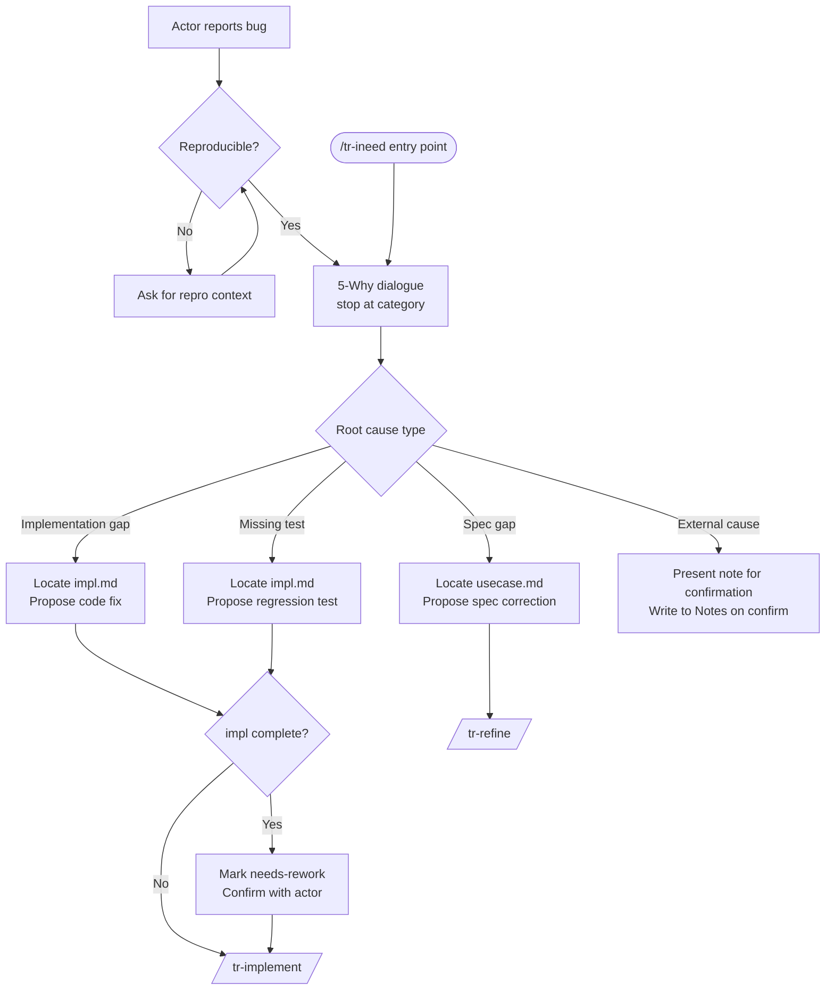

# Behaviour: Bug Triage and Root Cause Analysis

## Actor
Developer or AI coding agent who has observed a defect — unexpected system behaviour, a failing test, or a user-reported issue

## Preconditions
- The bug is observable: a symptom, reproduction steps, or failing test exists
- The taproot hierarchy exists in the project

## Main Flow
1. Actor invokes `/tr-bug` with a symptom description (or receives a hand-off from `/tr-ineed`)
2. Skill confirms the bug is reproducible: asks the actor for a minimal reproduction scenario if not already provided
3. Skill opens structured root cause dialogue using 5-Why method:
   a. Skill asks: "Why did this happen?" → Actor identifies the immediate cause
   b. Skill asks: "Why did that happen?" → Actor identifies the second-order cause
   c. Skill continues asking "Why?" until a root cause category can be assigned — stop as soon as a category is clear; do not ask beyond category identification. If no category is clear after 5 iterations, skill stops and asks the actor to classify directly: "Which of these best describes the root cause: implementation gap, spec gap, missing test, or external cause?"
4. Skill classifies the root cause into one of:
   - **Implementation gap** — code does not match spec (impl.md is implicated)
   - **Spec gap** — spec does not cover this scenario (usecase.md is implicated)
   - **Missing test** — behaviour exists and works but has no test catching this regression
   - **External cause** — dependency, environment, or configuration outside the hierarchy
   - If categories overlap, use this priority: **Spec gap > Implementation gap > Missing test**
5. Skill locates the implicated artifact using reverse lookup: scan all `impl.md` files in the hierarchy for `## Source Files` entries matching the files involved in the root cause. If a match is found, that impl.md is implicated. If no match is found, skill reads `taproot/OVERVIEW.md` to identify the closest matching behaviour and asks the actor to confirm: "Is `<path>` the right impl to target?"
6. Skill proposes a fix approach matching the root cause type and presents it to the actor for confirmation
7. Skill delegates to the appropriate next step:
   - **Implementation gap** → if the impl.md is `complete`, skill first presents: "I'll mark `<impl-path>` as `needs-rework` before proceeding — confirm?" then updates the State field and delegates to `/tr-implement <impl-path>`
   - **Spec gap** → `/tr-refine <usecase-path>` (correct or extend the spec)
   - **Missing test** → if the impl.md is `complete`, skill marks it `needs-rework` as above, then delegates to `/tr-implement <impl-path>` (add regression test)
   - **External cause** → skill presents the proposed note ("I'll add this finding to `<impl-path>` ## Notes: [text]") and waits for actor confirmation before writing

## Alternate Flows
### Bug not reproducible
- **Trigger:** Actor cannot confirm the symptom recurs consistently
- **Steps:**
  1. Skill asks for additional context: environment, inputs, frequency, logs
  2. If still not reproducible after clarification, skill suspends: "Cannot confirm reproduction — add a failing test case and re-run `/tr-bug` once it's consistent."

### tr-ineed hand-off
- **Trigger:** `/tr-ineed` detects a bug-shaped input ("it's broken", "this crashes", "wrong output for X") and delegates here
- **Steps:**
  1. Skill receives symptom description from tr-ineed
  2. Skips reproduction confirmation prompt — tr-ineed has already confirmed the intent; proceed directly to 5-Why dialogue (step 3)
- **Note:** tr-ineed must be updated to recognise bug-shaped language patterns and route to `/tr-bug`. Until that update lands, this flow is manually triggered by the actor invoking `/tr-bug` directly.

### Multiple root causes
- **Trigger:** 5-Why analysis surfaces two independent causes
- **Steps:**
  1. Skill lists both causes and asks the actor: "Which should we fix first?"
  2. Proceeds with the selected cause; notes the deferred one in the implicated impl.md

### Root cause points to an undocumented behaviour
- **Trigger:** The failing behaviour has no impl.md or usecase.md in the hierarchy
- **Steps:**
  1. Skill notes: "This behaviour isn't in the hierarchy yet."
  2. Delegates to `/tr-ineed` to place it, then returns to the fix flow

## Postconditions
- Root cause is identified and classified
- Implicated artifact (impl.md or usecase.md) is named
- Fix approach is proposed and confirmed by actor
- Delegated to tr-implement or tr-refine; or external cause documented with actor confirmation

## Error Conditions
- **Cannot locate implicated impl.md after OVERVIEW scan**: skill produces a hypothesis ("this looks like it lives in `<path>`") and asks the actor to confirm before proceeding
- **Root cause is infrastructure or environment**: skill presents proposed note, waits for confirmation, then writes to nearest impl.md Notes and stops — no hierarchy change made

## Flow

## Related
- `../route-requirement/usecase.md` — tr-ineed detects bug-shaped inputs and hands off here; tr-ineed must be updated to recognise bug patterns
- `../../hierarchy-integrity/pre-commit-enforcement/usecase.md` — failing pre-commit hook is a common bug trigger
- `../../quality-gates/definition-of-done/usecase.md` — missing test root cause leads to a DoD gap

## Acceptance Criteria

**AC-1: Happy path — implementation gap identified and delegated**
- Given a reproducible bug and a clear failing behaviour traceable to an impl.md
- When the actor runs `/tr-bug` and completes the 5-Why dialogue
- Then the skill identifies the implicated impl.md, proposes a fix, and delegates to `/tr-implement`

**AC-2: Spec gap identified and delegated to tr-refine**
- Given a bug caused by a missing or incorrect scenario in a usecase.md
- When the actor completes the 5-Why dialogue
- Then the skill identifies the implicated usecase.md and delegates to `/tr-refine`

**AC-3: Non-reproducible bug suspended**
- Given a bug that cannot be reproduced after clarification
- When the actor cannot provide a consistent reproduction case
- Then the skill suspends with a message instructing the actor to add a failing test first

**AC-4: tr-ineed hand-off skips reproduction prompt**
- Given tr-ineed delegates a bug-shaped input to tr-bug
- When tr-bug receives the hand-off
- Then the skill proceeds directly to 5-Why without asking for reproduction confirmation

**AC-5: Multiple root causes — actor chooses priority**
- Given 5-Why analysis surfaces two independent causes
- When the skill presents both
- Then the actor selects one; the other is noted in the impl.md and deferred

**AC-6: Undocumented behaviour routes to tr-ineed**
- Given the failing behaviour has no impl.md or usecase.md
- When the root cause analysis locates the gap
- Then the skill delegates to `/tr-ineed` to place the behaviour before fixing

**AC-7: Complete impl.md is marked needs-rework before delegation**
- Given the implicated impl.md has state `complete`
- When the skill is about to delegate to `/tr-implement`
- Then the skill presents the state change for confirmation and updates state to `needs-rework` before delegating

**AC-8: External cause write requires actor confirmation**
- Given root cause is classified as external cause
- When the skill identifies the nearest impl.md to annotate
- Then the skill presents the proposed note text and waits for actor confirmation before writing

## Implementations <!-- taproot-managed -->
- [Agent Skill — /tr-bug](./agent-skill/impl.md)

## Status
- **State:** specified
- **Created:** 2026-03-24
- **Last reviewed:** 2026-03-24

## Notes
- Git history is a useful diagnostic shortcut — `git log --oneline -- <file>` and `git bisect` can answer "when did this start breaking?" and short-circuit the 5-Why dialogue. Suggest these before lengthy analysis when a regression is suspected.
- The tr-ineed hand-off (AC-4) requires a corresponding update to `route-requirement/usecase.md` and the `ineed.md` skill to detect bug-shaped language. This is a cross-spec dependency tracked in the Related section.
- The reverse lookup in step 5 uses the same mechanism as `taproot commithook` — scan `## Source Files` sections across all impl.mds.
