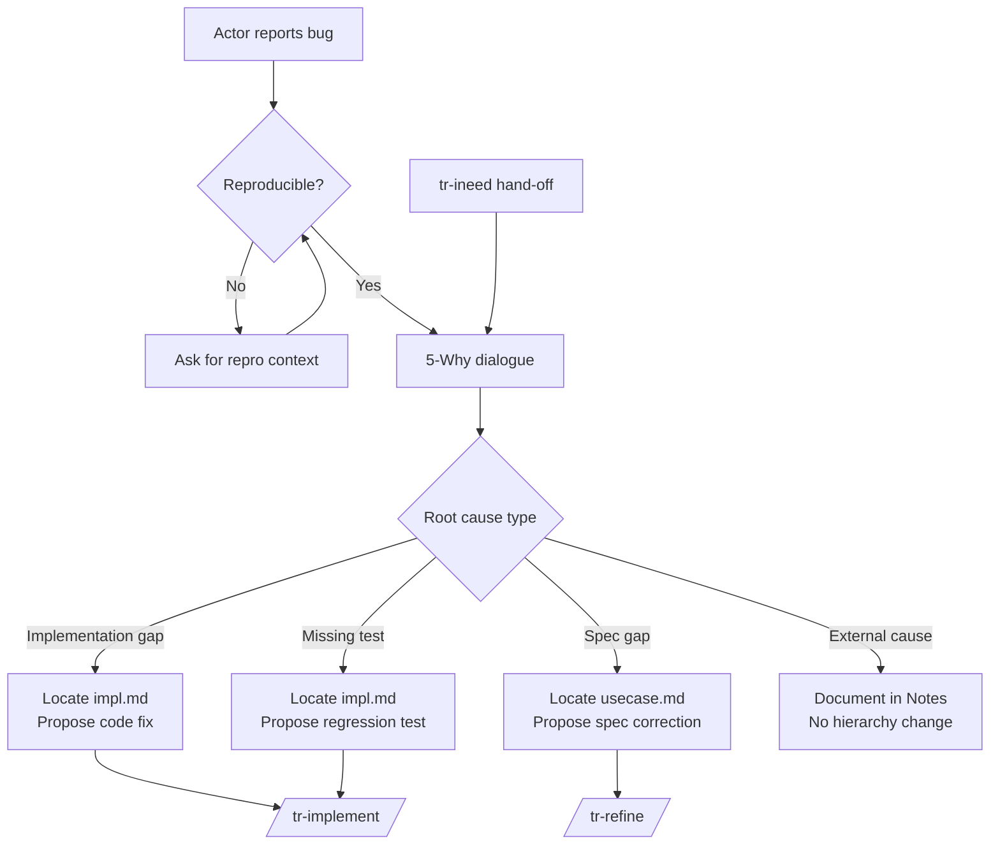

# Behaviour: Bug Triage and Root Cause Analysis

## Actor
Developer or AI coding agent who has observed a defect — unexpected system behaviour, a failing test, or a user-reported issue

## Preconditions
- The bug is observable: a symptom, reproduction steps, or failing test exists
- The taproot hierarchy exists in the project

## Main Flow
1. Actor invokes `/tr-bug` with a symptom description (or receives a hand-off from `/tr-ineed`)
2. Skill confirms the bug is reproducible: asks for a minimal reproduction scenario if not already provided
3. Skill opens structured root cause dialogue using 5-Why method:
   a. "Why did this happen?" → Actor or skill identifies the immediate cause
   b. "Why did that happen?" → Second-order cause
   c. Repeat until root cause category is reached (typically 3–5 iterations)
4. Skill classifies the root cause into one of:
   - **Implementation gap** — code does not match spec (impl.md is implicated)
   - **Spec gap** — spec does not cover this scenario (usecase.md is implicated)
   - **Missing test** — behaviour exists and works but has no test catching this regression
   - **External cause** — dependency, environment, or configuration outside the hierarchy
5. Skill locates the implicated artifact: walks the hierarchy to identify the impl.md or usecase.md responsible for the failing behaviour
6. Skill proposes a fix approach matching the root cause type and presents it for confirmation
7. Skill delegates to the appropriate next step:
   - **Implementation gap** → `/tr-implement <impl-path>` (update existing impl)
   - **Spec gap** → `/tr-refine <usecase-path>` (correct or extend the spec)
   - **Missing test** → `/tr-implement <impl-path>` (add regression test)
   - **External cause** → documents the finding in the implicated impl.md Notes section

## Alternate Flows
### Bug not reproducible
- **Trigger:** Actor cannot confirm the symptom recurs consistently
- **Steps:**
  1. Skill asks for additional context: environment, inputs, frequency, logs
  2. If still not reproducible after clarification, skill documents the report and suspends: "Cannot confirm reproduction — add a failing test case and re-run `/tr-bug` once it's consistent."

### tr-ineed hand-off
- **Trigger:** `/tr-ineed` detects a bug-shaped input ("it's broken", "this crashes", "wrong output for X") and delegates here
- **Steps:**
  1. Skill receives symptom description from tr-ineed
  2. Skips reproduction confirmation prompt — tr-ineed has already confirmed the intent; proceed directly to 5-Why dialogue (step 3)

### Multiple root causes
- **Trigger:** 5-Why analysis surfaces two independent causes
- **Steps:**
  1. Skill lists both causes and asks: "Which should we fix first?"
  2. Proceeds with the selected cause; notes the deferred one in the implicated impl.md

### Root cause points to an undocumented behaviour
- **Trigger:** The failing behaviour has no impl.md or usecase.md in the hierarchy
- **Steps:**
  1. Skill notes: "This behaviour isn't in the hierarchy yet."
  2. Delegates to `/tr-ineed` to place it, then returns to the fix flow

## Postconditions
- Root cause is identified and classified
- Implicated artifact (impl.md or usecase.md) is named
- Fix approach is proposed and confirmed
- Delegated to tr-implement or tr-refine

## Error Conditions
- **Cannot locate implicated impl.md**: skill produces a hypothesis ("this looks like it lives in `<path>`") and asks the developer to confirm before proceeding
- **Root cause is infrastructure or environment**: skill documents the finding as a Note in the nearest impl.md and stops — no hierarchy change made

## Flow

## Related
- `../route-requirement/usecase.md` — tr-ineed detects bug-shaped inputs and hands off here
- `../../hierarchy-integrity/pre-commit-enforcement/usecase.md` — failing pre-commit hook is a common bug trigger
- `../../quality-gates/definition-of-done/usecase.md` — missing test root cause leads to a DoD gap

## Acceptance Criteria

**AC-1: Happy path — implementation gap identified and delegated**
- Given a reproducible bug and a clear failing behaviour traceable to an impl.md
- When the actor runs `/tr-bug` and completes the 5-Why dialogue
- Then the skill identifies the implicated impl.md, proposes a fix, and delegates to `/tr-implement`

**AC-2: Spec gap identified and delegated to tr-refine**
- Given a bug caused by a missing or incorrect scenario in a usecase.md
- When the actor completes the 5-Why dialogue
- Then the skill identifies the implicated usecase.md and delegates to `/tr-refine`

**AC-3: Non-reproducible bug suspended**
- Given a bug that cannot be reproduced after clarification
- When the actor cannot provide a consistent reproduction case
- Then the skill suspends with a message instructing the actor to add a failing test first

**AC-4: tr-ineed hand-off skips reproduction prompt**
- Given tr-ineed delegates a bug-shaped input to tr-bug
- When tr-bug receives the hand-off
- Then the skill proceeds directly to 5-Why without asking for reproduction confirmation

**AC-5: Multiple root causes — actor chooses priority**
- Given 5-Why analysis surfaces two independent causes
- When the skill presents both
- Then the actor selects one; the other is noted in the impl.md and deferred

**AC-6: Undocumented behaviour routes to tr-ineed**
- Given the failing behaviour has no impl.md or usecase.md
- When the root cause analysis locates the gap
- Then the skill delegates to `/tr-ineed` to place the behaviour before fixing

## Status
- **State:** specified
- **Created:** 2026-03-24
- **Last reviewed:** 2026-03-24
