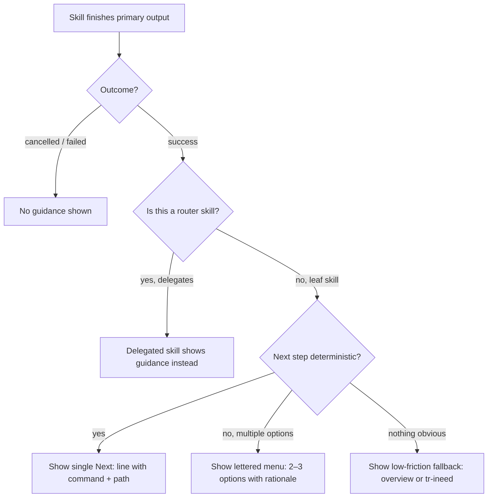

# Behaviour: Contextual Next-Step Guidance

## Actor
Any taproot skill (`/tr-behaviour`, `/tr-implement`, `/tr-status`, etc.) at the moment it produces its primary output

## Preconditions
- A skill has completed its main action (written a document, run a check, produced a report)
- The skill knows its own identity and the outcome of its execution

## Main Flow
1. Skill finishes writing its primary output (spec, report, impl record, etc.)
2. Skill identifies its completion context: which skill just ran and what was the outcome (success / partial / nothing-to-do)
3. Skill looks up the canonical next step for that context from the next-step map (see Notes)
4. Skill appends a **Next step** block at the end of its output:
   - **Deterministic** (one clear continuation): `**Next:** \`/tr-implement taproot/<path>/\` — implement this behaviour`
   - **Open-ended** (multiple valid options): lettered menu with the command and a one-line reason for each

   ```
   **What's next?**
   [A] `/tr-implement taproot/my-intent/my-behaviour/` — start building
   [B] `/tr-review taproot/my-intent/my-behaviour/usecase.md` — stress-test the spec first
   ```
5. Developer reads the suggestion and either acts on it or ignores it

## Alternate Flows

### Deterministic continuation
- **Trigger:** The skill's completion context maps to exactly one sensible next step (e.g. `/tr-behaviour` always leads to `/tr-implement` or `/tr-review`)
- **Steps:**
  1. Skill presents a single **Next:** line with the exact command and path pre-filled
  2. No menu — one line, no options to evaluate

### Open-ended context
- **Trigger:** Multiple next steps are equally valid (e.g. after `/tr-discover`, the developer might want `/tr-status`, `/tr-plan`, or `/tr-ineed`)
- **Steps:**
  1. Skill presents a lettered menu of 2–3 options, each with a one-line rationale
  2. Developer replies with a letter or runs the command directly

### Mid-chain skill (router delegates to another skill)
- **Trigger:** The skill's primary action is to delegate to another skill (e.g. `/tr-ineed` routes to `/tr-behaviour`)
- **Steps:**
  1. The *router* skill does **not** append next-step guidance — it delegates instead
  2. The *target* skill (e.g. `/tr-behaviour`) appends guidance at the end of its own run
  3. One guidance block per workflow chain, at the leaf skill

### Skill produced no primary output (cancelled or failed)
- **Trigger:** The skill was abandoned, the developer said "stop", or the outcome was an error
- **Steps:**
  1. No next-step guidance is shown
  2. Skill may still show an error summary, but no forward path is proposed

### Nothing obvious follows
- **Trigger:** The skill is a terminal action (e.g. `/tr-status` run at the end of a sprint, nothing in flight)
- **Steps:**
  1. Skill proposes a low-friction fallback: `taproot overview` to orient, or `/tr-ineed` to capture anything new
  2. Guidance is framed as optional: "Nothing obvious next — whenever you're ready: ..."

## Postconditions
- The developer knows exactly what command to run next, or has 2–3 named options to choose from
- The guidance is concrete: a real command with a real path, not "consider implementing this"
- No extra turn required to figure out what to do next

## Error Conditions
- **Context is genuinely ambiguous and no reasonable options exist:** Skill omits the guidance block entirely — silence is better than a placeholder like "consider what to do next"

## Flow


## Related
- `taproot/human-integration/route-requirement/usecase.md` — route-requirement is a router skill; it delegates and the leaf skill shows guidance, not the router
- `taproot/human-integration/grill-me/usecase.md` — grill-me is invoked mid-skill; guidance fires at the end of the *calling* skill, not grill-me itself
- `taproot/agent-integration/update-adapters-and-skills/usecase.md` — skill files are the implementation surface; this behaviour defines what every skill file must include at the end of its Steps section

## Acceptance Criteria

**AC-1: Deterministic next step shown after /tr-behaviour**
- Given a developer has just completed `/tr-behaviour` and a new `usecase.md` was written
- When the skill finishes its output
- Then the skill appends a single **Next:** line with `/tr-implement <path>` and a brief reason, requiring no further interaction

**AC-2: Lettered menu shown for open-ended context**
- Given a developer has just completed `/tr-discover` and the next step could be any of several workflows
- When the skill finishes its output
- Then the skill appends a 2–3 option lettered menu, each with a concrete command and one-line rationale

**AC-3: No guidance shown when skill is cancelled or failed**
- Given a skill was abandoned mid-flow or produced an error
- When the skill exits
- Then no next-step guidance is appended

**AC-4: Mid-chain router does not double-show guidance**
- Given `/tr-ineed` routes to `/tr-behaviour`
- When `/tr-behaviour` finishes
- Then only `/tr-behaviour` shows next-step guidance; `/tr-ineed` does not append a second block

**AC-5: Nothing-obvious fallback is low-friction and optional**
- Given a terminal skill runs with nothing obvious to do next
- When the skill finishes
- Then a soft fallback is shown (e.g. `taproot overview` or `/tr-ineed`) framed as optional, not as a required action

## Status
- **State:** specified
- **Created:** 2026-03-19
- **Last reviewed:** 2026-03-19

## Notes
- **Canonical next-step map** (deterministic continuations):
  - `/tr-intent` → `/tr-behaviour` (define the first behaviour) or `/tr-decompose` (if intent is large)
  - `/tr-behaviour` → `/tr-implement <path>/` (start building) **or** `/tr-review <usecase.md>` (stress-test first) — two options, not one
  - `/tr-implement` → `taproot dod <impl-path>` (run DoD and mark complete)
  - `/tr-refine` → `taproot validate-format --path <path>/` then commit; if significant changes, `/tr-implement`
  - `/tr-review` → `/tr-refine <path>` (if issues found) or `/tr-implement <path>/` (if clean)
  - `/tr-plan` → `/tr-implement <returned-slice-path>/`
  - `/tr-status` → `/tr-plan` (pick next item) or `/tr-ineed` (capture a gap)
  - `/tr-discover` → `/tr-status` (see coverage), `/tr-plan` (get next slice), or `/tr-ineed` (add missing requirements)
  - `/tr-analyse-change` → `/tr-refine <path>` (apply safe changes) or `/tr-intent <path>` (if upstream affected)
  - `/tr-promote` → `/tr-refine` on impacted sibling behaviours
  - `/tr-grill-me` → `/tr-ineed "<clarified requirement>"` or `/tr-behaviour <path>/`
- The implementation surface is **each skill file's `## Steps` section** — the last step must include the guidance block. This is enforced by convention, not by a CLI check.
- Guidance must use real paths: if the skill just created `taproot/my-intent/my-behaviour/usecase.md`, the next step must say `/tr-implement taproot/my-intent/my-behaviour/` — not a generic placeholder.
- The goal is zero cognitive overhead: the developer should be able to copy-paste or click the command without thinking.
