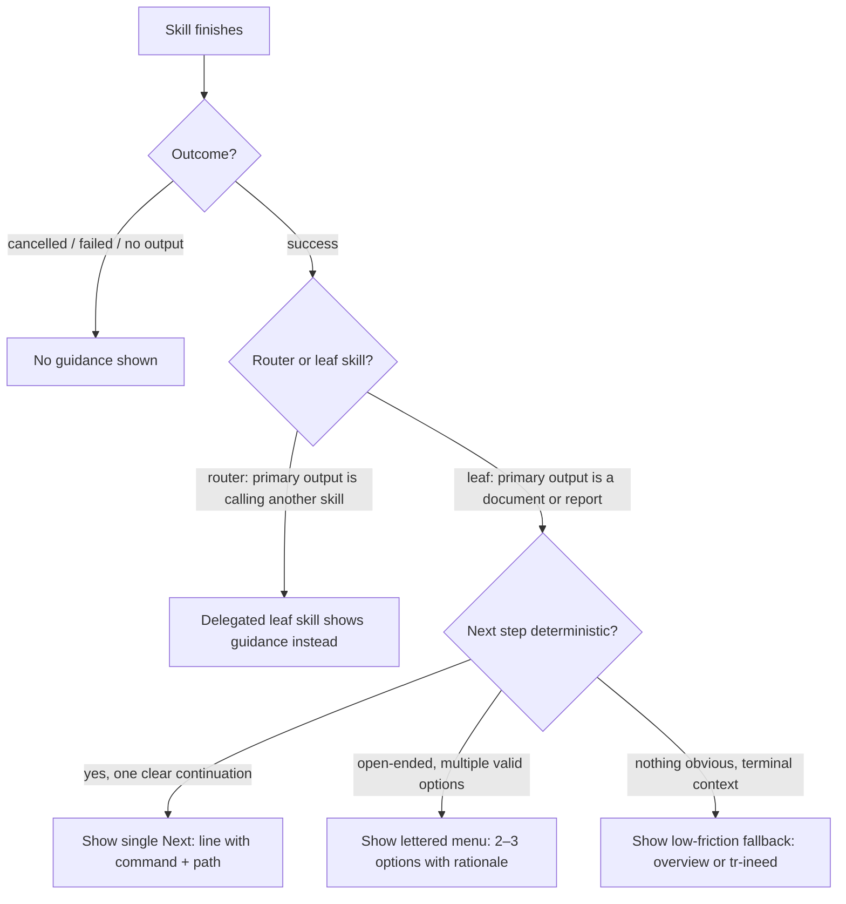

# Behaviour: Contextual Next-Step Guidance

## Actor
Any taproot skill (`/tr-behaviour`, `/tr-implement`, `/tr-status`, etc.) at the moment it produces its primary output

## Preconditions
- A skill has completed its main action (written a document, run a check, produced a report)
- The skill knows its own identity and the outcome of its execution

## Main Flow
1. Skill finishes writing its primary output (spec, report, impl record, etc.)
2. Skill identifies its completion context: which skill just ran and whether the outcome was success or cancelled/failed
3. Skill looks up the canonical next step for that context from the next-step map (see Notes — that section is the authoritative map; skill authors copy from it when implementing their last step)
4. Skill appends a **Next step** block at the end of its output:
   - **Deterministic** (one clear continuation): `**Next:** \`taproot dod taproot/<path>/impl.md\` — run DoD and mark complete`
   - **Open-ended** (multiple valid options): lettered menu with the command and a one-line reason for each

   ```
   **What's next?**
   [A] `/tr-implement taproot/my-intent/my-behaviour/` — start building
   [B] `/tr-review taproot/my-intent/my-behaviour/usecase.md` — stress-test the spec first
   ```
5. Developer reads the suggestion and either acts on it or ignores it

## Alternate Flows

### Deterministic continuation
- **Trigger:** The skill's completion context maps to exactly one sensible next step — e.g. `/tr-implement` always leads to `taproot dod`, `/tr-plan` always leads to `/tr-implement`
- **Steps:**
  1. Skill presents a single **Next:** line with the exact command and path pre-filled
  2. No menu — one line, no options to evaluate

### Open-ended context
- **Trigger:** Multiple next steps are equally valid — e.g. after `/tr-behaviour`, the developer may want to implement immediately or review first; after `/tr-discover`, they may want status, planning, or to add requirements
- **Steps:**
  1. Skill presents a lettered menu of 2–3 options, each with a one-line rationale
  2. Developer replies with a letter or runs the command directly

### Mid-chain skill (router delegates to another skill)
- **Trigger:** The skill's primary output is calling another skill rather than producing a document or report (see Notes for the router/leaf definition)
- **Steps:**
  1. The *router* skill does **not** append next-step guidance — it delegates instead
  2. The *target* (leaf) skill appends guidance at the end of its own run
  3. One guidance block per workflow chain, at the leaf skill

### Skill produced no primary output (cancelled or failed)
- **Trigger:** The skill was abandoned, the developer said "stop", or the outcome was an error with no document written
- **Steps:**
  1. No next-step guidance is shown
  2. Skill may still show an error summary, but no forward path is proposed

### Nothing obvious follows
- **Trigger:** The skill succeeded but has no deterministic continuation and the context is terminal — e.g. `/tr-status` run at end of sprint with everything healthy, `/tr-guide` run standalone
- **Steps:**
  1. Skill proposes a low-friction fallback: `taproot overview` to orient, or `/tr-ineed` to capture anything new
  2. Guidance is framed as optional: "Nothing obvious next — whenever you're ready: ..."

### `/tr-ineed` terminates without delegating (near-duplicate detected)
- **Trigger:** `/tr-ineed` finds an existing behaviour that matches the stated requirement and stops rather than routing to a new skill
- **Steps:**
  1. `/tr-ineed` shows the matched document and presents next steps as a leaf: `/tr-refine <path>` (if the requirement is a refinement) or confirm it is the same and stop

## Postconditions
- The final block of the skill output contains either a `**Next:**` line (deterministic) or a `**What's next?**` section (open-ended or fallback)
- The guidance names a real command with a real path — no generic placeholders
- The developer can act on the suggestion without any additional orientation turn

## Error Conditions
- **Context is genuinely ambiguous and no reasonable options exist:** Skill omits the guidance block entirely — silence is better than a placeholder like "consider what to do next"

## Flow


## Related
- `taproot/human-integration/route-requirement/usecase.md` — route-requirement is a router skill; the leaf skill it delegates to shows guidance
- `taproot/human-integration/grill-me/usecase.md` — grill-me is invoked mid-skill by callers; guidance fires at the end of the *calling* skill, not grill-me
- `taproot/agent-integration/update-adapters-and-skills/usecase.md` — skill files are the implementation surface; `taproot update` propagates skill changes

## Acceptance Criteria

**~~AC-1: Deterministic next step shown after /tr-behaviour~~**
~~- Given a developer has just completed `/tr-behaviour` and a new `usecase.md` was written~~
~~- When the skill finishes its output~~
~~- Then the skill appends a single **Next:** line with `/tr-implement <path>` and a brief reason, requiring no further interaction~~

**AC-1: Open-ended menu shown after /tr-behaviour**
- Given a developer has just completed `/tr-behaviour` and a new `usecase.md` was written
- When the skill finishes its output
- Then the skill appends a `**What's next?**` menu with `/tr-implement <path>` and `/tr-review <usecase.md>` as lettered options

**AC-2: Lettered menu shown for open-ended context**
- Given a developer has just completed `/tr-discover` and the next step could be any of several workflows
- When the skill finishes its output
- Then the skill appends a 2–3 option lettered menu, each with a concrete command and one-line rationale

**AC-3: No guidance shown when skill is cancelled or failed**
- Given a skill was abandoned mid-flow or produced an error with no primary output
- When the skill exits
- Then no next-step guidance is appended

**AC-4: Mid-chain router does not double-show guidance**
- Given `/tr-ineed` routes to `/tr-behaviour`
- When `/tr-behaviour` finishes
- Then only `/tr-behaviour` shows next-step guidance; `/tr-ineed` does not append a second block

**AC-5: Nothing-obvious fallback contains the optional framing phrase**
- Given a terminal skill runs with nothing obvious to follow
- When the skill finishes
- Then the output contains a soft fallback command preceded by "Nothing obvious next" or equivalent, making clear it is optional

**AC-6: /tr-ineed near-duplicate termination shows refinement option**
- Given `/tr-ineed` detects an existing behaviour that matches the requirement and stops
- When the match is confirmed
- Then the output presents `/tr-refine <matched-path>` as the next step rather than silently stopping

## Status
- **State:** specified
- **Created:** 2026-03-19
- **Last reviewed:** 2026-03-20

## Notes
- **Router vs leaf:** A skill is a **router** if its primary output is invoking another skill (e.g. `/tr-ineed` routes to `/tr-behaviour`; `/tr-decompose` routes to multiple `/tr-behaviour` calls). A skill is a **leaf** if its primary output is a document, report, or validation result. When in doubt: if the skill ends by writing files or presenting findings directly, it is a leaf and must show guidance.
- **Canonical next-step map** — this Notes section is the authoritative reference. When implementing this behaviour in a skill file, copy the relevant entry into the skill's final step. When a new skill is added to the ecosystem, update this map first, then propagate to the skill file:
  - `/tr-intent` → open-ended: `/tr-behaviour <intent-path>/` (define first behaviour) **or** `/tr-decompose <intent-path>/` (if intent has many sub-behaviours)
  - `/tr-behaviour` → open-ended: `/tr-implement <path>/` (start building) **or** `/tr-review <usecase.md>` (stress-test first)
  - `/tr-implement` → deterministic: `taproot dod <impl-path>` (run DoD and mark complete)
  - `/tr-refine` → open-ended: commit the change **or** `/tr-implement <path>/` (if spec changes require reimplementing)
  - `/tr-review` → open-ended: `/tr-refine <path>` (if issues found) **or** `/tr-implement <path>/` (if spec is clean)
  - `/tr-plan` → deterministic: `/tr-implement <returned-slice-path>/`
  - `/tr-status` → open-ended: `/tr-plan` (pick next item) **or** `/tr-ineed` (capture a gap)
  - `/tr-discover` → open-ended: `/tr-status` (see coverage), `/tr-plan` (get next slice), or `/tr-ineed` (add missing requirements)
  - `/tr-analyse-change` → open-ended: `/tr-refine <path>` (apply safe changes) **or** `/tr-intent <path>` (if upstream affected)
  - `/tr-promote` → open-ended: `/tr-refine` on each impacted sibling behaviour
  - `/tr-grill-me` → open-ended: `/tr-ineed "<clarified requirement>"` **or** `/tr-behaviour <path>/`
  - `/tr-decompose` → open-ended: `/tr-behaviour <intent-path>/` (define first sub-behaviour) **or** `/tr-status` (see what's now planned)
  - `/tr-trace` → open-ended: navigate to the identified document **or** `/tr-refine <path>` (if drift found between code and spec)
  - `/tr-guide` → nothing obvious: "Whenever you're ready — `/tr-ineed` to capture a requirement, or `/tr-status` for a project overview"
- Guidance must use real paths: if the skill just created `taproot/my-intent/my-behaviour/usecase.md`, the next step must say `/tr-implement taproot/my-intent/my-behaviour/` — not a generic placeholder.
- The goal is zero cognitive overhead: the developer should be able to copy-paste or click the command without thinking.
