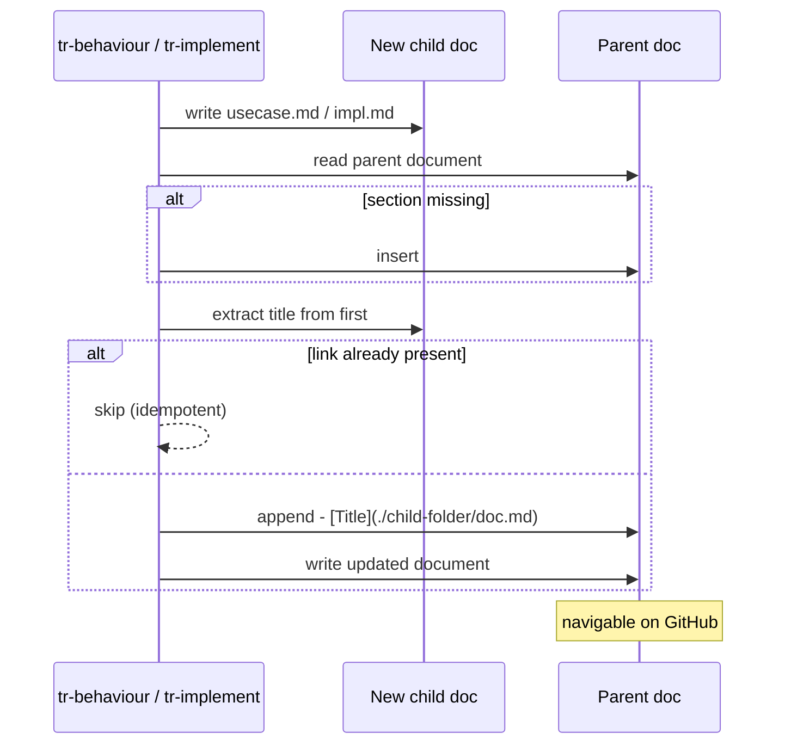

# Behaviour: Cross-Linked Specs

## Actor
`tr-behaviour` skill (when creating a new `usecase.md`) and `tr-implement` skill (when creating a new `impl.md`) — both maintain the link sections in their parent documents as a side-effect of document creation. `taproot update` runs a link-refresh pass across the full tree to backfill existing documents.

## Preconditions
- A taproot hierarchy exists with at least one intent
- `tr-behaviour` or `tr-implement` is about to write a new child document (creation path), OR `taproot update` is running (backfill path)

## Main Flow
1. Skill creates a new child document (`usecase.md` or `impl.md`) in the hierarchy
2. Skill determines the parent document path:
   - For `usecase.md`: parent is `intent.md` or a parent `usecase.md`
   - For `impl.md`: parent is the containing `usecase.md`
3. Skill reads the parent document and checks for the generated link section:
   - `intent.md` → `## Behaviours`
   - `usecase.md` → `## Implementations`
4. If the section does not exist, skill inserts it before `## Status`; if `## Status` is absent, skill appends it at end of file
5. Skill derives the link title from the child document's first `# Heading` line; falls back to the folder slug if no heading is found
6. Skill appends a relative markdown link (relative to the parent document's directory) to the section:
   - Format: `- [<Title>](./<child-folder>/usecase.md)` or `- [<Title>](./<child-folder>/impl.md)`
7. Skill writes the updated parent document

## Alternate Flows

### Link already present (idempotent run)
- **Trigger:** The child document's link already exists in the parent's section (e.g., re-running the skill after a partial failure)
- **Steps:**
  1. Skill detects the link already present in the section
  2. Skill skips the append — no duplicate is written

### Backfill existing hierarchy (`taproot update`)
- **Trigger:** Developer runs `taproot update` on a project that has existing intents/behaviours without `## Behaviours` or `## Implementations` sections
- **Steps:**
  1. `taproot update` walks all `intent.md` files in the hierarchy
  2. For each `intent.md`, enumerates child behaviour folders (folders containing `usecase.md`)
  3. Ensures `## Behaviours` section exists; appends any missing child links (skips links already present)
  4. For each `usecase.md`, enumerates child impl folders (folders containing `impl.md`)
  5. Ensures `## Implementations` section exists; appends any missing child links
  6. Reports each modified file: `updated  <path>` — same format as other `taproot update` output

### Generated section preserved during refinement
- **Trigger:** `tr-refine` or `tr-intent` rewrites a parent document that contains a generated link section
- **Steps:**
  1. Before rewriting, skill reads and preserves the full content of `## Behaviours` or `## Implementations` section
  2. After applying other changes, skill re-inserts the preserved section before `## Status`
  3. If the section was absent in the rewrite target, skill re-appends it at end of file

### Parent section does not exist yet
- **Trigger:** The parent document was authored before this behaviour was introduced and has no `## Behaviours` or `## Implementations` section (creation path — single document)
- **Steps:**
  1. Skill locates the `## Status` heading in the parent document
  2. Skill inserts the new section immediately before `## Status`
  3. Skill writes the link entry into the new section

### Child document deleted manually
- **Trigger:** A `usecase.md` or `impl.md` is removed from the filesystem but its link remains in the parent
- **Steps:**
  1. `taproot validate-format` detects that the linked file does not exist
  2. Reports: `STALE_LINK — link in ## Behaviours/## Implementations points to non-existent file <path>`
  3. Developer removes the stale link manually, or runs `taproot update` which prunes stale links during its refresh pass

## Postconditions
- Parent document contains a `## Behaviours` or `## Implementations` section, marked with `<!-- taproot-managed -->` on the section line, so tools and humans know it is maintained by taproot and should not be manually reordered
- Links are valid relative paths (resolved from the parent document's directory), navigable on GitHub and any standard markdown renderer
- `taproot validate-format` checks: every `intent.md` with child behaviour folders has a `## Behaviours` section; every `usecase.md` with child impl folders has an `## Implementations` section; every link in those sections resolves to an existing file

## Error Conditions
- **Parent document not found**: skill reports an internal error and does not write the child document — the hierarchy must be consistent before proceeding
- **Child document title not parseable** (no `# Heading` found): skill falls back to the folder slug as the link title and continues — no failure
- **Concurrent write conflict**: if two skill runs modify the same parent simultaneously, the last write wins silently. Mitigation: skills are agent-driven and typically sequential; concurrent runs are out of scope for this behaviour

## Flow

## Related
- `../human-readable-report/usecase.md` — both serve hierarchy legibility; status report gives a dashboard view, cross-links give in-place navigation
- `../../hierarchy-integrity/validate-format/usecase.md` — validate-format is extended to enforce link section presence, link validity, and resolution of relative paths
- `../../hierarchy-integrity/validate-structure/usecase.md` — structural validation detects orphaned folders; link validation is complementary, not redundant
- `../../taproot-lifecycle/update-installation/usecase.md` — `taproot update` runs the backfill pass (Alternate Flow: Backfill existing hierarchy) as part of its standard refresh cycle

## Implementations <!-- taproot-managed -->
- [Multi-Surface — validate-format + update backfill + skill steps](./multi-surface/impl.md)

## Status
- **State:** specified
- **Created:** 2026-03-19
- **Last reviewed:** 2026-03-19

