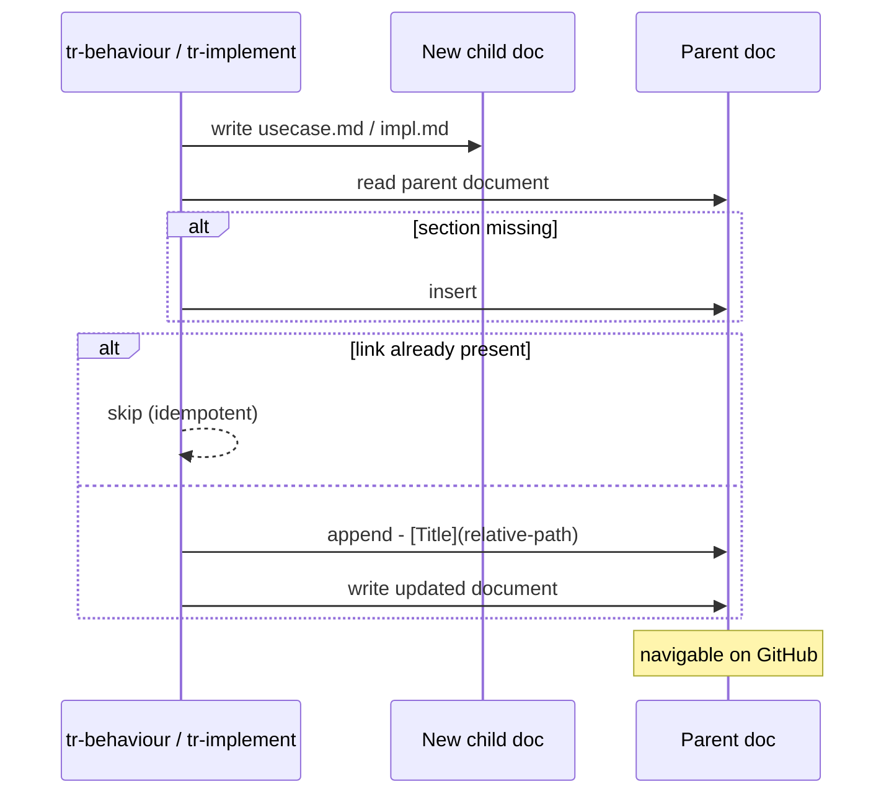

# Behaviour: Cross-Linked Specs

## Actor
`tr-behaviour` skill (when creating a new `usecase.md`) and `tr-implement` skill (when creating a new `impl.md`) — both maintain the link sections in their parent documents as a side-effect of document creation.

## Preconditions
- A taproot hierarchy exists with at least one intent
- `tr-behaviour` or `tr-implement` is about to write a new child document

## Main Flow
1. Skill creates a new child document (`usecase.md` or `impl.md`) in the hierarchy
2. Skill determines the parent document path:
   - For `usecase.md`: parent is `intent.md` or a parent `usecase.md`
   - For `impl.md`: parent is the containing `usecase.md`
3. Skill reads the parent document and checks for the generated link section:
   - `intent.md` → `## Behaviours`
   - `usecase.md` → `## Implementations`
4. If the section does not exist, skill inserts it before `## Status`
5. Skill appends a relative markdown link to the new child document:
   - Format: `- [<Title>](<relative-path>)`
6. Skill writes the updated parent document
7. On `taproot validate-format`, system checks that:
   - Every `intent.md` with child behaviour folders has a `## Behaviours` section
   - Every `usecase.md` with child impl folders has an `## Implementations` section
   - Every link in those sections resolves to an existing file

## Alternate Flows

### Link already present (idempotent run)
- **Trigger:** The child document's link already exists in the parent's section (e.g., re-running the skill after a partial failure)
- **Steps:**
  1. Skill detects the link already present in the section
  2. Skill skips the append — no duplicate is written

### Parent section does not exist yet
- **Trigger:** The parent document was authored before this behaviour was introduced and has no `## Behaviours` or `## Implementations` section
- **Steps:**
  1. Skill locates the `## Status` heading in the parent document
  2. Skill inserts the new section immediately before `## Status`
  3. Skill writes the link entry into the new section

### Child document deleted manually
- **Trigger:** A `usecase.md` or `impl.md` is removed from the filesystem but its link remains in the parent
- **Steps:**
  1. `taproot validate-format` detects that the linked file does not exist
  2. Reports: `STALE_LINK — link in ## Behaviours/## Implementations points to non-existent file <path>`
  3. Developer removes the stale link manually or via `tr-refine` on the parent

## Postconditions
- Parent document contains a `## Behaviours` or `## Implementations` section with a link to the new child
- Links are valid relative paths, navigable on GitHub and any markdown renderer that supports relative links
- `taproot validate-format` passes on the parent document

## Error Conditions
- **Parent document not found**: skill reports an internal error and does not write the child document — the hierarchy must be consistent
- **Section insertion point missing** (`## Status` not found in parent): skill appends section at end of file and warns: `"## Status not found in <parent> — appended ## Behaviours/## Implementations at end of file"`

## Flow

## Related
- `../human-readable-report/usecase.md` — both serve hierarchy legibility; status report gives a dashboard, cross-links give in-place navigation
- `../../hierarchy-integrity/validate-format/usecase.md` — validate-format is extended to enforce link section presence and link validity
- `../../hierarchy-integrity/validate-structure/usecase.md` — structural validation detects orphaned folders; link validation is complementary
- `../../agent-integration/update-adapters-and-skills/usecase.md` — `taproot update` could run a link-refresh pass as part of its stale cleanup

## Status
- **State:** specified
- **Created:** 2026-03-19
- **Last reviewed:** 2026-03-19
