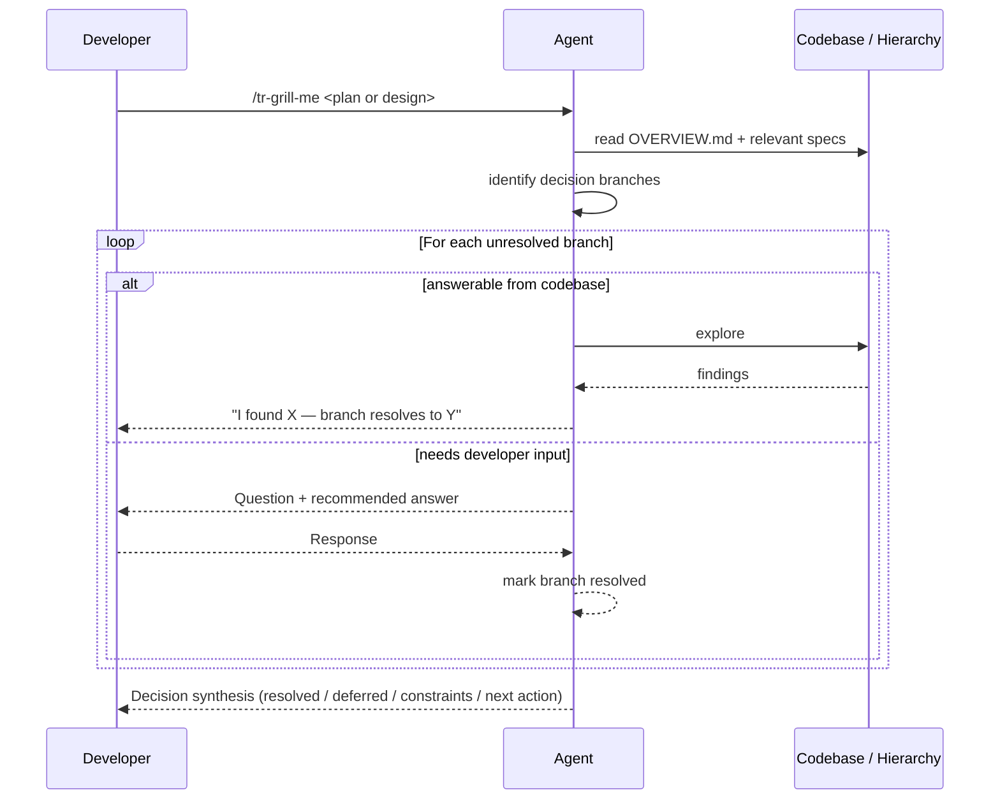

# Behaviour: Grill Me

## Actor
Developer or orchestrator who wants to stress-test a plan, design decision, or vague idea through relentless structured questioning — invoked directly via `/tr-grill-me`, or called by another skill (`tr-ineed`, `tr-behaviour`) when deeper elicitation is needed before writing a spec.

## Preconditions
- Developer has a plan, design decision, or concept they want to think through (can be partially-formed)
- The taproot hierarchy and codebase are accessible for context

## Main Flow
1. Developer invokes `/tr-grill-me` with a description of the plan or design to explore
2. Agent reads `taproot/OVERVIEW.md` and any relevant existing specs to understand current context — this informs the questions it will ask
3. Agent identifies the key decision branches in the plan: the points where different choices lead to meaningfully different outcomes (architecture, scope, actor, dependencies, tradeoffs)
4. Agent asks the first question and **immediately provides its own recommended answer** before waiting for the developer to respond — the developer should react to the recommendation, not start from scratch
5. Developer responds; agent accepts, challenges, or refines the answer, then marks that branch resolved
6. Agent moves to the next unresolved branch and repeats: ask → recommend → resolve
7. Agent continues until all identified branches of the decision tree are resolved or explicitly deferred
8. Agent produces a decision synthesis:
   - Resolved decisions: what was chosen and why
   - Deferred decisions: what was skipped and what would trigger revisiting it
   - Surfaced constraints: limits or risks that emerged during the session
   - Recommended next action: the clearest next step given the resolved decisions

## Alternate Flows

### Question answerable from the codebase or hierarchy
- **Trigger:** A question about architecture, existing behaviour, or code structure can be resolved by exploring the repo rather than asking the developer
- **Steps:**
  1. Agent explores the codebase or hierarchy directly
  2. Agent presents what it found: "I checked `<path>` — it already handles X, so this branch resolves to Y"
  3. Branch is marked resolved without asking the developer

### Called by another skill (embedded mode)
- **Trigger:** `tr-ineed` (option [A] — Go Deeper), `tr-behaviour`, or another skill delegates to `grill-me` for deeper elicitation before continuing
- **Steps:**
  1. Agent runs the grill-me session scoped to the specific decision the calling skill needs resolved
  2. At the end, agent returns the synthesis summary to the calling skill rather than presenting a standalone report
  3. The calling skill continues from where it delegated

### Developer requests to skip a branch
- **Trigger:** Developer says the question is out of scope, already decided, or not relevant right now
- **Steps:**
  1. Agent notes the branch as explicitly deferred with the developer's stated reason
  2. Agent moves to the next branch

### Plan is too vague to identify branches
- **Trigger:** The input is too abstract to extract specific decision points
- **Steps:**
  1. Agent asks one grounding question: "What specifically are you trying to decide? What's the outcome you're trying to reach?"
  2. Developer responds with a more concrete framing
  3. Agent identifies branches from the refined input and proceeds from Main Flow step 3

## Postconditions
- Every branch of the decision tree has been walked and is either resolved or explicitly deferred with a stated reason
- Each resolved decision has a chosen path and the reasoning behind it
- Developer leaves with a clearer, more complete understanding of the plan — and a concrete next action
- When called in embedded mode: the synthesis is available as structured input for the calling skill

## Error Conditions
- **Unknown required to resolve a branch**: Agent cannot answer from the codebase and the developer doesn't know either — agent marks the branch as `UNKNOWN`, flags what information would resolve it, and moves on

## Flow

## Related
- `./route-requirement/usecase.md` — `tr-ineed` delegates to `grill-me` on the "Go deeper [A]" path during structured discovery
- `./human-readable-report/usecase.md` — `tr-status` suggests `tr-grill-me` for semantic review of the plan after reporting hierarchy health

## Status
- **State:** specified
- **Created:** 2026-03-19
- **Last reviewed:** 2026-03-19

## Notes
- Based on Matt Pocock's `grill-me` skill (MIT licensed, https://github.com/mattpocock/skills/blob/main/grill-me/SKILL.md): "Interview me relentlessly about every aspect of this plan until we reach a shared understanding. Walk down each branch of the design tree, resolving dependencies between decisions one-by-one. For each question, provide your recommended answer."
- The agent always provides its recommended answer before the developer responds — this makes the session a dialogue about recommendations, not a blank-slate interview
- "Relentless" means the agent does not drop a branch just because the developer gives a short answer — it pushes until the branch is genuinely resolved or explicitly deferred
- The distinction from `tr-review` (formerly `tr-grill`): `tr-review` stress-tests a finished taproot artefact from an adversarial reviewer's perspective; `tr-grill-me` interviews the developer before the artefact is written, to sharpen the thinking that goes into it
