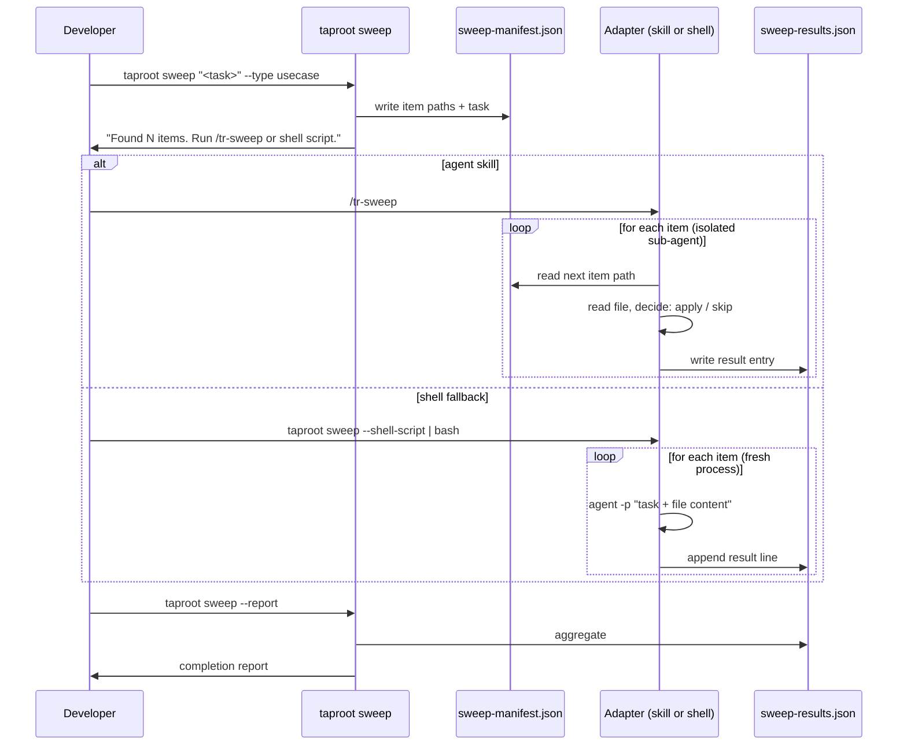

# Behaviour: Hierarchy Sweep

## Actor
Developer — triggering a uniform task across many hierarchy items without accumulating context drift. Also surfaced by `/tr-ineed` when the developer expresses a bulk-edit intent (e.g. "add X to all usecases").

## Preconditions
- A taproot hierarchy exists under `taproot/`
- The developer has a well-formed task: a prompt that can be evaluated independently per item
- The task is item-scoped — it can be applied to one file at a time without needing context from sibling items
- An agent or shell scripting environment is available to execute the sweep adapter

## Main Flow
1. Developer runs `taproot sweep "<task>" --type <intent|usecase|impl|all> [--path <subtree>] [--dry-run]`
2. System enumerates all matching hierarchy items under the given path (default: `taproot/`), ordered depth-first
3. System writes a **work manifest** to `.taproot/sweep-manifest.json` — a structured file containing the task prompt and the list of item paths (paths only, not inline content; the adapter reads each file on demand)
4. System presents the item count and manifest path:
   > "Found 14 usecases. Manifest written to `.taproot/sweep-manifest.json`.
   > Run your agent adapter: `/tr-sweep`
   > Or use the shell fallback: `taproot sweep --shell-script | bash`"
5. Developer invokes their adapter — either `/tr-sweep` (agent skill) or the shell script fallback
6. The adapter reads the manifest and processes each item in isolation:
   - Reads the item file content from disk
   - Passes task + content to an isolated agent context (fresh sub-agent, fresh process, or fresh API call)
   - Each agent independently decides: apply / skip / error
7. For each item, the agent writes a result entry to `.taproot/sweep-results.json`:
   ```json
   {"item": "taproot/foo/bar/usecase.md", "status": "modified", "note": "added 3 ACs"}
   ```
8. Developer runs `taproot sweep --report` to aggregate results:
   ```
   Sweep complete — 14 items processed
     ✓ modified:  8
     ○ skipped:   5  (already satisfied / not applicable)
     ✗ errors:    1  taproot/foo/bar/usecase.md — <reason>
   ```

## Alternate Flows

### Dry-run mode
- **Trigger:** Developer passes `--dry-run` to `taproot sweep`
- **Steps:**
  1. System writes the manifest as normal
  2. Adapter processes each item but writes `"dry-run": true` results — no files modified
  3. `taproot sweep --report` shows what would have been applied

### Sub-agent skips item
- **Trigger:** Agent determines the task does not apply to this item
- **Steps:**
  1. Agent writes a skip result with the reason
  2. Processing continues to next item
  3. Item appears as `○ skipped` in the report

### Shell scripting fallback
- **Trigger:** Developer has no agent skill adapter, is running in CI, or prefers a shell loop
- **Steps:**
  1. Developer runs `taproot sweep --shell-script` — system prints a ready-to-run shell script to stdout
  2. Script loops over manifest items, invoking the installed CLI agent per item:
     ```bash
     while IFS= read -r item; do
       result=$(claude -p "$(cat .taproot/sweep-task.txt)\n\n$(cat "$item")")
       echo "{\"item\": \"$item\", \"result\": \"$result\"}" >> .taproot/sweep-results.jsonl
     done < .taproot/sweep-items.txt
     ```
  3. Any CLI agent with a `-p` / `--print` flag works: `claude`, `gemini`, `gh copilot`, `llm`, `ollama`
  4. Each CLI invocation is a fresh process — maximum isolation, no shared context

### Partial results (sweep interrupted)
- **Trigger:** Agent session ends before all items are processed
- **Steps:**
  1. Results written so far are preserved in `.taproot/sweep-results.json`
  2. Developer runs `taproot sweep --resume` — re-generates the manifest with only unprocessed items
  3. Adapter re-runs on the remaining items

### Surfaced by `/tr-ineed`
- **Trigger:** Developer expresses a bulk-edit intent in `/tr-ineed`
- **Steps:**
  1. `/tr-ineed` detects the bulk pattern and interrupts:
     > "That sounds like a hierarchy sweep — apply a task to every matching item in isolation. Want to use `taproot sweep`?"
     > **[A] Yes** — configure and run the sweep
     > **[B] No** — route as a new requirement
  2. If [A]: agent configures and runs `taproot sweep "<task>" --type <type>`

## Postconditions
- Each applicable item has been processed by an isolated agent context (or process)
- `.taproot/sweep-results.json` records every decision with a one-line note
- `taproot sweep --report` produces a human-readable summary

## Error Conditions
- **Task is not item-scoped** (e.g. "renumber all AC IDs globally"): `taproot sweep` warns "This task requires cross-item context — consider `/tr-review-all` instead." No manifest is written.
- **No matching items found**: `No <type> items found under <path>.`
- **Manifest already exists from a prior sweep**: System prompts "A sweep manifest already exists. Overwrite, resume, or abort?"
- **Results file missing when `--report` is run**: `No results found. Run your sweep adapter or shell script first.`

## Flow


## Related
- `./route-requirement/usecase.md` — `/tr-ineed` surfaces sweep when it detects bulk-edit intent
- `./pattern-hints/usecase.md` — same interruptive surfacing mechanism
- `./pause-and-confirm/usecase.md` — related pattern: multi-document operations with developer checkpoints
- `../agent-integration/generate-agent-adapter/usecase.md` — `/tr-sweep` is an agent adapter, generated per-platform like other adapters
- `research/agent-sweep-isolation-mechanisms.md` — research backing the manifest/adapter split and per-platform compatibility

## Acceptance Criteria

**AC-1: Manifest written with correct items**
- Given a hierarchy with 5 usecases
- When developer runs `taproot sweep "<task>" --type usecase`
- Then `.taproot/sweep-manifest.json` contains exactly 5 item path entries plus the task string (no inline file content)

**AC-2: Report aggregates results correctly**
- Given sweep-results.json with 3 modified, 2 skipped entries
- When developer runs `taproot sweep --report`
- Then the report shows `modified: 3, skipped: 2, errors: 0`

**AC-3: Dry-run produces no file changes**
- Given a hierarchy with usecases
- When developer runs `taproot sweep "<task>" --type usecase --dry-run` and runs the adapter
- Then no hierarchy files are modified and results are marked `dry-run: true`

**AC-4: Resume skips already-processed items**
- Given a sweep interrupted after 3 of 5 items
- When developer runs `taproot sweep --resume`
- Then the new manifest contains only the 2 unprocessed items

**AC-5: Surfaced by `/tr-ineed`**
- Given developer says "I want to add X to all usecases" via `/tr-ineed`
- When `/tr-ineed` processes the input
- Then it interrupts and offers `taproot sweep` before routing as a new requirement

**AC-6: Shell script fallback produces valid results**
- Given a manifest with 3 items and a CLI agent with `-p` support installed
- When developer runs `taproot sweep --shell-script | bash`
- Then each item is processed in a fresh process and results appear in `sweep-results.json`

## Status
- **State:** proposed
- **Created:** 2026-03-20
- **Last reviewed:** 2026-03-20

## Notes
- **Manifest format (resolved):** Paths-only — the manifest lists item paths and the task string; adapters read file content on demand. Inline content would duplicate data and create size problems for large hierarchies.
- **Manifest location (resolved):** `.taproot/` directory — git-visible for debugging and resume capability. Add `.taproot/sweep-*.json` to `.gitignore` to keep it out of history.
- **Platform isolation:** Platforms differ in isolation mechanism — choose the adapter accordingly:
  | Platform | Isolation | Adapter type |
  |---|---|---|
  | Claude Code | Context window only (no worktree) | Skill, sequential preferred |
  | Cursor / Windsurf | Git worktree per agent | IDE Rule reads manifest on session start |
  | GitHub Copilot | Worktree + context | Background agent session per item |
  | Gemini CLI | Context window | Skill or `gemini -p` shell loop |
  | Shell / CI | Fresh process | `agent -p` shell loop |
- **Sequential vs parallel:** Claude Code sub-agents share the filesystem — concurrent edits to the same file may conflict. Sequential processing is safer for file-editing sweeps unless git worktrees are used externally.
- **Token cost:** Multi-agent sweeps run at 4–15× standard token cost depending on platform. Use `--dry-run` to preview scope before committing to a full sweep.
