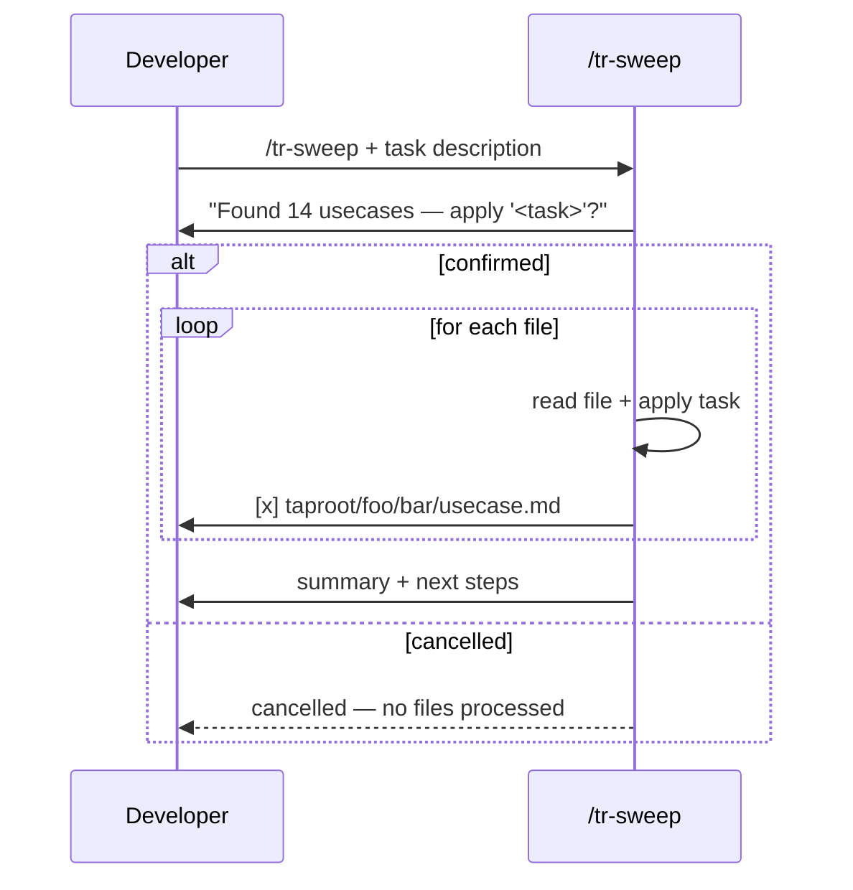

# Behaviour: Hierarchy Sweep

## Actor
Developer — applying a uniform task across many hierarchy items without accumulating context drift. Also surfaced by `/tr-ineed` when the developer expresses a bulk-edit intent (e.g. "add X to all usecases").

## Preconditions
- A taproot hierarchy exists under `taproot/`
- The task can be evaluated independently per item (no cross-item context needed)

## Main Flow
1. Developer runs `/tr-sweep` and describes the task: what to apply and which items (e.g. "add a Notes section to all usecases")
2. Skill enumerates matching items and presents the list: `"Found 14 usecases"`
3. Skill confirms with the developer before proceeding: `"Apply '<task>' to each of these 14 items?"`
4. Skill iterates through the confirmed file list in-session. For each file:
   a. Skill reads the file and applies the task prompt directly
   b. Skill marks the file as completed: `[x] taproot/foo/bar/usecase.md`
5. Developer sees live progress after each file completes:
   ```
   [x] taproot/intent-a/behaviour-b/usecase.md
   [x] taproot/intent-a/behaviour-c/usecase.md
   [ ] taproot/intent-a/behaviour-d/usecase.md ← processing...
   ```
6. After all files are processed, skill shows a summary (N modified, M skipped) and next steps

## Alternate Flows

### Developer cancels at confirmation
- **Trigger:** Developer says no at step 3
- **Steps:**
  1. Skill stops — no files are processed

### Surfaced by `/tr-ineed`
- Developer expresses a bulk-edit intent (e.g. "add X to all usecases")
- `/tr-ineed` interrupts: "That sounds like a hierarchy sweep. Want me to run `/tr-sweep`?"
- **[A] Yes** — runs the sweep
- **[B] No** — routes as a new requirement

## Postconditions
- The same task has been applied uniformly to every matching item
- Developer sees a summary of what changed

## Error Conditions
- **Task requires cross-item context** (e.g. "renumber all AC IDs globally"): skill warns "This task needs cross-item context — consider `/tr-review-all` instead." No filelist is written.
- **No matching items found**: `No <type> items found under <path>.`

## Flow


## Related
- `../route-requirement/usecase.md` — `/tr-ineed` surfaces sweep when it detects bulk-edit intent
- `../pause-and-confirm/usecase.md` — related pattern: multi-document operations with developer checkpoints

## Acceptance Criteria

**AC-1: Processes each file in-session and marks it complete**
- Given a hierarchy with 5 usecases and a developer-confirmed task
- When `/tr-sweep` runs
- Then each file is read, the task is applied, and the file is marked `[x]` as completed

**AC-2: Confirmation step prevents accidental execution**
- Given a developer who declines at the confirmation step
- When `/tr-sweep` presents the item list
- Then no files are processed

**AC-3: Surfaced by `/tr-ineed`**
- Given developer says "I want to add X to all usecases" via `/tr-ineed`
- When `/tr-ineed` processes the input
- Then it offers to invoke `/tr-sweep` before routing as a new requirement

**AC-4: Live progress visible after each file**
- Given a sweep in progress over N files
- When each file completes
- Then the developer sees `[x] <path>` for completed files and can observe progress before the sweep finishes

## Implementations <!-- taproot-managed -->
- [Agent Skill — /tr-sweep](./agent-skill/impl.md)

## Status
- **State:** implemented
- **Created:** 2026-03-20
- **Last reviewed:** 2026-03-20
- **Refined:** 2026-03-20 — execution model changed from `taproot apply` delegation to in-session per-file iteration
