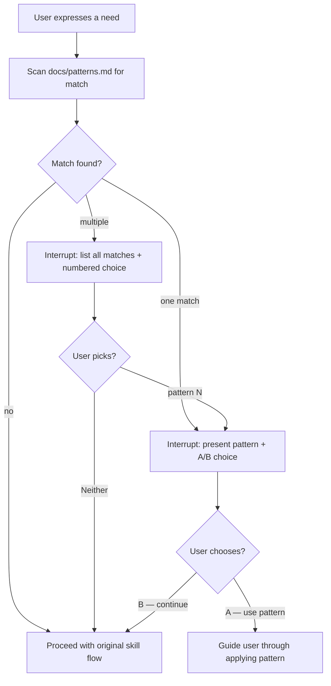

# Behaviour: Surface Relevant Patterns Before Proceeding

## Actor
Agent — processing any user-expressed need via any taproot skill (`/tr-ineed`, `/tr-behaviour`, `/tr-implement`, `/tr-refine`, or any skill that receives a natural language description of intent).

## Preconditions
- The user has expressed a need (a requirement, a rule, a constraint, a quality concern)
- `docs/patterns.md` exists and contains at least one pattern entry

## Main Flow
1. User expresses a need through any taproot skill.
2. Agent scans the stated need against the patterns listed in `docs/patterns.md`, looking for semantic matches. Trigger signals include:
   - "apply to all implementations / every implementation / every skill" → `check-if-affected-by`
   - "guide agents / architecture rules / agents should follow / enforce a rule" → `check-if-affected-by`
   - "enforce documentation quality / docs must stay current" → `document-current`
   - "every new feature must update X / keep X in sync" → `check-if-affected: X`
   - "research before building / check if a library exists" → research-first (`/tr-research`)
3. Agent interrupts the normal flow and presents the match **before proceeding**:
   > "Before I route this — that sounds like the **`<pattern-name>`** pattern. [one-line description of what it solves]. Here's how it works: [brief how-to or link to `docs/patterns.md#anchor`]."
   >
   > **[A] Use this pattern now** — I'll guide you through applying it
   > **[B] Continue as a new requirement** — route and spec it normally
4. If **[A]**: agent guides the user through applying the pattern directly (e.g. for `check-if-affected-by`: write the behaviour spec, add the DoD entry to `.taproot/settings.yaml`).
5. If **[B]**: agent continues with the original skill flow, unmodified.

## Alternate Flows

### No pattern match
- **Trigger:** Stated need does not semantically match any pattern in `docs/patterns.md`
- **Steps:**
  1. Agent proceeds with the original skill flow without interruption. No hint is shown.

### Multiple patterns match
- **Trigger:** The stated need matches two or more patterns
- **Steps:**
  1. Agent lists all matching patterns concisely, numbered:
     > "Before I route this — your need matches a couple of taproot patterns:"
     > "1. **`check-if-affected-by`** — enforce a rule across all implementations"
     > "2. **`document-current`** — keep docs accurate on every change"
  2. Agent asks: "Are either of these what you're after? **[1]** / **[2]** / **[N] Neither — continue routing**"
  3. Chosen pattern → step 4 of main flow. Neither → step 5.

### Pattern already in use
- **Trigger:** User's requirement matches a pattern that is already configured in `.taproot/settings.yaml` or already implemented in the hierarchy
- **Steps:**
  1. Agent notes the existing usage:
     > "That pattern is already active (`check-if-affected-by: skill-architecture/context-engineering`). Is your need covered by that, or is this a separate concern?"
  2. **Covered** → link to existing spec; stop.
  3. **Separate** → continue with routing.

### `docs/patterns.md` absent
- **Trigger:** `docs/patterns.md` does not exist or is empty
- **Steps:**
  1. Agent skips pattern check and proceeds with the original skill flow. No error is raised.

## Postconditions
- If a match was found and **[A]** chosen: the pattern is applied; no requirement is added to the hierarchy (the pattern itself is the resolution)
- If **[B]** chosen or no match: the original skill flow completes normally
- No hint is shown when no match exists — the flow is not interrupted unnecessarily

## Error Conditions
- **`docs/patterns.md` cannot be parsed** (malformed markdown): agent silently skips pattern check and proceeds. No error surfaced to the user — pattern hints are enhancement, not blocker.

## Flow

## Related
- `../contextual-next-steps/usecase.md` — same `check-if-affected-by` enforcement mechanism; contextual-next-steps fires *after* output, pattern-hints fires *before* proceeding
- `../route-requirement/usecase.md` — `/tr-ineed` is the primary skill where this fires; pattern check runs at step 1 before classification
- `../pause-and-confirm/usecase.md` — architectural peer: both interrupt the normal flow to keep the human in control

## Acceptance Criteria

**AC-1: Single pattern match — user applies pattern**
- Given a user says "I want a rule that every implementation must pass a security checklist"
- When any taproot skill processes this need
- Then the agent interrupts before routing, names the `check-if-affected-by` pattern, and offers [A] Use it / [B] Continue

**AC-2: Single pattern match — user continues as requirement**
- Given a pattern match is surfaced
- When the user chooses [B]
- Then the original skill flow resumes from the point it was interrupted, with no further mention of the pattern

**AC-3: Multiple patterns match**
- Given a user says "I need to enforce documentation quality and keep the CLI help current"
- When the agent scans patterns
- Then it lists both `document-current` and `check-if-affected` as matches and asks the user to choose before proceeding

**AC-4: No match — no interruption**
- Given a user states a need with no pattern match
- When the agent scans patterns
- Then the original skill flow proceeds without any pattern hint being shown

**AC-5: Pattern already in use**
- Given a user expresses a need that matches a pattern already in `.taproot/settings.yaml`
- When the agent scans patterns
- Then it notes the existing usage and asks whether the need is already covered or is a separate concern

**AC-6: docs/patterns.md absent — graceful skip**
- Given `docs/patterns.md` does not exist
- When any skill processes a user need
- Then no error is raised and the skill proceeds normally

**AC-7: Pattern applied via [A] — no requirement added to hierarchy**
- Given the user chooses [A] Use pattern
- When the pattern is applied (e.g. spec written, .taproot/settings.yaml updated)
- Then no duplicate behaviour is added to the hierarchy — the pattern application is the resolution

## Implementations <!-- taproot-managed -->
- [Agent Skill Pattern Check](./agent-skill/impl.md)

## Status
- **State:** implemented
- **Created:** 2026-03-20
- **Last reviewed:** 2026-03-20
