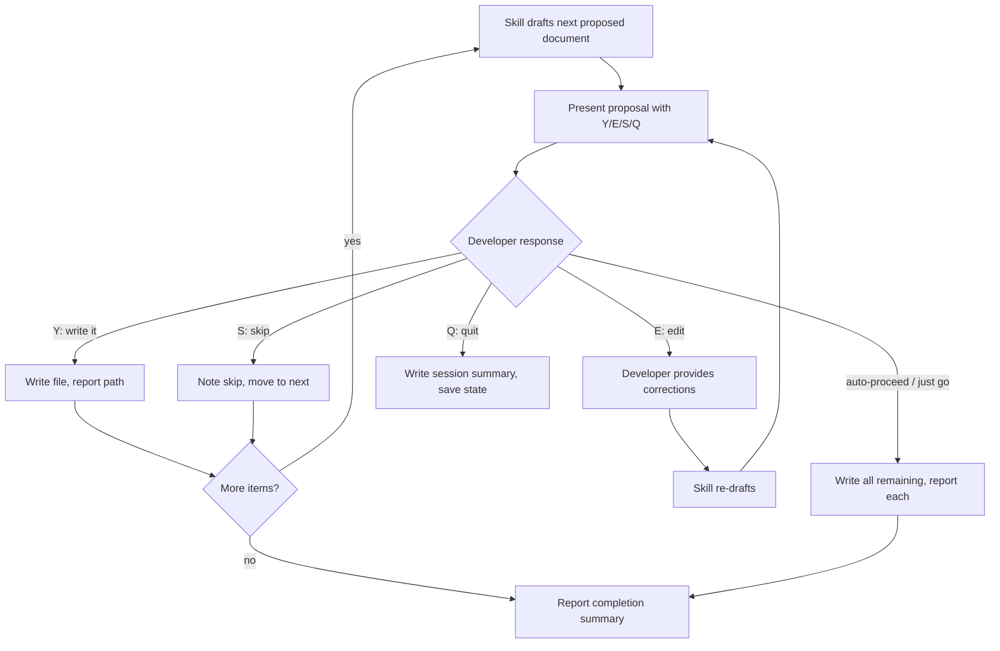

# Behaviour: Pause and Confirm Before Writing Each Document

## Actor
Developer using any taproot skill that writes more than one document in sequence (primarily `/tr-discover`, `/tr-decompose`, and any future bulk-authoring skill)

## Preconditions
- A skill has generated a queue of proposed documents (intents, usecases, impl.md files) based on earlier dialogue
- The developer has not explicitly opted into auto-proceeding through the queue

## Main Flow
1. Skill drafts the next proposed document in memory (content ready, not yet written to disk)
2. Skill presents the proposal to the developer:

   ```
   Proposed: taproot/<path>/intent.md — Password Reset

   <full proposed content or structured summary if content is long>

   [Y] Write it   [E] Edit before writing   [S] Skip   [Q] Quit session
   ```

3. Developer responds
4. If **[Y]**: skill writes the file to disk, reports the path written, and moves to the next item in the queue
5. If the queue is exhausted: skill reports completion — how many files written, how many skipped — and presents next-step guidance

## Alternate Flows

### Developer opts into auto-proceed
- **Trigger:** Developer says "just go", "do all", "proceed with everything", or the skill was invoked with `--auto`
- **Steps:**
  1. Skill acknowledges: "Auto-proceeding through remaining items — say 'stop' at any time to pause."
  2. Skill writes all remaining proposed documents without further confirmation
  3. After each write, skill still reports the path (no silent writes)
  4. At the end, skill reports the full list of files written

### Developer edits before writing ([E])
- **Trigger:** Developer selects [E] or provides corrections inline ("change the goal to…", "remove the second criterion")
- **Steps:**
  1. Developer provides edit instructions
  2. Skill re-drafts the document applying the changes
  3. Skill presents the updated proposal again with the same Y/E/S/Q menu
  4. Loop continues until developer selects [Y] or [S]

### Developer skips ([S])
- **Trigger:** Developer selects [S] — does not want this document written now
- **Steps:**
  1. Skill does not write the file
  2. Skill notes the skip: "Skipped `taproot/<path>/<file>` — you can create it later with `/tr-behaviour <parent>/`"
  3. Skill moves to the next item in the queue

### Developer quits ([Q])
- **Trigger:** Developer selects [Q] or says "stop", "pause", "enough for now"
- **Steps:**
  1. Skill stops processing the queue immediately
  2. Skill writes a session summary:
     ```
     Session ended.
     Written (3): taproot/auth/intent.md, taproot/auth/register/usecase.md, taproot/auth/login/usecase.md
     Skipped (1): taproot/auth/reset/usecase.md
     Remaining (4): taproot/auth/verify-email/usecase.md, ...
     Resume: run the skill again and it will offer to continue from where you left off.
     ```
  3. If the skill supports session state (e.g. `/tr-discover`), the state file is updated so the session can be resumed

### Batch-confirm remaining items
- **Trigger:** Developer says "yes to all" or "confirm the rest"
- **Steps:**
  1. Equivalent to auto-proceed from that point: skill writes all remaining items without pausing
  2. Still reports each path as it is written
  3. Reports completion summary at the end

### Single-document skills (not applicable)
- **Trigger:** A skill writes exactly one document (e.g. `/tr-intent`, `/tr-behaviour` when called alone)
- **Steps:**
  1. This behaviour does not apply — the skill presents its single output for review as part of its normal flow
  2. No Y/E/S/Q menu needed; the skill naturally pauses after presenting the single document

## Postconditions
- Every file written during the session was explicitly confirmed by the developer, or the developer explicitly opted into auto-proceed
- No files are written silently or as a side-effect of earlier answers
- Skipped and remaining items are surfaced, not silently dropped

## Error Conditions
- **Write fails (file system error):** Skill reports the error for that specific file, does not write a partial file, and asks: "Retry, skip this file, or quit?" — does not auto-proceed to the next item
- **Edit instructions too vague to apply:** Skill asks one clarifying question before re-drafting: "Do you mean [interpretation A] or [interpretation B]?" — does not guess

## Flow


## Related
- `taproot/project-discovery/discover-existing-project/usecase.md` — primary violating skill; must implement this pattern for each intent, behaviour, and impl proposed during discovery
- `taproot/human-integration/contextual-next-steps/usecase.md` — sibling concern: next-step guidance fires at the end of a skill; pause-and-confirm fires during a multi-document skill run
- `taproot/human-integration/route-requirement/usecase.md` — single-document skill; not directly affected, but shares the "agents propose, humans confirm" principle from the parent intent

## Acceptance Criteria

**AC-1: Confirmation pause shown before each document in a multi-document skill**
- Given `/tr-discover` has proposed a second intent after the first was written
- When the first intent is confirmed and written
- Then the skill pauses and presents the second proposed intent with the Y/E/S/Q menu before writing it

**AC-2: [Y] writes the file and advances to the next item**
- Given a proposal is shown with the Y/E/S/Q menu
- When the developer responds [Y]
- Then the file is written to disk, the path is reported, and the next proposal is presented

**AC-3: [E] enters an edit loop — file is not written until confirmed**
- Given a proposal is shown and the developer selects [E] or gives inline corrections
- When corrections are provided
- Then the skill re-drafts and shows the updated proposal again; the original file is not written

**AC-4: [S] skips without writing and notes the skip**
- Given a proposal is shown with the Y/E/S/Q menu
- When the developer responds [S]
- Then no file is written, a skip note is shown with the path, and the next proposal is presented

**AC-5: [Q] stops the session with a written/skipped/remaining summary**
- Given a multi-document session is in progress
- When the developer responds [Q] or says "stop"
- Then the skill stops immediately, writes a summary listing written, skipped, and remaining items

**AC-6: "Just go" or "do all" enables auto-proceed for remaining items**
- Given a multi-document session is in progress and the developer says "just go"
- When the acknowledgement is shown
- Then all remaining items are written without pausing; each written path is still reported

**AC-7: No file is ever written without either confirmation or explicit auto-proceed opt-in**
- Given a multi-document skill is running
- When the session completes
- Then every file on disk was either explicitly confirmed with [Y] or written during an opted-in auto-proceed pass

## Implementations <!-- taproot-managed -->
- [Discover and Decompose](./discover-and-decompose/impl.md)

## Status
- **State:** specified
- **Created:** 2026-03-20
- **Last reviewed:** 2026-03-20

## Notes
- The Y/E/S/Q pattern is the minimum required interface. Skills may extend it (e.g. `[R] Regenerate` to re-draft from scratch), but must include all four base options.
- "Reporting each path" during auto-proceed is non-negotiable — auto-proceed is not silent bulk-write. The developer should be able to see what was written in the conversation scroll even if they didn't confirm each one.
- The session summary on [Q] is critical because multi-document sessions are frequently interrupted (context limits, user fatigue, reprioritisation). The summary must be enough to know where to resume.
- Skills that call other skills (routers like `/tr-ineed`) are not subject to this behaviour — they produce at most one document before delegating. Only bulk-authoring skills (discover, decompose) must implement it.
- The `--auto` flag is an escape hatch for non-interactive environments (CI, scripted runs). It should be documented in the skill but not the default.
