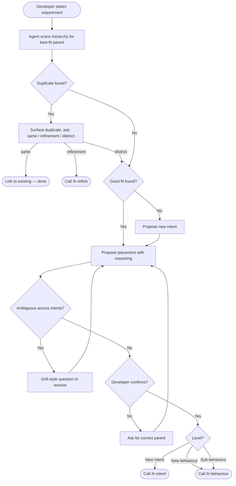

# UseCase: Route a Natural Language Requirement

## Actor
Human orchestrator / developer stating a requirement in natural language

## Preconditions
- A taproot hierarchy exists (or can be initialised)
- The developer has a requirement in mind — at any level of detail

## Main Flow
1. Developer states a requirement in natural language, either:
   - Explicitly: invokes `/tr-ineed` with the requirement as the argument (e.g. `/tr-ineed "users need to reset their password"`)
   - Conversationally: says something the agent detects as a requirement statement ("we also need...", "the system should...", "I want users to be able to...")
2. Agent acknowledges the requirement and reads the existing hierarchy (`taproot/OVERVIEW.md` or walks the hierarchy directly)
3. Agent searches for the best-fit parent intent by matching the requirement's domain and goal against existing intents
4. Agent checks for near-duplicate behaviours or intents that already cover the stated requirement
5. Agent presents its proposed placement with reasoning:
   > "This sounds like it belongs under **`<intent-slug>`** (*`<intent goal>`*) as a new behaviour. Does that feel right?"
6. Developer confirms the proposed placement
7. Agent calls the appropriate skill for the confirmed level:
   - **New intent needed**: calls `/tr-intent` to define a new top-level business goal
   - **New behaviour under existing intent**: calls `/tr-behaviour` on the matched intent
   - **New sub-behaviour**: calls `/tr-behaviour` on the matched parent behaviour
8. The skill guides the developer through the full document, and a new `intent.md` or `usecase.md` is written

## Alternate Flows

### No suitable parent intent exists
- **Trigger:** Requirement doesn't map to any existing intent
- **Steps:**
  1. Agent proposes: "This doesn't clearly fit any existing intent — it may need a new one. Here's what I'd name it: `<proposed-slug>` — *`<proposed goal>`*. Agree?"
  2. Developer confirms or adjusts
  3. Agent calls `/tr-intent` to define the new intent, then `/tr-behaviour` under it

### Near-duplicate detected
- **Trigger:** An existing behaviour or intent closely matches the stated requirement
- **Steps:**
  1. Agent surfaces the existing document: "There's already a behaviour `<path>` that covers `
`. Is your requirement the same, a refinement, or a distinct addition?"
  2. If same → agent links to existing document and stops
  3. If refinement → agent calls `/tr-refine` on the existing usecase
  4. If distinct → agent continues with placement as a new sibling

### Developer disagrees with proposed placement
- **Trigger:** Developer says the proposed intent/parent is wrong
- **Steps:**
  1. Agent asks: "Which intent feels like the right home? Or should this be a new intent entirely?"
  2. Developer names or describes the right parent
  3. Agent confirms and proceeds from step 7

### Requirement is ambiguous across multiple intents
- **Trigger:** Agent identifies two or more intents that could plausibly own this requirement
- **Steps:**
  1. Agent names the candidates and uses a grill-style question to resolve the ambiguity:
     - "Who is the primary stakeholder for this — an end user, an operator, or a developer?"
     - "If this was removed, which intent's success criteria would be most affected?"
     - "Is this really one requirement or two requirements that happen to arrive together?"
  2. Developer answers; agent re-proposes placement based on the answer
  3. Proceed from step 6

### Requirement is too vague to place
- **Trigger:** The statement is too broad or abstract to match any level of the hierarchy (e.g. "the system should be better")
- **Steps:**
  1. Agent flags the vagueness and asks sharpening questions:
     - "Who specifically needs this?"
     - "What would 'done' look like — how would you know this requirement is met?"
     - "Is there a specific flow or interaction you have in mind?"
  2. Developer sharpens the requirement
  3. Agent restarts from step 3 with the refined statement

### Conversational detection
- **Trigger:** Developer mentions a requirement casually without invoking `/tr-ineed`
- **Steps:**
  1. Agent detects the requirement statement and asks: "Should I add that to the taproot hierarchy?"
  2. Developer confirms
  3. Agent proceeds from step 3 with the detected statement

## Error Conditions
- **Requirement spans multiple intents**: Agent flags this and recommends splitting into separate requirements, one per intent
- **No hierarchy exists yet**: Agent offers to run `taproot init` first, then proceeds with placement

## Postconditions
- A new `intent.md`, `usecase.md`, or both exists in the hierarchy at the confirmed location
- The placement was confirmed by the developer before writing
- The new document is validated by `taproot validate-structure` and `taproot validate-format`

## Diagram

## Status
- **State:** specified
- **Created:** 2026-03-19

## Notes
- The conversational detection trigger (alternate flow) requires the agent to be watching for requirement language during the session — this is a Claude Code behaviour, not a CLI capability.
- The grill questions used for ambiguity resolution are the same as those in `/tr-grill` for intent-level challenges — reuse that logic rather than inventing new questions.
- `/tr-ineed` is the Claude Code adapter command name for this skill.
