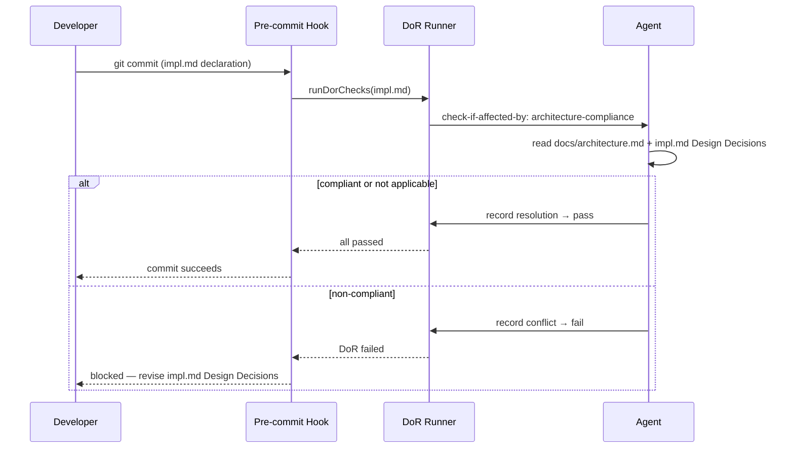

# Behaviour: Architecture Compliance Check

## Actor
Developer or agent declaring a new implementation (committing an `impl.md`) — the check runs automatically at Definition of Ready time before any code is written.

## Preconditions
- `docs/architecture.md` exists in the project
- An `impl.md` is being declared (declaration commit in progress)
- `check-if-affected-by: implementation-quality/architecture-compliance` is configured in `definitionOfReady` in `.taproot/settings.yaml`

## Main Flow
1. Developer commits an `impl.md` (declaration commit)
2. Pre-commit hook runs DoR checks against the `impl.md`
3. DoR runner encounters `check-if-affected-by: implementation-quality/architecture-compliance`
4. Agent reads `docs/architecture.md` and the `impl.md` Design Decisions section
5. Agent reasons: does this implementation's approach conflict with any architectural decision or constraint?
6. If compliant (or not applicable): agent records a resolution in `impl.md` under `## DoR Resolutions` and DoR passes
7. Pre-commit hook succeeds — implementation may proceed

## Alternate Flows

### Not applicable
- **Trigger:** The implementation is trivially unaffected (e.g. a documentation-only change with no design decisions)
- **Steps:**
  1. Agent records "not applicable" with a brief reason in `## DoR Resolutions`
  2. DoR passes

## Postconditions
- Every implementation that proceeds to coding has been explicitly checked against the architecture
- The resolution (compliant / not applicable + reason) is recorded in `impl.md` for traceability

## Error Conditions
- **Non-compliant implementation**: Agent identifies a conflict with `docs/architecture.md` — DoR fails, developer must revise the design decisions in `impl.md` and re-commit
- **`docs/architecture.md` absent**: DoR check cannot run — agent records the check as blocked and surfaces: "Architecture compliance check skipped: `docs/architecture.md` not found. Create it or remove this DoR condition."

## Flow

## Related
- `./definition-of-ready/usecase.md` — this behaviour is enforced via the DoR mechanism; configured as a `check-if-affected-by` entry in `definitionOfReady`
- `./definition-of-done/usecase.md` — DoD enforces post-implementation; this behaviour enforces pre-implementation

## Acceptance Criteria

**AC-1: Compliant implementation passes**
- Given `docs/architecture.md` exists and an impl.md with compatible design decisions
- When the developer commits the impl.md declaration
- Then DoR passes and a compliance resolution is recorded in `## DoR Resolutions`

**AC-2: Non-compliant implementation is blocked**
- Given `docs/architecture.md` exists and an impl.md whose design decisions conflict with an architectural constraint
- When the developer commits the impl.md declaration
- Then DoR fails and the pre-commit hook blocks the commit with the specific conflict noted

**AC-3: Not-applicable case passes**
- Given an impl.md with no design decisions that touch architectural concerns
- When the developer commits the impl.md declaration
- Then agent records "not applicable" and DoR passes

**AC-4: Missing architecture doc is surfaced**
- Given `docs/architecture.md` does not exist
- When the developer commits the impl.md declaration
- Then DoR surfaces a clear message that the check was skipped and directs the developer to create `docs/architecture.md`

## Implementations <!-- taproot-managed -->
- [Multi-surface — config + architecture doc](./multi-surface/impl.md)

## Status
- **State:** implemented
- **Created:** 2026-03-20
- **Last reviewed:** 2026-03-20

## Notes
- `docs/architecture.md` is a freeform document — not a usecase. It captures architectural decisions, constraints, and patterns the team has agreed on (e.g. "all CLI commands must be stateless", "no global mutable state", "external I/O only at command boundaries").
- The DoR runner already only operates on `impl.md` files — the "impl.md only" constraint is structurally enforced, not configured.
- To activate: add `- check-if-affected-by: implementation-quality/architecture-compliance` to `definitionOfReady` in `.taproot/settings.yaml`.
