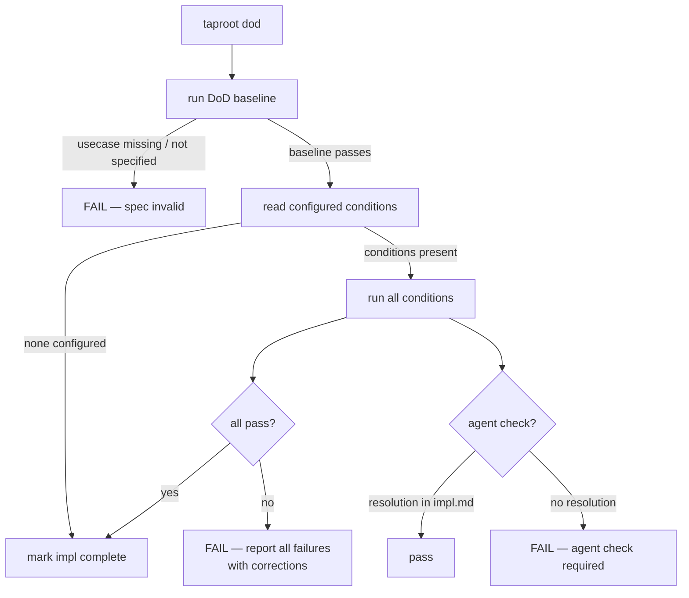

# Behaviour: Definition of Done Enforcement

## Actor
`/tr-implement` — triggered automatically at the end of the implement flow before marking an impl `complete`. Also invoked by `taproot commithook` on implementation commits (staged source files + `impl.md`). Can also be invoked standalone by a developer or CI pipeline.

## Preconditions
- Implementation work is complete (code written, tests written)
- `impl.md` exists for the behaviour being implemented
- The parent `usecase.md` was DoR-validated at declaration commit time

## Main Flow
1. System always runs the DoD baseline (non-configurable):
   - Parent `usecase.md` still exists
   - Parent `usecase.md` still has `state: specified`
   - `taproot validate-format` passes on the parent `usecase.md`
2. System reads `definitionOfDone` conditions from `.taproot.yaml` (may be empty — baseline already ran)
3. System runs all configured conditions — every condition runs regardless of whether earlier ones fail
4. For each condition, system records: name, pass/fail, output, and a proposed correction if failed:
   - Shell conditions: executed directly; exit code 0 = pass
   - `document-current`: agent reads recent git commits and diffs, identifies stale sections in `README.md` and `docs/`, and applies updates directly — condition passes once updates are made
   - `check-if-affected`: agent reads the git diff, reasons whether the target file should have been updated, applies changes if needed — condition passes once resolved; agent writes resolution to `impl.md` via `taproot dod --resolve`
   - `check-if-affected-by`: agent reads the referenced behaviour spec at `<behaviour-path>`, reasons whether that cross-cutting behaviour applies to the current implementation, verifies compliance and applies changes if needed — condition passes once resolved; agent writes resolution to `impl.md` via `taproot dod --resolve`
   - `check:`: agent reads the free-form question text, reasons whether the answer is yes, no, or not applicable for this implementation, and takes any indicated action (e.g. adds an entry to `.taproot.yaml`, updates `docs/patterns.md`) — agent calls `taproot dod --resolve "check: <text>" "<resolution note>"` recording what was done or why it does not apply
5. If all conditions pass: system marks `impl.md` `state: complete` and reports success
6. If any conditions fail: system reports all failures together with corrections and does NOT mark impl complete

## Alternate Flows
### No configured conditions
- **Trigger:** `.taproot.yaml` has no `definitionOfDone` section, or the file does not exist
- **Steps:**
  1. System runs DoD baseline only (step 1 of main flow)
  2. If baseline passes: impl is marked `complete`
  3. If baseline fails: impl is blocked with correction

### check-if-affected-by condition (cross-cutting compliance)
- **Trigger:** A condition declared as `check-if-affected-by: <behaviour-path>` — references a behaviour that may apply to every implementation of a given type (e.g. `human-integration/contextual-next-steps` applied to every new skill)
- **Steps:**
  1. Agent reads the referenced `usecase.md` at `<behaviour-path>`
  2. Agent reasons: does this cross-cutting requirement apply to the current implementation?
  3. If not applicable: agent records "not applicable — `<reason>`" and resolves
  4. If applicable and already satisfied: agent records "satisfied — `<how>`" and resolves
  5. If applicable but not satisfied: agent applies the necessary changes, then resolves
  6. Agent calls `taproot dod --resolve "check-if-affected-by: <path>" "<resolution note>"`

### Generic agent check (`check:` condition)
- **Trigger:** A condition declared as `check: <free-form text>` — an open-ended question the agent reasons about at DoD time
- **Steps:**
  1. Agent reads the question text
  2. Agent reasons whether the answer is yes, no, or not applicable for this specific implementation
  3. If yes — agent takes the indicated action (e.g. adds a `check-if-affected-by` entry to `.taproot.yaml`, documents a new pattern in `docs/patterns.md`)
  4. Agent calls `taproot dod --resolve "check: <text>" "<what was done or why it does not apply>"`

### Agent check resolution
- **Trigger:** Agent resolves an agent-driven condition (`document-current`, `check-if-affected`, `check-if-affected-by`) and calls `taproot dod --resolve <condition> "<resolution note>"`
- **Steps:**
  1. System writes the resolution to a `## DoD Resolutions` section in `impl.md` with condition name, resolution note, and timestamp
  2. On subsequent DoD runs, system reads `impl.md` for resolutions — if a valid resolution exists for an agent check, it passes without re-prompting
  3. Resolutions are valid for the current impl session — stale resolutions (impl.md modified after resolution) are ignored and the agent check re-triggers

### Standalone check (outside `/tr-implement`)
- **Trigger:** Developer or CI pipeline runs `taproot dod [impl-path]` manually
- **Steps:**
  1. System runs baseline + all configured conditions
  2. System reports full pass/fail summary with proposed corrections
  3. System does not modify `impl.md` state — reporting only

### Custom shell command condition
- **Trigger:** A condition in `.taproot.yaml` is declared with a `run:` key
- **Steps:**
  1. System executes the shell command in the project root
  2. Exit code 0 = pass; non-zero = fail
  3. On failure, system includes stdout/stderr and the `correction:` field if provided

## Postconditions
- If all conditions passed: `impl.md` has `state: complete`
- If any condition failed: `impl.md` state is unchanged; contributor has a full list of failures with corrections

## Error Conditions
- **DoD baseline fails — usecase.md missing or no longer specified**: `FAIL — the behaviour spec this implementation references is no longer valid. Restore the spec to 'specified' before marking complete`
- **Condition script not found**: reported as a failure with correction "Ensure the command exists and is executable from the project root"
- **Condition times out**: reported as a failure with correction "Check for hanging processes or increase the timeout in `.taproot.yaml`"
- **`.taproot.yaml` DoD section is malformed**: system aborts and reports a parse error with the offending line; impl is not marked complete

## Flow


## Related
- `../definition-of-ready/usecase.md` — DoD baseline re-validates DoR conditions; DoR must have passed at declaration commit time
- `../../hierarchy-integrity/pre-commit-enforcement/usecase.md` — the hook invokes DoD on implementation commits (source + impl.md)

## Implementations <!-- taproot-managed -->
- [CLI Command — taproot dod](./cli-command/impl.md)


## Acceptance Criteria

**AC-1: Generic check condition — action taken**
- Given `.taproot.yaml` contains `check: "does this story introduce a cross-cutting concern..."`
- When the agent runs DoD on an implementation that does introduce such a concern
- Then the agent adds the appropriate `check-if-affected-by` or `check-if-affected` entry to `.taproot.yaml` and records the resolution via `taproot dod --resolve`

**AC-2: Generic check condition — not applicable**
- Given `.taproot.yaml` contains a `check:` condition
- When the agent runs DoD on an implementation where the answer is no
- Then the agent records "no — <reason>" via `taproot dod --resolve` and the condition passes without any file changes

**AC-3: Generic check condition — appears in dod output**
- Given `.taproot.yaml` contains a `check:` condition with no prior resolution in `impl.md`
- When `taproot dod` is run
- Then the condition appears in the output as an agent check required, with the full question text displayed

**AC-4: Custom shell command passes when exit code is 0, fails when non-zero**
- Given a condition with `run: true` and another with `run: false`
- When `taproot dod` runs
- Then the `true` condition passes and the `false` condition fails

**AC-5: All conditions run even when an earlier one fails**
- Given three conditions where first and third fail
- When `taproot dod` runs
- Then all three conditions are evaluated and two failures are reported

**AC-6: document-current condition reports as agent check required**
- Given a `document-current` condition in `.taproot.yaml`
- When `taproot dod` runs without a resolution in `impl.md`
- Then the condition is reported as not passed with "Agent check required" in the output

**AC-7: check-if-affected condition reports as agent check required**
- Given a `check-if-affected: src/commands/update.ts` condition
- When `taproot dod` runs without a resolution
- Then the condition name is `check-if-affected: src/commands/update.ts` and output contains "Agent check required"

**AC-8: check-if-affected-by condition reports as agent check required**
- Given a `check-if-affected-by: human-integration/contextual-next-steps` condition
- When `taproot dod` runs without a resolution
- Then the condition name is `check-if-affected-by: human-integration/contextual-next-steps` and output contains "Agent check required"

**AC-9: DoD baseline fails when usecase.md is missing**
- Given an `impl.md` with no parent `usecase.md`
- When `taproot dod` runs with that `implPath`
- Then the `baseline-usecase-exists` check fails

**AC-10: DoD baseline fails when usecase state is not specified**
- Given a `usecase.md` with `state: proposed`
- When `taproot dod` runs
- Then the `baseline-state-specified` check fails with output containing `proposed`

**AC-11: DoD baseline passes with a valid usecase.md**
- Given a fully-specified `usecase.md` with all required sections
- When `taproot dod` runs
- Then all baseline checks pass

**AC-12: agent check passes when resolution is recorded in impl.md**
- Given a `check-if-affected` condition and a matching resolution entry in `## DoD Resolutions`
- When `taproot dod` runs
- Then that condition passes

**AC-13: agent check fails when no resolution recorded**
- Given a `check-if-affected` condition and no resolution in `impl.md`
- When `taproot dod` runs
- Then that condition fails

**AC-14: agent check fails when resolution is stale**
- Given a resolution recorded in `impl.md` but `impl.md` modified after the resolution timestamp
- When `taproot dod` runs
- Then the condition fails with "Agent check required"

**AC-15: Marks impl complete when all conditions pass and implPath provided**
- Given an `impl.md` in `in-progress` state and all conditions passing
- When `taproot dod` runs with `implPath`
- Then `impl.md` state becomes `complete`

**AC-16: Does not mark impl complete when a condition fails**
- Given an `impl.md` in `in-progress` state and a failing condition
- When `taproot dod` runs
- Then `impl.md` state remains `in-progress`

**AC-17: Does not modify impl.md in dry-run mode**
- Given an `impl.md` in `in-progress` state and all conditions passing
- When `taproot dod --dry-run` runs
- Then `impl.md` is unchanged

## Status
- **State:** implemented
- **Created:** 2026-03-19
- **Last verified:** 2026-03-20
- **Last reviewed:** 2026-03-20

## Notes
- Conditions in `.taproot.yaml` use a mixed syntax: built-in names are bare strings; custom conditions use `run:` with optional `name:` and `correction:` keys; parameterizable built-ins use a `key: value` form:
  ```yaml
  definitionOfDone:
    - tests-passing
    - linter-clean
    - document-current: README.md and docs/ accurately reflect all currently implemented CLI commands, skills, and configuration options
    - check-if-affected: src/commands/update.ts
    - check-if-affected: skills/guide.md
    - check-if-affected-by: human-integration/contextual-next-steps
    - check: "does this story introduce a cross-cutting concern that warrants a new check-if-affected-by or check-if-affected entry in .taproot.yaml?"
    - check: "does this story reveal a reusable pattern worth documenting in docs/patterns.md?"
    - run: npm run custom-check
      name: my-check
      correction: "Run the fix script"
  ```
- Built-in names (`tests-passing`, `linter-clean`, `commit-conventions`) resolve to known commands and standard corrections without requiring shell configuration.
- `document-current`, `check-if-affected`, `check-if-affected-by`, and `check:` are agent-driven conditions — they always fail in a plain shell context and require agent reasoning to resolve. Agents call `taproot dod --resolve <condition> "<note>"` to record their resolution in `impl.md`.
- `check:` is the most open-ended agent condition: write any question whose answer might change what gets committed or configured. The two taproot default entries (cross-cutting concern, new pattern) are a starting point — replace or extend them for your project.
- `check-if-affected-by` is the inverse of `check-if-affected`: where `check-if-affected` asks "did my change require updating X?", `check-if-affected-by` asks "does cross-cutting behaviour X apply to what I just built, and if so, is it satisfied?". Use it for requirements that apply to every implementation of a given type — e.g. every new skill must satisfy `human-integration/contextual-next-steps` and `human-integration/pause-and-confirm`.
- DoD can never be a no-op: the baseline always runs, even with no configured conditions. An impl cannot be marked `complete` without the baseline passing.
