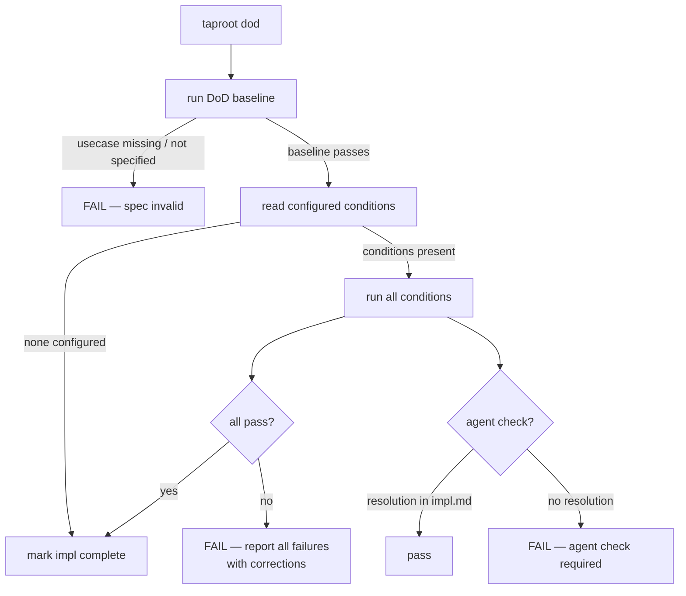

# Behaviour: Definition of Done Enforcement

## Actor
`/tr-implement` — triggered automatically at the end of the implement flow before marking an impl `complete`. Also invoked by `taproot commithook` on implementation commits (staged source files + `impl.md`). Can also be invoked standalone by a developer or CI pipeline.

## Preconditions
- Implementation work is complete (code written, tests written)
- `impl.md` exists for the behaviour being implemented
- The parent `usecase.md` was DoR-validated at declaration commit time

## Main Flow
1. System always runs the DoD baseline (non-configurable):
   - Parent `usecase.md` still exists
   - Parent `usecase.md` still has `state: specified`
   - `taproot validate-format` passes on the parent `usecase.md`
2. System reads `definitionOfDone` conditions from `.taproot.yaml` (may be empty — baseline already ran)
3. System runs all configured conditions — every condition runs regardless of whether earlier ones fail
4. For each condition, system records: name, pass/fail, output, and a proposed correction if failed:
   - Shell conditions: executed directly; exit code 0 = pass
   - `document-current`: agent reads recent git commits and diffs, identifies stale sections in `README.md` and `docs/`, and applies updates directly — condition passes once updates are made
   - `check-if-affected`: agent reads the git diff, reasons whether the target file should have been updated, applies changes if needed — condition passes once resolved; agent writes resolution to `impl.md` via `taproot dod --resolve`
5. If all conditions pass: system marks `impl.md` `state: complete` and reports success
6. If any conditions fail: system reports all failures together with corrections and does NOT mark impl complete

## Alternate Flows
### No configured conditions
- **Trigger:** `.taproot.yaml` has no `definitionOfDone` section, or the file does not exist
- **Steps:**
  1. System runs DoD baseline only (step 1 of main flow)
  2. If baseline passes: impl is marked `complete`
  3. If baseline fails: impl is blocked with correction

### Agent check resolution
- **Trigger:** Agent resolves an agent-driven condition (`document-current`, `check-if-affected`) and calls `taproot dod --resolve <condition> "<resolution note>"`
- **Steps:**
  1. System writes the resolution to a `## DoD Resolutions` section in `impl.md` with condition name, resolution note, and timestamp
  2. On subsequent DoD runs, system reads `impl.md` for resolutions — if a valid resolution exists for an agent check, it passes without re-prompting
  3. Resolutions are valid for the current impl session — stale resolutions (impl.md modified after resolution) are ignored and the agent check re-triggers

### Standalone check (outside `/tr-implement`)
- **Trigger:** Developer or CI pipeline runs `taproot dod [impl-path]` manually
- **Steps:**
  1. System runs baseline + all configured conditions
  2. System reports full pass/fail summary with proposed corrections
  3. System does not modify `impl.md` state — reporting only

### Custom shell command condition
- **Trigger:** A condition in `.taproot.yaml` is declared with a `run:` key
- **Steps:**
  1. System executes the shell command in the project root
  2. Exit code 0 = pass; non-zero = fail
  3. On failure, system includes stdout/stderr and the `correction:` field if provided

## Postconditions
- If all conditions passed: `impl.md` has `state: complete`
- If any condition failed: `impl.md` state is unchanged; contributor has a full list of failures with corrections

## Error Conditions
- **DoD baseline fails — usecase.md missing or no longer specified**: `FAIL — the behaviour spec this implementation references is no longer valid. Restore the spec to 'specified' before marking complete`
- **Condition script not found**: reported as a failure with correction "Ensure the command exists and is executable from the project root"
- **Condition times out**: reported as a failure with correction "Check for hanging processes or increase the timeout in `.taproot.yaml`"
- **`.taproot.yaml` DoD section is malformed**: system aborts and reports a parse error with the offending line; impl is not marked complete

## Flow


## Related
- `../definition-of-ready/usecase.md` — DoD baseline re-validates DoR conditions; DoR must have passed at declaration commit time
- `../../hierarchy-integrity/pre-commit-enforcement/usecase.md` — the hook invokes DoD on implementation commits (source + impl.md)

## Implementations <!-- taproot-managed -->
- [CLI Command — taproot dod](./cli-command/impl.md)


## Status
- **State:** implemented
- **Created:** 2026-03-19
- **Last verified:** 2026-03-19

## Notes
- Conditions in `.taproot.yaml` use a mixed syntax: built-in names are bare strings; custom conditions use `run:` with optional `name:` and `correction:` keys; parameterizable built-ins use a `key: value` form:
  ```yaml
  definitionOfDone:
    - tests-passing
    - linter-clean
    - document-current: README.md and docs/ accurately reflect all currently implemented CLI commands, skills, and configuration options
    - check-if-affected: src/commands/update.ts
    - check-if-affected: skills/guide.md
    - run: npm run custom-check
      name: my-check
      correction: "Run the fix script"
  ```
- Built-in names (`tests-passing`, `linter-clean`, `commit-conventions`) resolve to known commands and standard corrections without requiring shell configuration.
- `document-current` and `check-if-affected` are agent-driven conditions — they always fail in a plain shell context and require agent reasoning to resolve. Agents call `taproot dod --resolve <condition> "<note>"` to record their resolution in `impl.md`.
- DoD can never be a no-op: the baseline always runs, even with no configured conditions. An impl cannot be marked `complete` without the baseline passing.
