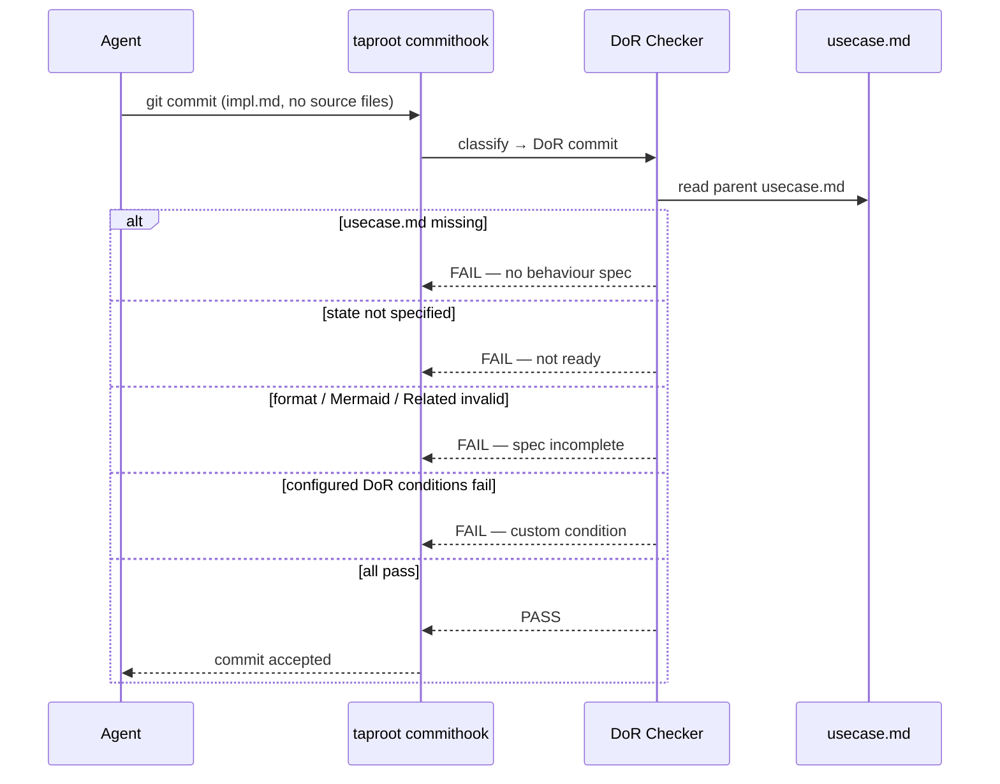

# Behaviour: Definition of Ready

## Actor
`taproot commithook` — triggered automatically when a contributor commits an `impl.md` file without source code changes (the "I'm starting this implementation" declaration commit).

## Preconditions
- A git pre-commit hook invoking `taproot commithook` is installed
- The commit contains at least one `impl.md` file and no source code changes
- The `impl.md` references a parent behaviour via `../usecase.md`

## Main Flow
1. `taproot commithook` detects that staged files include `impl.md` and no source files — classifies as a DoR commit
2. System reads the parent `usecase.md` referenced by the `impl.md`
3. System checks baseline DoR conditions (always enforced, not configurable):
   a. `usecase.md` exists at the expected parent path
   b. `usecase.md` has `state: specified`
   c. `taproot validate-format` passes on the `usecase.md`
   d. `usecase.md` contains a `## Flow` section with a Mermaid diagram
   e. `usecase.md` contains a `## Related` section
4. System reads `definitionOfReady` conditions from `.taproot.yaml` (if present) and runs each — same condition format as DoD (bare built-in names, `run:` shell commands, parameterised built-ins, `check:` agent questions)
5. If all conditions pass: system allows the commit to proceed
6. If any conditions fail: system prints all failures with corrections and blocks the commit

## Alternate Flows
### Re-implementing a completed behaviour
- **Trigger:** A `complete` `impl.md` already exists under the same behaviour
- **Steps:**
  1. System warns: "An implementation already exists at `<path>` with state: complete — is this a replacement?"
  2. Commit is allowed to proceed (warning only, not a block)

### Generic agent check (`check:` condition)
- **Trigger:** A condition declared as `check: <free-form text>` in `definitionOfReady` — an open-ended question the agent reasons about before starting implementation
- **Steps:**
  1. Agent reads the question text
  2. Agent reasons whether the answer is yes, no, or not applicable for this behaviour spec
  3. If yes — agent takes the indicated action (e.g. flags a concern, updates a related document) before allowing the declaration commit
  4. Resolution recorded in the DoR output; commit proceeds if all checks resolve

### No `definitionOfReady` configured
- **Trigger:** `.taproot.yaml` has no `definitionOfReady` section
- **Steps:**
  1. System runs baseline checks only
  2. No additional conditions are evaluated

## Postconditions
- If passed: the behaviour spec is formally declared ready; implementation work may begin
- If blocked: contributor has a full list of failures with corrections; no implementation record is created until the spec is brought up to standard

## Error Conditions
- **`usecase.md` not found**: `FAIL — no behaviour spec at <path>/usecase.md. Create one with /tr-behaviour before committing an impl.md`
- **State is not `specified`**: `FAIL — usecase.md state is '<current-state>'. Bring the spec to 'specified' (run /tr-review then /tr-refine) before starting implementation`
- **`validate-format` violations**: `FAIL — usecase.md has format violations: <list>. Fix them and re-commit`
- **Mermaid diagram missing**: `FAIL — usecase.md has no ## Flow section with a Mermaid diagram. Add one before starting implementation`
- **Related section missing**: `FAIL — usecase.md has no ## Related section. Document related behaviours before starting implementation`
- **Custom DoR condition fails**: correction from the condition's `correction:` field or stdout/stderr of the failed command
- **`check:` condition unresolved at commit time**: DoR blocks with "agent check required: <question text>" — agent must reason about the question and record a resolution before the declaration commit proceeds

## Flow

## Related
- `../definition-of-done/usecase.md` — companion gate: DoD runs on the implementation commit (source + impl.md); DoR baseline is a precondition for DoD
- `../../hierarchy-integrity/pre-commit-enforcement/usecase.md` — the hook that invokes DoR as one of its three commit-type tiers
- `../../hierarchy-integrity/validate-format/usecase.md` — DoR delegates format checking to validate-format as part of its baseline

## Acceptance Criteria

**AC-1: Generic check condition at DoR — resolves before commit**
- Given `definitionOfReady` contains `check: "is this spec complete enough to implement without further clarification?"`
- When an agent makes a declaration commit
- Then DoR evaluates the question, the agent records a resolution, and the commit proceeds

**AC-2: Generic check condition at DoR — blocks if unresolved**
- Given `definitionOfReady` contains a `check:` condition
- When no resolution has been recorded
- Then DoR blocks the commit with "agent check required: <question text>"

## Implementations <!-- taproot-managed -->
- [CLI Command — taproot commithook (DoR tier)](./cli-command/impl.md)

## Status
- **State:** implemented
- **Created:** 2026-03-19
- **Last reviewed:** 2026-03-20
- **Last verified:** 2026-03-19
