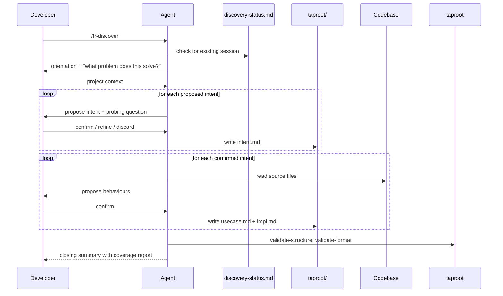

# UseCase: Discover Existing Project into Taproot Hierarchy

## Actor
Developer invoking `/tr-discover` on a codebase that has no taproot hierarchy yet (or a partial one)

## Preconditions
- A codebase exists with no taproot hierarchy, or an incomplete one
- The developer wants to reverse-engineer the existing work into a living requirement hierarchy
- Taproot is initialized in the project (`taproot/` directory exists)

## Main Flow
1. Developer invokes `/tr-discover`
2. Agent checks for `taproot/_brainstorms/discovery-status.md` — if found, offers to resume, restart, or abandon the prior session
3. Agent reads orientation materials: README, package manifests, existing taproot documents (to avoid duplicating already-documented intents)
4. Agent presents a one-paragraph orientation and asks: "What problem does this software solve, and who uses it?"
5. Developer answers; agent forms hypotheses about the top-level business intents
6. Agent proposes intents one at a time, asking a probing question about each to validate it reflects a real business goal (not a technical module)
7. For each confirmed intent, agent writes `taproot/<slug>/intent.md` and updates the status file
8. After all intents are confirmed, agent works through each intent's source code to propose use cases — observable system behaviours from the actor's perspective
9. For each confirmed behaviour, agent writes `taproot/<intent>/<behaviour>/usecase.md` and updates the status file
10. For each confirmed behaviour, agent identifies source files, tests, and relevant commits, then writes `taproot/<intent>/<behaviour>/<impl>/impl.md`
11. After each intent's implementations are written, agent runs `taproot validate-structure` and `taproot validate-format` and fixes any errors
12. Agent runs `taproot coverage` and presents the results as a closing summary

## Alternate Flows
- **Resume session**: Agent reads the status file, skips already-completed items, and resumes from the last confirmed phase/item
- **`scope` argument**: Discovery is limited to a specific subdirectory or area
- **`depth: intents-only`**: Agent stops after writing intent documents
- **`depth: behaviours`**: Agent stops after writing behaviour (usecase) documents
- **Developer says "stop" or "pause"**: Agent updates the status file with current progress and informs the developer how to resume

## Error Conditions
- **Validation errors after writing docs**: Agent fixes errors before moving to the next intent
- **Ambiguous code with no clear business purpose**: Agent asks before documenting — may be dead code, vestigial feature, or internal infrastructure that doesn't warrant a top-level intent

## Postconditions
- The existing codebase has a living taproot hierarchy that reflects what was built and why
- All documents are marked `status: active` / `complete` (or `in-progress` where gaps were noted)
- The session state is preserved in `taproot/_brainstorms/discovery-status.md` and can be resumed if interrupted

## Flow

## Related
- `taproot/human-integration/route-requirement/usecase.md` — individual requirements discovered during this flow are routed via tr-ineed

## Implementations <!-- taproot-managed -->
- [Agent Skill — /tr-discover](./agent-skill/impl.md)

## Status
- **State:** implemented
- **Created:** 2026-03-19
