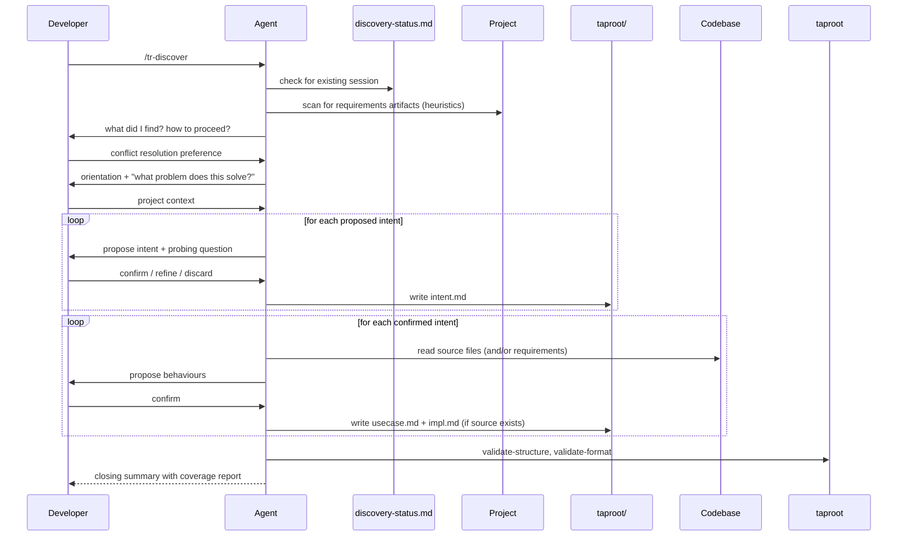

# UseCase: Discover Existing Project into Taproot Hierarchy

## Actor
Developer invoking `/tr-discover` on a project that has no taproot hierarchy yet (or a partial one)

## Preconditions
- A project exists with no taproot hierarchy, or an incomplete one — it may contain source code, existing requirements artifacts (e.g. PRDs, specs, stories, ADRs), or both
- The developer wants to reverse-engineer the existing work into a living requirement hierarchy
- Taproot is initialized in the project (`taproot/` directory exists)

## Main Flow
1. Developer invokes `/tr-discover`
2. Agent checks for `taproot/_brainstorms/discovery-status.md` — if found, offers to resume, restart, or abandon the prior session
3. Agent scans for existing requirements artifacts using naming heuristics — folders or files named `prd`, `requirements`, `specs`, `stories`, `epics`, `architecture`, `adr`, `design`, `rfcs`, and similar (excluding known non-requirement files such as `requirements.txt`). If candidates are found, agent reads them to understand their structure; if the format or tool is unfamiliar, agent researches it before proceeding.
4. Agent presents what it found and asks the developer how to proceed:
   - **No artifacts found**: proceed silently — standard code-first flow
   - **Artifacts found, no source code**: "I found what looks like requirements in `<path>` — [brief description of structure]. No source code detected. Should I import these as specified behaviours?"
   - **Both source and requirements found**: "I found source code and requirements in `<path>` — [brief description]. If they conflict, which takes precedence — source or requirements?"

   Developer's choice is recorded in the status file.
5. Agent reads orientation materials: README, package manifests, existing taproot documents (to avoid duplicating already-documented intents), and — if requirements artifacts were found — uses them as supplementary context for intent hypotheses
6. Agent presents a one-paragraph orientation and asks: "What problem does this software solve, and who uses it?"
7. Developer answers; agent forms hypotheses about the top-level business intents
8. Agent proposes intents one at a time, asking a probing question about each to validate it reflects a real business goal (not a technical module)
9. For each confirmed intent, agent writes `taproot/<slug>/intent.md` and updates the status file
10. After all intents are confirmed, agent works through each intent's source code (and/or requirements artifacts) to propose use cases — observable system behaviours from the actor's perspective
11. For each confirmed behaviour, agent writes `taproot/<intent>/<behaviour>/usecase.md` and updates the status file
12. For each confirmed behaviour where source code exists, agent identifies source files, tests, and relevant commits, then writes `taproot/<intent>/<behaviour>/<impl>/impl.md`
13. After each intent's documents are written, agent runs `taproot validate-structure` and `taproot validate-format` and fixes any errors
14. Agent runs `taproot coverage` and presents the results as a closing summary

## Alternate Flows
- **Resume session**: Agent reads the status file, skips already-completed items, and resumes from the last confirmed phase/item
- **`scope` argument**: Discovery is limited to a specific subdirectory or area
- **`depth: intents-only`**: Agent stops after writing intent documents
- **`depth: behaviours`**: Agent stops after writing behaviour (usecase) documents
- **Developer says "stop" or "pause"**: Agent updates the status file with current progress and informs the developer how to resume
- **Requirements-only import**: Developer confirms import → agent creates `intent.md` and `usecase.md` files derived from the requirements artifacts; no `impl.md` files are created; behaviours are marked `status: specified`
- **Source takes precedence**: Requirements used as supplementary hints only — where source and requirements conflict, source wins; discrepancies are noted but do not block
- **Requirements take precedence**: Requirements are the authoritative spec; source is used to fill gaps and create `impl.md` entries
- **Case-by-case conflict resolution**: Agent surfaces each source/requirements conflict individually for the developer to decide

## Error Conditions
- **Validation errors after writing docs**: Agent fixes errors before moving to the next intent
- **Ambiguous code with no clear business purpose**: Agent asks before documenting — may be dead code, vestigial feature, or internal infrastructure that doesn't warrant a top-level intent
- **Ambiguous artifact names**: Files such as `requirements.txt` (Python deps), `architecture.png` (images), or `specs/` folders containing test files are not treated as requirements artifacts — agent applies common-sense filtering before prompting
- **Unreadable or empty requirements artifacts**: Agent skips the file and notes it in the status file rather than aborting

## Postconditions
- The project has a living taproot hierarchy that reflects what was built and/or specified
- For source-based discovery: documents are marked `status: active` / `complete` (or `in-progress` where gaps were noted)
- For requirements-only discovery: behaviours are marked `status: specified`; no `impl.md` files are created
- The session state is preserved in `taproot/_brainstorms/discovery-status.md` and can be resumed if interrupted

## Flow

## Related
- `taproot/human-integration/route-requirement/usecase.md` — individual requirements discovered during this flow are routed via tr-ineed

## Implementations <!-- taproot-managed -->
- [Agent Skill — /tr-discover](./agent-skill/impl.md)

## Status
- **State:** implemented
- **Created:** 2026-03-19
- **Last reviewed:** 2026-03-20
