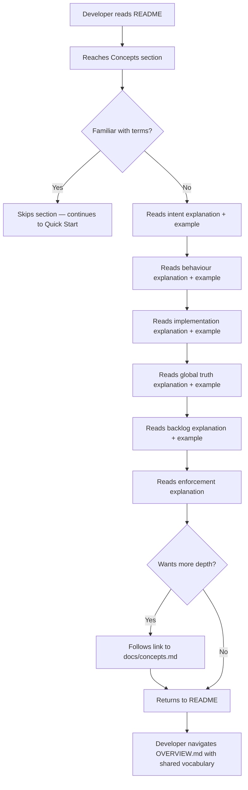

# Behaviour: Conceptual Orientation

## Actor
Developer reading the README for the first time — either evaluating taproot or having just installed it and wanting to understand the vocabulary before running any commands

## Preconditions
- `README.md` exists in the taproot repository root, with a value proposition section and a Quick Start section already in place (i.e., `welcoming-readme` is implemented)
- The implementation artifact is a **section added to the existing `README.md`** — not a new document; the Concepts section is placed after the value proposition and before Quick Start
- The developer has no prior knowledge of taproot's terminology (intent, behaviour, implementation, global truth, backlog)

## Main Flow
1. Developer reads the README and reaches the **Concepts** section
2. Developer reads the explanation of **intent** — the business goal a set of behaviours fulfils — and sees a one-line example (`password-reset`: *Allow users to recover access to their account*)
3. Developer reads the explanation of **behaviour** — an observable, testable thing the system does for a specific actor — and sees a one-line example (`request-reset`: *User submits their email; system sends a reset link*)
4. Developer reads the explanation of **implementation** — the code that fulfils a behaviour, with a traceable link back to the spec — and sees that it maps to actual source files
5. Developer reads the explanation of **global truth** — a project-wide fact (glossary term, business rule, entity definition) stored in `taproot/global-truths/` and enforced at commit time — and sees an example (`prices are always exclusive of VAT`)
6. Developer reads the explanation of **backlog** — a lightweight scratchpad for ideas and deferred work captured mid-session, separate from the requirement hierarchy — and sees that it lives in `.taproot/backlog.md`
7. Developer reads the explanation of **how taproot enforces integrity** — the pre-commit hook automatically runs DoD and DoR gates, truth-checks, and spec quality checks on every commit — and understands this happens without any manual invocation

## Alternate Flows

### Developer already knows the concepts
- **Trigger:** Developer has prior taproot experience or read the docs first
- **Steps:**
  1. Developer skips the Concepts section
  2. Concepts section does not interrupt the flow to Quick Start or other sections

### Developer wants deeper understanding of a concept
- **Trigger:** A one-liner definition is not enough — developer wants to know how scope cascade works, what DoR/DoD gates do, or how global truths are enforced
- **Steps:**
  1. Each concept links to the closest relevant existing document — `docs/concepts.md` for the three-layer hierarchy (intent/behaviour/implementation), `docs/workflows.md` for lifecycle gates (DoR/DoD), or the relevant hierarchy document for global-truths and backlog
  2. Developer follows the link out of the README and returns when ready

### Developer encounters an unfamiliar concept not in the list
- **Trigger:** Developer reads the skill output and sees a term like "DoR", "DoD", or "impl" not explained in the Concepts section
- **Steps:**
  1. Developer follows the link at the bottom of the Concepts section to `docs/concepts.md` for the full hierarchy terminology
  2. Developer reads the relevant docs page and finds the definition for the unfamiliar term

## Postconditions
- Developer can distinguish intent, behaviour, implementation, global truth, and backlog without opening any other document
- Developer understands that the hierarchy is structured as intent → behaviour → implementation and can navigate `taproot/OVERVIEW.md` accordingly
- Developer knows that global truths are enforced at commit time (not just advisory)
- Developer knows the backlog is a separate lightweight capture tool, not part of the requirement hierarchy
- Developer understands that taproot's integrity checks run automatically on every commit via the pre-commit hook — no manual invocation required

## Error Conditions
- **Concepts section becomes stale (a core term renamed or removed):** The section drifts from actual CLI/skill output and misleads new users — mitigated by the `document-current` DoD condition enforced on all implementations that rename or remove terminology
- **Examples are too abstract:** If the example project (`password-reset`) is unfamiliar to the developer's domain, the concept mapping fails — examples should be domain-neutral and immediately recognisable (login, price, user account). Mitigated by reviewer checklist: confirm examples are understood by someone outside the web-authentication domain before merge.
- **Linked docs page does not exist or is outdated:** If any docs page referenced from the Concepts section is missing or stale, the alternate flow for deeper understanding breaks silently — mitigated by verifying all link targets exist before merge.

## Flow

## Related
- `taproot/project-presentation/welcoming-readme/usecase.md` — same document (README.md); Concepts section sits within the welcoming README, after the value proposition and before Quick Start
- `taproot/human-integration/route-requirement/usecase.md` — once the developer understands the vocabulary, /tr-ineed is the first command they'll use to place a requirement

## Acceptance Criteria

**AC-1: All five concepts explained with examples in README**
- Given a developer reading the README for the first time
- When they reach the Concepts section
- Then they see a plain-language explanation and a one-line concrete example for each of: intent, behaviour, implementation, global truth, and backlog

**AC-2: Concepts section does not block flow to Quick Start**
- Given a developer who skips the Concepts section
- When they continue reading the README
- Then the Quick Start section is reachable without scrolling back through the Concepts section

**AC-3: Each concept links to further reading**
- Given a developer who wants more depth on any concept
- When they look for more information in the Concepts section
- Then each concept includes an inline link to the most relevant docs page, OR the section ends with a clearly labelled "Further reading" block that individually maps each concept to its docs page

**AC-4: Examples are domain-neutral**
- Given a developer from any software domain (not just web authentication)
- When they read the concept examples
- Then the examples use a simple, universally recognisable scenario that does not require domain-specific knowledge to understand

**AC-5: Global truth example conveys enforcement, not just storage**
- Given a developer reading the global truth explanation
- When they read the example
- Then the example communicates that the truth is enforced at commit time — not just a note in a file

**AC-6: Enforcement model explained without requiring knowledge of internals**
- Given a developer reading the Concepts section for the first time
- When they reach the enforcement explanation
- Then they understand that: (a) taproot runs integrity checks automatically on every commit, (b) code without a valid spec is rejected by git, and (c) no manual check invocation is required — in plain language, without requiring prior knowledge of DoD, DoR, or hook internals

## Implementations <!-- taproot-managed -->
- [Concepts Section](./concepts-section/impl.md)

## Status
- **State:** implemented
- **Created:** 2026-03-26
- **Last reviewed:** 2026-03-26
