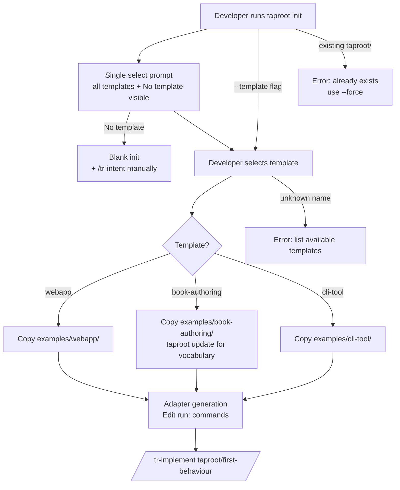

# Behaviour: Starter Examples

## Actor
Developer starting a new project with taproot — who has decided to use taproot but is facing a blank hierarchy and does not know what intents or behaviours to create.

## Preconditions
- taproot is available via `npx @imix-js/taproot` or a local/global install
- The developer is initialising taproot in a new or empty project

## Main Flow
1. Developer runs `npx @imix-js/taproot init`
2. System detects an empty or new project and presents a single template selection prompt showing all options:
   ```
   Start from a template?
   ❯ No template — start with an empty hierarchy
     webapp        — SaaS web application (user auth, profiles)
     book-authoring — Book or content project (manuscript, research, publishing)
     cli-tool      — Command-line tool or developer utility
   ```
3. Developer selects an option (default: "No template")
4. If "No template" is selected: init continues without copying any template (proceeds to adapter generation)
5. If a template is selected: system copies the starter's `taproot/` and `.taproot/` folders into the project root
6. System continues with adapter generation
7. Developer opens `.taproot/settings.yaml` and adjusts the `run:` commands for their actual test runner and build tool
8. Developer opens their agent and runs `/tr-implement taproot/<first-behaviour>/` against a pre-populated spec

## Alternate Flows

### Non-interactive / scripted use
- **Trigger:** Developer wants to skip the prompt (CI, scripts, or already knows which template to use)
- **Steps:**
  1. Developer runs `npx @imix-js/taproot init --template <type>` directly
  2. System skips the prompt and copies the named template immediately
  3. Rest of flow proceeds from step 6 of the main flow

### Non-development domain (e.g. book authoring)
- **Trigger:** Developer is not building software — they are writing a book, producing a research report, or running a content-driven project
- **Steps:**
  1. Developer selects `book-authoring` at the template prompt (or runs `init --template book-authoring`)
  2. System copies the starter, which includes vocabulary overrides (`tests → manuscript reviews`, `source files → chapters`, `implementation → writing`) pre-configured in `.taproot/settings.yaml`
  3. Developer runs `npx @imix-js/taproot update` so vocabulary overrides are applied to installed skill files
  4. Developer has a domain-appropriate hierarchy with no dev-specific terminology in skill files

### Developer tooling (e.g. CLI tool)
- **Trigger:** Developer is building a CLI tool, library, or backend service — not a user-facing web app
- **Steps:**
  1. Developer selects `cli-tool` at the template prompt (or runs `init --template cli-tool`)
  2. System copies the starter, which includes intents for command interface, configuration, and output formatting
  3. Developer adjusts the `run:` commands (e.g. swap `npm run build` for `go build ./...`)
  4. Developer has a CLI-appropriate hierarchy without having to model the right intents from scratch

### No matching starter
- **Trigger:** Developer's project type has no starter (e.g. mobile app, embedded system)
- **Steps:**
  1. Developer runs bare `npx @imix-js/taproot init`
  2. Developer reviews the closest available starter on GitHub for structural inspiration
  3. Developer creates intents manually using `/tr-intent`

## Postconditions
- The project root contains a populated `taproot/` hierarchy with at least two intents and their behaviours in `specified` state
- `.taproot/settings.yaml` is configured with DoD conditions appropriate for the project type
- Agent adapters have been generated and the developer's agent can immediately invoke taproot skills
- `/tr-implement` can be invoked on a pre-populated spec without any manual editing

## Error Conditions
- **Existing `taproot/` detected when `--template` is used**: System warns "taproot/ already exists — use `--force` to overwrite or copy manually from `examples/<type>/`" and exits without modifying files.
- **Unknown template name**: System lists available templates and exits. Example: `Unknown template 'django'. Available: webapp, book-authoring, cli-tool`.
- **`run:` commands in settings.yaml do not match the project's stack**: `taproot dod` fails on the first implementation commit. The settings template includes inline comments explaining which command to substitute for each stack.

## Flow


## Related
- `./welcoming-readme/usecase.md` — precedes this; visitor first understands taproot via the README, then picks a starter to begin
- `../taproot-adaptability/domain-vocabulary/usecase.md` — the book-authoring starter uses vocabulary overrides; this behaviour depends on that capability
- `../requirements-hierarchy/initialise-hierarchy/usecase.md` — the `--template` flag extends the existing `taproot init` command

## Acceptance Criteria

**AC-1: Webapp template produces an immediately implementable hierarchy**
- Given a developer who runs `npx @imix-js/taproot init --template webapp` in an empty project
- When the command completes
- Then the resulting `taproot/` directory contains at least 2 intents with behaviours in `specified` state, and `/tr-implement taproot/user-auth/sign-up/` can be invoked immediately without any manual editing of the spec

**AC-2: Book-authoring template configures domain vocabulary**
- Given a developer who runs `npx @imix-js/taproot init --template book-authoring`
- When they then run `npx @imix-js/taproot update`
- Then `.taproot/settings.yaml` has `vocabulary:` overrides configured (`tests → manuscript reviews`, `source files → chapters`) and the installed skill files reflect those substitutions

**AC-3: CLI tool template has CLI-appropriate DoD conditions**
- Given a developer who runs `npx @imix-js/taproot init --template cli-tool`
- When they inspect `.taproot/settings.yaml`
- Then the `definitionOfDone` contains conditions relevant to CLI development (build check, type check) and not webapp-specific checks

**AC-4: No-match fallback initialises cleanly**
- Given a developer whose project type has no matching starter
- When they run bare `npx @imix-js/taproot init`
- Then the hierarchy initialises successfully with an empty `taproot/` folder and the developer can create their first intent with `/tr-intent`

**AC-5: All starters pass structural and format validation**
- Given any starter is copied into a project via `init --template <type>`
- When `taproot validate-structure` and `taproot validate-format` are run
- Then both commands report no violations

**AC-6: Unknown template name produces a helpful error**
- Given a developer runs `npx @imix-js/taproot init --template unknown-type`
- When the command runs
- Then it exits with a non-zero code and lists the available template names

**AC-7: All template options visible before selection**
- Given a developer runs `npx @imix-js/taproot init` on a fresh project
- When the template prompt is shown
- Then all available templates with their one-line descriptions are visible in a single prompt, with "No template" as the default option — before the developer commits to any choice

## Implementations <!-- taproot-managed -->
- [Bundled Templates](./bundled-templates/impl.md)

## Status
- **State:** implemented
- **Created:** 2026-03-25
- **Last reviewed:** 2026-03-27

## Notes
- The webapp starter already exists at `examples/webapp/`. This behaviour spec covers the full collection including the two starters yet to be built (book-authoring, cli-tool) and the `--template` flag for `taproot init`.
- Starters are hierarchy-only — no source code. This keeps them maintenance-free and avoids the "example project goes stale" problem.
- The `examples/settings/` templates (webapp.yaml, library.yaml, microservice.yaml) complement this but are not the same thing — they provide settings without a hierarchy.
- `taproot init --template` is an extension to the existing `initialise-hierarchy` behaviour — the implementation should add the flag to the existing init command rather than creating a new command.
