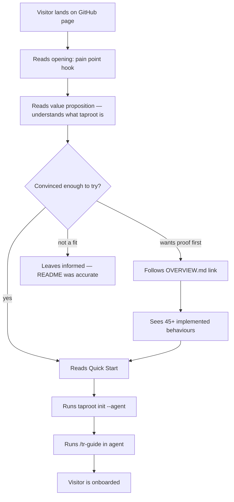

# Behaviour: Welcoming README

## Actor
Developer discovering taproot for the first time

## Preconditions
- `README.md` exists in the taproot repository root
- The README is rendered on the GitHub repository landing page

## Main Flow
1. Visitor lands on the taproot GitHub page and reads the opening — a clear, compelling statement of the pain point taproot solves (AI-assisted coding loses track of *why* code exists)
2. Visitor reads the one-line value proposition and immediately understands what taproot is
3. Visitor scans the design principles — filesystem-based, agent-agnostic, CLI-validated — and judges fit for their project
4. Visitor reads the Quick Start section and runs the three-step install
5. Visitor runs `taproot init --agent <agent>` in their project and installs their agent adapter
6. Visitor runs `/tr-guide` in their agent for the onboarding walkthrough
7. Visitor sees a reference to taproot tracking itself (OVERVIEW.md) and follows it as a live example

## Alternate Flows

### Evaluator skips to proof
- **Trigger:** Visitor is an engineering lead who wants evidence of maturity before reading further
- **Steps:**
  1. Visitor sees the "Taproot tracks itself" section and follows the OVERVIEW.md link
  2. Visitor sees 45+ implemented behaviours and recognises the tool is production-ready
  3. Visitor returns to the README and continues with the Quick Start

### Visitor wants to understand before installing
- **Trigger:** Visitor reads the Why section and wants more depth before committing to an install
- **Steps:**
  1. Visitor follows a link in the README to `docs/concepts.md` or `docs/workflows.md`
  2. Visitor returns to the README Quick Start when ready

### Visitor decides taproot is not a fit
- **Trigger:** Visitor reads the README and determines the workflow doesn't match their team
- **Steps:**
  1. README accurately represents what taproot is and is not — visitor leaves informed, not misled
  2. No false promises; constraints and scope boundaries are visible

## Postconditions
- Visitor can describe what taproot is and who it's for without reading any other document
- Visitor has either completed `taproot init` or made an informed decision not to
- The README accurately reflects taproot's actual capability (not just the minimal quick-start)

## Error Conditions
- **README becomes stale after feature additions:** Mitigated by the `document-current` DoD condition already enforced on all implementations — README accuracy is a resolved cross-cutting concern
- **Quick Start steps break after a dependency change:** If the install instructions in the README no longer work, a first-time visitor is immediately blocked — this is a critical failure; install steps must be verified with each release

## Flow

## Related
- `taproot/requirements-hierarchy/initialise-hierarchy/usecase.md` — the Quick Start leads directly here; README must accurately reflect `taproot init` behaviour
- `taproot/agent-integration/generate-agent-adapter/usecase.md` — `taproot init --agent` is the key first-install action the README guides visitors toward
- `taproot/agent-integration/agent-support-tiers/usecase.md` — README should reflect agent tier labels (Tier 1/2/3) so visitors know Claude is fully supported

## Acceptance Criteria

**AC-1: Pain point visible without scrolling**
- Given a visitor on a standard laptop screen (1080p, default browser font)
- When they land on the taproot GitHub page
- Then the opening sentence names the specific problem taproot solves (AI coding loses track of *why* code exists) before any code block or feature list

**AC-2: Value proposition clear within first scroll**
- Given a visitor who has never heard of taproot
- When they read through the first visible section of the README
- Then they can explain in one sentence what taproot does and who it's for

**AC-3: Quick Start is complete and works end-to-end**
- Given a developer with Node.js installed and no prior taproot setup
- When they follow only the README Quick Start steps
- Then they have taproot installed, `taproot init` has run successfully, and their agent adapter is in place — without needing to consult any other document

**AC-4: Taproot's own usage is surfaced as proof**
- Given a visitor reading the README
- When they reach the "Taproot tracks itself" section
- Then they see a link to `taproot/OVERVIEW.md` and the current behaviour/implementation counts — demonstrating taproot is used on its own codebase

**AC-5: README does not make false claims**
- Given any feature described in the README
- When a developer attempts to use that feature after install
- Then the feature exists and behaves as described — no aspirational or placeholder content

**NFR-1: README renders without broken syntax on GitHub**
- Given the README.md content pushed to the repository
- When GitHub renders it on the repository landing page
- Then all Markdown elements (code blocks, headers, lists, links) render correctly with no raw syntax visible

## Implementations <!-- taproot-managed -->
- [README Content](./content/impl.md)

## Status
- **State:** implemented
- **Created:** 2026-03-21
- **Last reviewed:** 2026-03-21

## Notes
- The README is the only document a first-time visitor reads before deciding whether to install — it carries more weight than any other doc in the project.
- Inspiration: GSD README (bold problem-first opening, punchy feature bullets with em-dashes, numbered CLI workflow steps) and OpenSpec README (stated design philosophy early, competitive positioning, conversational problem framing).
- The README should reflect the real maturity of the project: 45 behaviours, agent tiers, DoD/DoR gates, acceptance criteria traceability — not just the minimal "here's a tree" quick-start.
- The "Taproot tracks itself" section is a key trust signal — it shows that the tool is used in production on its own codebase.
