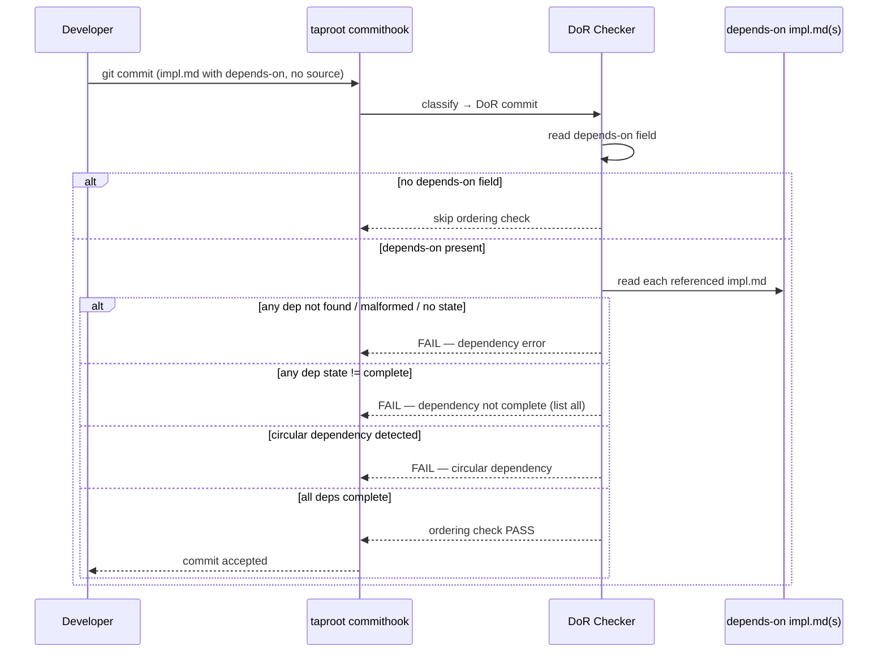

# Behaviour: Implementation Ordering Constraints

## Actor
Developer or agent — making a declaration commit (`impl.md` only, no source files) for a new implementation that depends on another implementation being complete before work can begin.

## Preconditions
- A git pre-commit hook invoking `taproot commithook` is installed
- The commit contains at least one `impl.md` and no source code changes (DoR commit)

## Main Flow
1. Developer adds a `depends-on:` field to the `impl.md` header, listing paths to implementation(s) that must be complete first
2. Developer makes a declaration commit staging only `impl.md`
3. `taproot commithook` classifies the commit as a DoR commit and reads the `depends-on` field
4. For each declared dependency path, system resolves the path relative to the project root and reads the referenced `impl.md`
5. System checks that each referenced `impl.md` has `state: complete`
6. All dependencies are complete — ordering check passes; DoR baseline and configured conditions run normally
7. Commit is allowed; implementation work may begin

## Alternate Flows

### No `depends-on` field declared
- **Trigger:** The `impl.md` being committed has no `depends-on` field
- **Steps:**
  1. System skips the ordering check entirely
  2. DoR proceeds with baseline checks only
- **Outcome:** Backwards-compatible — existing impls are unaffected

### Multiple dependencies, some incomplete
- **Trigger:** `depends-on` lists multiple paths and at least one has a non-`complete` state
- **Steps:**
  1. System evaluates all dependencies
  2. System collects all that are not `state: complete`
  3. Commit is blocked; all failing dependencies are listed together in one error message
- **Outcome:** Developer sees the full list of blockers in one pass — no iterative unblocking

### `depends-on` lists a single path as a scalar string
- **Trigger:** `depends-on: taproot/other-intent/behaviour/impl.md` (single value, not a YAML list)
- **Steps:**
  1. System normalises scalar to a single-item list
  2. Ordering check runs as normal
- **Outcome:** Both scalar and list syntax are accepted

## Postconditions
- **Pass:** All declared dependencies are `complete`; the declaration commit proceeds and implementation work may begin
- **Block:** Contributor has a list of all unfulfilled dependencies with their current states; no implementation record is created until dependencies are resolved

## Error Conditions
- **Dependency not complete:** `FAIL — depends-on: <path> has state: <state>. That implementation must be complete before this one can be declared`
- **Dependency path not found:** `FAIL — depends-on: <path> does not exist. Check the path relative to the project root and try again`
- **Circular dependency detected:** `FAIL — circular dependency: <path-A> → <path-B> → <path-A>. Remove the cycle before declaring this implementation`
- **Malformed `depends-on` value:** `FAIL — depends-on must be a string path or list of string paths — got <type>. Check the field syntax in impl.md`
- **Dependency has no `state` field:** `FAIL — depends-on: <path> has no state field. The referenced impl.md is incomplete — add a state: field before declaring this dependency`
- **Dependency is `deferred`:** `FAIL — depends-on: <path> has state: deferred. A deferred implementation cannot satisfy an ordering dependency — remove it from depends-on or reconsider the dependency`

## Flow

## Related
- `../definition-of-ready/usecase.md` — this check runs as part of the DoR tier; DoR baseline must also pass
- `../../hierarchy-integrity/pre-commit-enforcement/usecase.md` — the hook that invokes DoR as one of its three commit-type tiers

## Acceptance Criteria

**AC-1: All dependencies complete — commit allowed**
- Given `impl.md` with `depends-on: taproot/other-intent/behaviour/impl/impl.md` where that impl has `state: complete`
- When DoR runs at declaration commit time
- Then the ordering check passes and the commit proceeds

**AC-2: Dependency not complete — commit blocked**
- Given `impl.md` with `depends-on: taproot/other-intent/behaviour/impl/impl.md` where that impl has `state: in-progress`
- When DoR runs
- Then DoR blocks the commit with `FAIL — depends-on: <path> has state: in-progress`

**AC-3: No `depends-on` field — ordering check skipped**
- Given `impl.md` with no `depends-on` field
- When DoR runs
- Then the ordering check is skipped and DoR proceeds with baseline checks only

**AC-4: Dependency path not found — commit blocked**
- Given `impl.md` with `depends-on: taproot/nonexistent/impl.md`
- When DoR runs
- Then DoR blocks with `FAIL — depends-on: taproot/nonexistent/impl.md does not exist`

**AC-5: Multiple dependencies, one incomplete — commit blocked listing all failures**
- Given `impl.md` with `depends-on: [path-A, path-B]` where path-A has `state: complete` and path-B has `state: specified`
- When DoR runs
- Then DoR blocks listing only path-B as the failing dependency (path-A is not mentioned)

**AC-6: Transitive circular dependency detected — commit blocked**
- Given impl-A → impl-B → impl-C → impl-A (transitive cycle of 3 nodes)
- When DoR runs on impl-A
- Then DoR blocks with a circular dependency error naming all nodes in the cycle: impl-A → impl-B → impl-C → impl-A

**AC-7: Scalar `depends-on` syntax accepted**
- Given `impl.md` with `depends-on: taproot/some/impl.md` (scalar, not a list) where that impl has `state: complete`
- When DoR runs
- Then the ordering check treats it as a single-item list and passes

**AC-8: Malformed `depends-on` value — commit blocked**
- Given `impl.md` with `depends-on: 123` (non-string, non-list value)
- When DoR runs
- Then DoR blocks with `FAIL — depends-on must be a string path or list of string paths`

**AC-9: Dependency has no `state` field — commit blocked**
- Given `impl.md` with `depends-on: taproot/other/impl.md` where that impl.md exists but has no `state:` field
- When DoR runs
- Then DoR blocks with `FAIL — depends-on: <path> has no state field`

**AC-10: Deferred dependency — commit blocked**
- Given `impl.md` with `depends-on: taproot/other/impl.md` where that impl has `state: deferred`
- When DoR runs
- Then DoR blocks with `FAIL — depends-on: <path> has state: deferred`

## Status
- **State:** specified
- **Created:** 2026-03-26
- **Last reviewed:** 2026-03-26

## Notes
- **Point-in-time gate:** The ordering check fires once at declaration commit time. If a dependency's state is later reset (e.g. the impl is re-opened for a spec change), the hook does not retroactively invalidate the declaration. Teams relying on strong ordering guarantees should also check `taproot coverage` or `/tr-plan` before starting work.
- **Path format:** `depends-on` values must be project-root-relative paths (e.g. `taproot/quality-gates/other-impl/impl.md`). File-relative paths (`../sibling/impl.md`) are not supported and will be treated as "not found."
- **`/tr-plan` integration:** `/tr-plan` (extract-next-slice) should respect `depends-on` when determining which impls are independently startable — impls whose dependencies are not yet `complete` should not be proposed as the next work item. This is a companion constraint on `/tr-plan`, not enforced by this behaviour.
