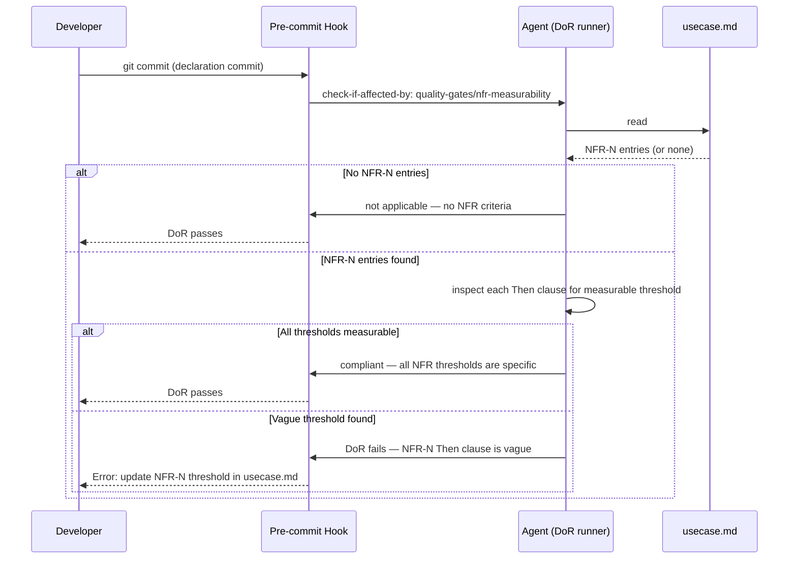

# Behaviour: NFR Measurability Check

## Actor
Developer or agent declaring a new implementation (committing an `impl.md`) — the check runs automatically at Definition of Ready time before any code is written.

## Preconditions
- An `impl.md` is being declared (declaration commit in progress)
- `check-if-affected-by: quality-gates/nfr-measurability` is configured in `definitionOfReady` in `.taproot/settings.yaml`

## Main Flow
1. Developer commits an `impl.md` (declaration commit)
2. Pre-commit hook runs DoR checks against the `impl.md`
3. DoR runner encounters `check-if-affected-by: quality-gates/nfr-measurability`
4. Agent reads the parent `usecase.md` (two levels up from `impl.md`) and collects all `**NFR-N:**` entries from the `## Acceptance Criteria` section
5. If no `**NFR-N:**` entries are found: agent records "not applicable — no NFR criteria in usecase.md" and DoR passes
6. For each `**NFR-N:**` entry, agent inspects the `Then` clause for a measurable threshold — one of:
   - A number with a unit (e.g. `200ms`, `60%`, `500 concurrent users`, `< 1s`)
   - A named standard or specification (e.g. `WCAG 2.1 AA`, `PCI DSS 4.0`, `RFC 7519`)
   - A testable boolean condition (e.g. `account is locked`, `notification email is sent`)
7. If all `**NFR-N:**` entries are measurable: agent records a resolution in `impl.md` under `## DoR Resolutions` and DoR passes
8. Pre-commit hook succeeds — implementation may proceed

## Alternate Flows

### Not applicable — no NFR criteria
- **Trigger:** The parent `usecase.md` has no `**NFR-N:**` entries in `## Acceptance Criteria`
- **Steps:**
  1. Agent records "not applicable — no NFR criteria in usecase.md" in `## DoR Resolutions`
  2. DoR passes

### Not applicable — documentation-only implementation
- **Trigger:** The `impl.md` describes a documentation or spec update with no behaviour to performance-test
- **Steps:**
  1. Agent records "not applicable — documentation change; no NFR thresholds apply" in `## DoR Resolutions`
  2. DoR passes

## Postconditions
- Every implementation whose behaviour spec contains NFR criteria has been explicitly checked for measurability before coding begins
- Vague NFR criteria (e.g. "must be fast", "must be secure") are caught at declaration time, not during review
- The resolution (measurable / not applicable + reason) is recorded in `impl.md` under `## DoR Resolutions` for traceability

## Error Conditions
- **Vague NFR threshold found**: Agent identifies a `Then` clause containing only qualitative language ("fast", "secure", "reasonable", "good") with no number, standard, or testable condition — DoR fails. Developer must update the `**NFR-N:**` entry in `usecase.md` to include a specific threshold, then re-commit the `impl.md`
- **Parent `usecase.md` absent**: Agent cannot read NFR criteria — records "blocked: usecase.md not found at expected path. Restore the spec or remove this DoR condition." DoR fails.

## Flow

## Related
- `taproot/acceptance-criteria/specify-nfr-criteria/usecase.md` — defines the `**NFR-N:**` format that this gate validates
- `taproot/quality-gates/architecture-compliance/usecase.md` — parallel DoR gate; same structural pattern, different concern
- `taproot/quality-gates/definition-of-ready/usecase.md` — the DoR mechanism this gate plugs into

## Acceptance Criteria

**AC-1: Passes when all NFR thresholds are measurable**
- Given a `usecase.md` with `**NFR-1:**` whose Then clause reads "results returned within 200ms (p95)"
- When the DoR runner fires the nfr-measurability check
- Then the check passes and a resolution is recorded in `impl.md`

**AC-2: Passes as not-applicable when no NFR criteria exist**
- Given a `usecase.md` with only `**AC-N:**` entries and no `**NFR-N:**` entries
- When the DoR runner fires the nfr-measurability check
- Then the check records "not applicable — no NFR criteria" and passes

**AC-3: Fails when a Then clause contains only qualitative language**
- Given a `usecase.md` with `**NFR-1:**` whose Then clause reads "the system must respond quickly"
- When the DoR runner fires the nfr-measurability check
- Then the check fails with a message identifying NFR-1 and requiring a specific threshold

**AC-4: Accepts named standard as a valid threshold**
- Given a `usecase.md` with `**NFR-1:**` whose Then clause reads "all interactive elements must meet WCAG 2.1 AA"
- When the DoR runner fires the nfr-measurability check
- Then the check passes — a named standard is a valid measurable threshold

**AC-5: Fails when usecase.md is absent**
- Given an `impl.md` whose parent `usecase.md` does not exist
- When the DoR runner fires the nfr-measurability check
- Then the check fails with a message noting the missing spec and blocking the commit

**NFR-1: Check completes within commit hook timeout**
- Given a `usecase.md` with up to 20 `**NFR-N:**` entries
- When the DoR runner fires the nfr-measurability check
- Then the check completes within 30 seconds (within the `TIMEOUT_MS` constant used by the DoD runner)

## Implementations <!-- taproot-managed -->
- [Settings Wiring](./settings-wiring/impl.md)

## Status
- **State:** specified
- **Created:** 2026-03-21
- **Last reviewed:** 2026-03-21

## Notes
- **Measurability heuristics for the agent**: a Then clause is measurable if it contains at least one of: (a) a digit followed by a unit (`ms`, `s`, `%`, `MB`, `rps`, `users`), (b) a proper noun referencing a named standard, or (c) a past-tense or present-tense verb describing a testable system state ("is locked", "is sent", "returns 4xx"). Pure adjectives ("fast", "secure", "reliable", "good") without qualification always fail.
- **Wiring**: add `- check-if-affected-by: quality-gates/nfr-measurability` to `definitionOfReady` in `.taproot/settings.yaml` to activate this gate.
- **Relationship to DoD**: this gate fires at *declaration* time (DoR) — before implementation. A separate DoD check (verify-coverage) ensures NFR criteria are covered by test artefacts after implementation.
