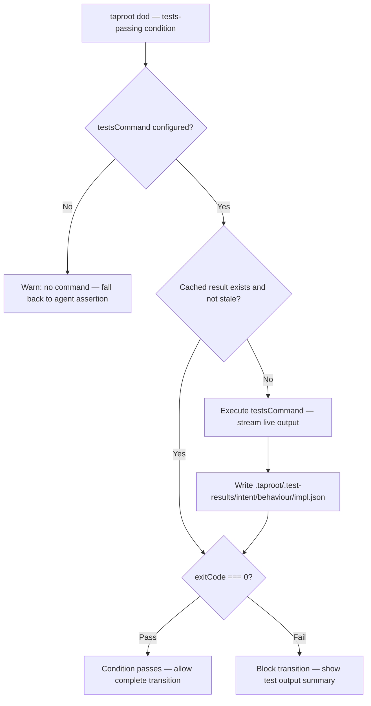

# Behaviour: State Transition Guardrails

## Actor
`taproot dod` CLI — when processing the `tests-passing` condition for an `impl.md` about to be marked `complete`. Also enforced by `taproot commithook` when an implementation commit includes an `impl.md` whose state is `complete`.

## Preconditions
- `tests-passing` is present in `definitionOfDone` in `.taproot/settings.yaml`
- An `impl.md` is being evaluated for the `complete` state transition (either via `taproot dod` or `taproot commithook`)
- A test command is configured in `.taproot/settings.yaml` under `testsCommand` (e.g. `npm test`, `pytest`, `cargo test`)

## Main Flow
1. `taproot dod <impl-path>` encounters the `tests-passing` condition
2. System checks `.taproot/.test-results/<intent>/<behaviour>/<impl>.json` for a cached result (mirroring the `taproot/` directory structure — unique per impl):
   - If a result exists and is not stale (see Staleness definition below): proceed to step 5
   - If absent or stale: proceed to step 3
3. System executes the configured `testsCommand` in the project root, streaming stdout/stderr live to the developer. Output is also captured; the final 20 lines are stored as `summary` in the cache file.
4. System writes `.taproot/.test-results/<intent>/<behaviour>/<impl>.json`, creating parent directories if absent, with:
   - `timestamp`: ISO 8601 execution time
   - `command`: the command that was run
   - `exitCode`: 0 = passed, non-zero = failed
   - `summary`: last 20 lines of output (for diagnostics)
5. If `exitCode === 0`: `tests-passing` condition passes — state transition to `complete` is allowed
6. If `exitCode !== 0`: `tests-passing` condition fails — state transition is blocked with a clear error showing the test output summary

**Staleness definition:** A cached result is stale if any source file tracked by the `impl.md` (listed in `## Source Files`) has been modified more recently than the test result timestamp. If no source files are listed, the result is stale after a configurable `testResultMaxAge` (default: 60 minutes).

## Alternate Flows

### No `testsCommand` configured
- **Trigger:** `tests-passing` condition is encountered but `.taproot/settings.yaml` has no `testsCommand` key
- **Steps:**
  1. System falls back to the existing agent-reasoning path: agent asserts compliance via `--resolve "tests-passing" --note "<reasoning>"`
  2. System emits a warning: `"No testsCommand configured — tests-passing resolved by agent assertion only. Add testsCommand to .taproot/settings.yaml to enable evidence-based verification."`

### Test result is fresh — skip re-execution
- **Trigger:** `.taproot/.test-results/<intent>/<behaviour>/<impl>.json` exists and is not stale
- **Steps:**
  1. System reads the cached result and checks `exitCode`
  2. If `exitCode === 0`: condition passes immediately — no re-execution
  3. If `exitCode !== 0`: condition fails — developer must fix tests and re-run `taproot dod`

### State transition to non-`complete` state
- **Trigger:** `taproot dod` or commithook processes an `impl.md` whose target state is not `complete` (e.g., `in-progress`, `needs-rework`)
- **Steps:**
  1. Guardrail does not trigger — evidence-based check is only required for `complete` transitions
  2. Normal DoD processing continues

### Developer forces re-run
- **Trigger:** Developer runs `taproot dod <impl-path> --rerun-tests`
- **Steps:**
  1. System ignores any cached result and re-executes the `testsCommand`
  2. Result overwrites the previous cache entry
  3. Flow continues from Main Flow step 5

### Commithook enforcement
- **Trigger:** `taproot commithook` encounters an implementation commit where `impl.md` state is `complete` and `tests-passing` is in `definitionOfDone`
- **Steps:**
  1. Commithook reads `.taproot/.test-results/<intent>/<behaviour>/<impl>.json`
  2. If absent or stale: commit is blocked — `"tests-passing blocked: no fresh test result found. Run taproot dod <impl-path> to execute tests and record evidence."`
  3. If present, fresh, and `exitCode === 0`: test evidence is valid — guardrail passes, commit proceeds
  4. If present, fresh, but `exitCode !== 0`: previous test run failed — commit is blocked with the stored summary

### Test command times out
- **Trigger:** `testsCommand` execution exceeds `testTimeout` (default: 300 seconds)
- **Steps:**
  1. System kills the process and writes a failed result with `exitCode: -1` and `summary: "timed out after Ns"`
  2. Condition fails — state transition blocked
  3. Error message: `"tests-passing blocked: test command timed out after Ns. Increase testTimeout in .taproot/settings.yaml if needed."`

## Postconditions
- `.taproot/.test-results/<intent>/<behaviour>/<impl>.json` exists with an up-to-date execution result
- If `exitCode === 0`: `impl.md` is marked `complete` and DoD records the resolution with the evidence path and timestamp
- If `exitCode !== 0`: `impl.md` remains in its current state; developer sees test failure output

## Error Conditions
- **`testsCommand` exits non-zero:** System blocks the `complete` transition and displays: `"tests-passing blocked: 
. Fix failing tests and re-run taproot dod."` State is not changed.
- **`testsCommand` not found in PATH:** System reports: `"tests-passing blocked: command '<testsCommand>' not found. Check testsCommand in .taproot/settings.yaml."` State is not changed.
- **`--resolve "tests-passing"` called when `testsCommand` is configured:** System rejects the manual resolution: `"tests-passing cannot be resolved by assertion when testsCommand is configured. Run taproot dod <impl-path> to execute tests and record evidence."` This prevents agents from bypassing evidence-based enforcement.
- **Cache file exists but is corrupt or malformed JSON:** System treats the file as absent, re-executes `testsCommand`, and logs a warning: `"Ignoring malformed cache at <path> — re-running tests."`
- **`.taproot/.test-results/` not writable:** System reports a permission error and falls back to the agent-assertion path with a warning.

## Flow

## Related
- `quality-gates/definition-of-done/usecase.md` — the DoD runner is the execution context for this guardrail; `tests-passing` is the specific condition this behaviour makes evidence-backed
- `hierarchy-integrity/cascade-impl-status/usecase.md` — cascade-impl-status triggers after an impl is marked `complete`; guardrails gate whether that transition is allowed
- `hierarchy-integrity/pre-commit-enforcement/usecase.md` — the commithook enforces guardrails at commit time for implementation commits where `impl.md` state is `complete`

## Acceptance Criteria

**AC-1: Test command executes and passes — state transition allowed**
- Given `tests-passing` is in `definitionOfDone` and `testsCommand: npm test` is configured
- When `taproot dod taproot/my-intent/my-behaviour/impl.md` is run and `npm test` exits 0
- Then `tests-passing` resolves as passed, `.taproot/.test-results/my-intent/my-behaviour/impl.json` is written, and `impl.md` is marked `complete`

**AC-2: Test command fails — state transition blocked**
- Given `tests-passing` is in `definitionOfDone` and `testsCommand: npm test` is configured
- When `taproot dod` is run and `npm test` exits non-zero
- Then `tests-passing` fails, the `complete` state is not set, and the last 20 lines of test output are shown

**AC-3: Fresh cache skips re-execution**
- Given a passing test result exists in `.taproot/.test-results/` and no source files tracked by `impl.md` have changed since
- When `taproot dod` is run again
- Then `testsCommand` is not re-executed and the cached result is used

**AC-4: Stale cache triggers re-execution**
- Given a passing test result exists but a tracked source file has been modified since the result was written
- When `taproot dod` is run
- Then `testsCommand` is re-executed and the cache is refreshed

**AC-5: No `testsCommand` configured — falls back to agent assertion with warning**
- Given `tests-passing` is in `definitionOfDone` but no `testsCommand` is in `settings.yaml`
- When `taproot dod` processes `tests-passing`
- Then the agent-reasoning path runs and a warning is emitted: `"No testsCommand configured — resolved by agent assertion only"`

**AC-6: Commithook enforces guardrail on implementation commits**
- Given `impl.md` state is `complete` and `tests-passing` is in `definitionOfDone` and `testsCommand` is configured
- When a commit is made that includes source files tracked by the `impl.md`
- Then `taproot commithook` verifies `.taproot/.test-results/<intent>/<behaviour>/<impl>.json` has a fresh passing result; blocks if absent or stale

**AC-7: `--rerun-tests` forces fresh execution**
- Given a cached passing test result exists
- When `taproot dod <impl-path> --rerun-tests` is run
- Then `testsCommand` is re-executed regardless of cache freshness

**AC-8: Commithook blocks commit when test result is absent**
- Given `impl.md` state is `complete`, `testsCommand` is configured, and no cache file exists
- When `git commit` is run with that `impl.md` staged
- Then the commit is blocked with: `"tests-passing blocked: no fresh test result found. Run taproot dod <impl-path> to execute tests and record evidence."`

**AC-9: Manual `--resolve "tests-passing"` rejected when `testsCommand` configured**
- Given `testsCommand` is configured in `settings.yaml`
- When `taproot dod --resolve "tests-passing" --note "looks fine"` is called
- Then the system rejects the resolution with: `"tests-passing cannot be resolved by assertion when testsCommand is configured"`

**AC-10: Malformed cache file treated as absent**
- Given `.taproot/.test-results/<path>.json` exists but contains invalid JSON
- When `taproot dod` is run
- Then a warning is logged, the file is treated as absent, and `testsCommand` is re-executed

## Status
- **State:** specified
- **Created:** 2026-03-25
- **Last reviewed:** 2026-03-25

## Notes
- **Cache key uniqueness:** `.taproot/.test-results/<intent>/<behaviour>/<impl>.json` mirrors the `taproot/` hierarchy, ensuring uniqueness even when multiple implementations share the same folder name (e.g. many `cli-command` impls across different intents).
- **`.taproot/.test-results/` should be in `.gitignore`** — it is a local execution cache, not a committed artifact. `taproot init` should append this entry automatically.
- **Staleness in CI:** Filesystem mtimes may be reset during CI checkouts, making source-file-based staleness unreliable. Teams can set `testResultMaxAge: 0` to always re-execute, or configure CI to run `taproot dod` as a separate step with a fresh environment.
- **DoD resolution format:** When `tests-passing` is satisfied via the evidence path, the resolution written to `## DoD Resolutions` should include the cache reference: `condition: tests-passing | evidence: .taproot/.test-results/<path>.json @ <ISO timestamp> | exitCode: 0 | resolved: <date>`. This distinguishes evidence-backed resolutions from agent-asserted ones and makes the audit trail explicit.
- **Security:** `testsCommand` is executed as a shell command in the project root. See `docs/security.md`. Never interpolate user-provided or external input into `testsCommand`.
- The `testsCommand` in `settings.yaml` is the project-wide test command. It may differ from the DoD `check:` conditions which are agent-evaluated.
- `testResultMaxAge` and `testTimeout` are optional settings.yaml keys with documented defaults; neither is required.
- The evidence-based path and the agent-assertion fallback coexist intentionally — teams can adopt gradually. Full guardrail enforcement requires `testsCommand` to be set.
- This behaviour strengthens `tests-passing` specifically; other DoD conditions (`document-current`, `check-if-affected-by`, etc.) remain agent-evaluated by design — they require reasoning, not execution.
