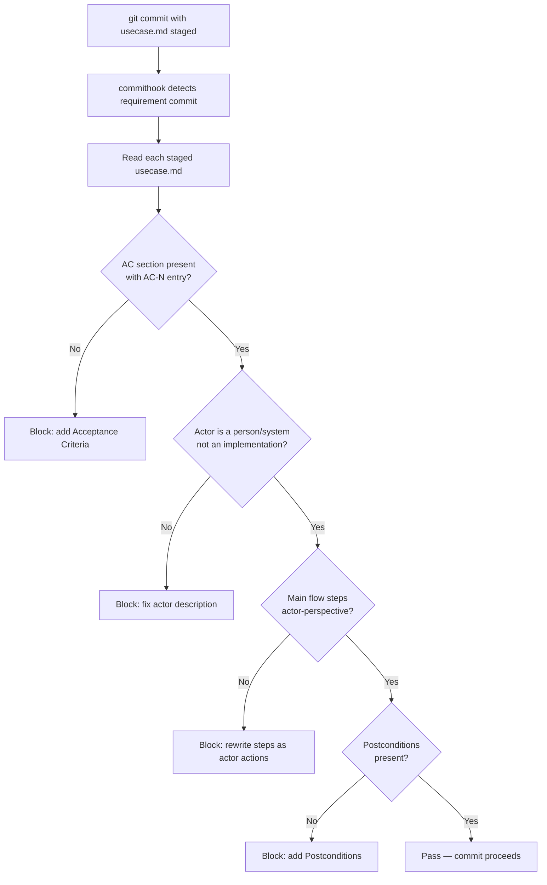

# Behaviour: Validate UseCase Quality at Commit

## Actor
`taproot commithook` — triggered automatically when a `usecase.md` is committed (requirement commit)

## Preconditions
- A git pre-commit hook invoking `taproot commithook` is installed
- The commit contains at least one `usecase.md` file
- No `impl.md` files are staged (pure requirement commit)

## Main Flow
1. `taproot commithook` detects that staged files include `usecase.md` — classifies as a requirement commit
2. System reads each staged `usecase.md`
3. System checks baseline usecase quality conditions:
   a. `## Acceptance Criteria` section is present and contains at least one `AC-N:` entry
   b. `## Actor` section describes a human, system, or external service — not an implementation mechanism (e.g. "the API endpoint" or "the database query" are not valid actors)
   c. `## Main Flow` steps are written from the actor's perspective — each step has a subject performing an action (not passive voice describing system internals)
   d. `## Postconditions` section is present and non-empty
4. If all conditions pass: commit proceeds
5. If any conditions fail: system prints each failure with a correction hint and blocks the commit

## Alternate Flows

### Agent context guidance (soft path)
- **Trigger:** Agent is writing a `usecase.md` — before the commit gate fires
- **Steps:**
  1. Agent is instructed (via CLAUDE.md / agent context) on what a valid usecase looks like
  2. Agent writes spec meeting quality criteria on the first attempt
  3. Gate passes without rejection

### Custom quality conditions
- **Trigger:** `.taproot/settings.yaml` defines `definitionOfSpec` conditions
- **Steps:**
  1. System runs custom conditions alongside baseline checks
  2. Results reported and failures block the commit

### Sub-behaviour usecase (parent is a usecase, not an intent)
- **Trigger:** The staged `usecase.md` lives under another `usecase.md` (sub-behaviour)
- **Steps:**
  1. Same quality checks apply — sub-behaviours must meet the same standard

## Postconditions
- Every committed `usecase.md` has acceptance criteria, a valid actor, actor-perspective flow steps, and postconditions
- Agents writing usecases encounter the quality bar at commit time with actionable correction hints

## Error Conditions
- **`## Acceptance Criteria` section missing**: "Add an `## Acceptance Criteria` section with at least one `AC-1:` Gherkin scenario before committing"
- **Actor describes implementation mechanism**: "Actor should be a human, system, or external service — not an implementation detail. Change '`<current value>`' to the person or system that initiates this behaviour"
- **Main flow uses passive voice or describes internals**: "Main flow steps must describe what the actor does, not what the code does. Rewrite step N as: '`<Actor>` does `<action>`'"
- **`## Postconditions` missing**: "Add a `## Postconditions` section describing what is true after the flow succeeds"

## Flow

## Related
- `../validate-intent-quality/usecase.md` — sibling: intent quality gate (measurable goal, stakeholders)
- `../definition-of-ready/usecase.md` — sibling: DoR runs on impl.md declaration commits; this gate runs on usecase.md commits
- `../../acceptance-criteria/specify-acceptance-criteria/usecase.md` — documents how to write AC; this gate enforces it
- `../../hierarchy-integrity/pre-commit-enforcement/usecase.md` — the hook that runs this gate

## Acceptance Criteria

**AC-1: Missing AC section blocks commit**
- Given a `usecase.md` with no `## Acceptance Criteria` section is staged
- When `git commit` runs
- Then the hook blocks the commit with: "Add an `## Acceptance Criteria` section with at least one AC-1: entry"

**AC-2: AC section with at least one entry passes**
- Given a `usecase.md` with `## Acceptance Criteria` containing `**AC-1:**` is staged
- When `git commit` runs
- Then the AC check passes

**AC-3: Implementation-mechanism actor blocks commit**
- Given a `usecase.md` whose `## Actor` section reads "the REST endpoint" or "the database"
- When `git commit` runs
- Then the hook blocks with: "Actor should be a human, system, or external service"

**AC-4: Valid actor (human or system) passes**
- Given a `usecase.md` whose `## Actor` is "Developer" or "External payment service"
- When `git commit` runs
- Then the actor check passes

**AC-5: Missing Postconditions blocks commit**
- Given a `usecase.md` with no `## Postconditions` section is staged
- When `git commit` runs
- Then the hook blocks with: "Add a `## Postconditions` section"

**AC-6: All checks pass — commit proceeds**
- Given a `usecase.md` with AC section, valid actor, actor-perspective flow, and postconditions
- When `git commit` runs
- Then all quality checks pass and the commit is not blocked

## Implementations <!-- taproot-managed -->

## Status
- **State:** specified
- **Created:** 2026-03-20
