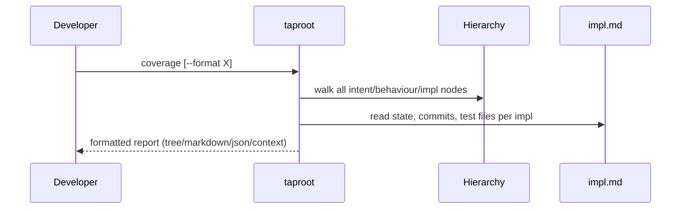

# UseCase: Generate Coverage Report

## Actor
Developer or operator running `taproot coverage`

## Preconditions
- A taproot hierarchy exists with at least one intent

## Main Flow
1. Developer runs `taproot coverage` (optionally with `--format tree|json|markdown|context`)
2. System walks the hierarchy, building a summary of every intent, behaviour, and implementation
3. For each implementation, system reads `impl.md` to extract state, commit count, and test file count
4. System computes totals: intents, behaviours, implementations, complete implementations, tested implementations
5. System renders the report in the requested format:
   - **tree** (default): ASCII tree with progress bars showing complete/total impl per behaviour
   - **markdown**: heading-based report suitable for GitHub or docs sites
   - **json**: machine-readable structured data for tooling integration
   - **context**: generates `taproot/CONTEXT.md` — a navigable summary for AI agents, including a "Needs Attention" section
6. For `--format context`, system writes the file to `taproot/CONTEXT.md` and reports the path; all other formats print to stdout

## Alternate Flows
- **`--format context`**: Side-effect output — writes `CONTEXT.md` rather than printing to stdout; includes a "Needs Attention" section with in-progress, untested, and unimplemented items

## Error Conditions
- **No intents found**: Reports zero counts; no error exit

## Postconditions
- Developer can see at a glance how much of the requirement hierarchy is specified, implemented, and tested
- AI agents can load `CONTEXT.md` for a compact navigable summary without reading every document

## Diagram

## Status
- **State:** implemented
- **Created:** 2026-03-19
