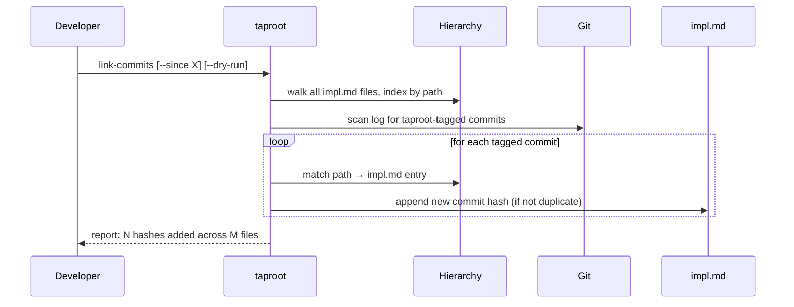

# UseCase: Link Commits to Implementation Records

## Actor
Developer or CI operator running `taproot link-commits`

## Preconditions
- The project is inside a git repository
- One or more `impl.md` files exist in the hierarchy
- Commits have been made using the taproot commit convention: `taproot(<path>): <message>` (or configured equivalent)

## Main Flow
1. Developer runs `taproot link-commits` (optionally with `--since <date|hash>` to limit scope)
2. System loads configuration and resolves the taproot root path
3. System walks the hierarchy and indexes all `impl.md` files by their repo-relative path
4. System reads each `impl.md` to extract already-known commit hashes (to avoid duplicates)
5. System scans git log, extracting commits whose message contains a taproot path reference matching the configured commit pattern
6. For each matching commit, system resolves the referenced path to an `impl.md` entry in the index
7. System appends newly discovered commit hashes to the `## Commits` section of the matching `impl.md`
8. System reports which files were updated and how many hashes were added

## Alternate Flows
- **`--dry-run` flag**: System reports what would be added without writing any files
- **No matching commits found**: System outputs "No new commits to link." and exits successfully
- **Commit already linked**: Duplicate hashes are skipped silently

## Error Conditions
- **Not a git repository**: System throws an error — `link-commits` requires git history
- **Unreadable `impl.md`**: File is skipped with no error (graceful degradation)
- **`impl.md` has no `## Commits` section**: System appends a new section at the end of the file

## Postconditions
- Each `impl.md` whose implementation path appears in a tagged commit now has those commit hashes listed under `## Commits`
- The git audit trail from business intent → code change is navigable without manual maintenance

## Diagram

## Status
- **State:** implemented
- **Created:** 2026-03-19
