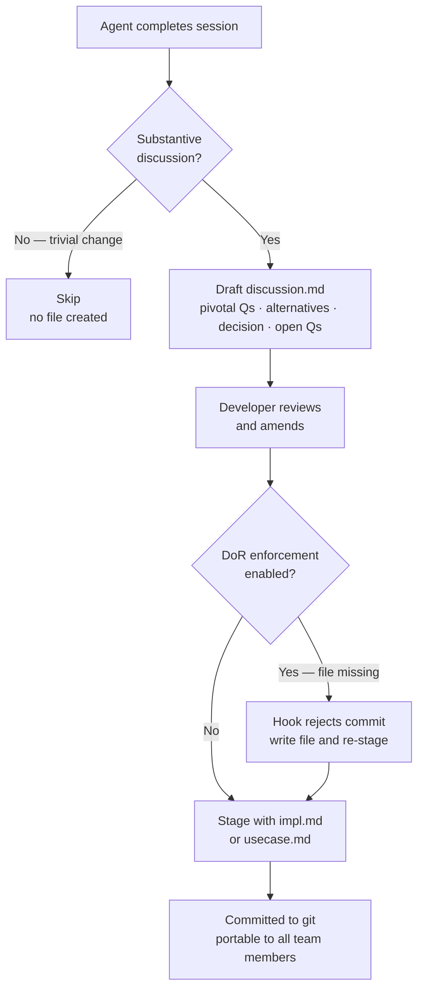

# Behaviour: Record Decision Rationale

## Actor
Agent — executing a taproot skill that involves substantive discussion: primarily `/tr-implement` at declaration commit time, optionally `/tr-behaviour` after spec authoring. Can also be written by a developer working without an agent.

## Preconditions
- A substantive agent session has occurred: design decisions have been made, alternatives have been evaluated, or a spec has been shaped through dialogue
- An `impl.md` exists (implementation rationale) or a `usecase.md` has just been authored (spec rationale)

## Main Flow
1. Agent completes the session — design decisions, explored alternatives, and pivotal exchanges have occurred
2. Agent drafts `discussion.md` as the final step before staging:
   - **Pivotal Questions** — the 1–3 questions or exchanges that most shaped the outcome
   - **Alternatives Considered** — each option that was evaluated and rejected, with the rejection reason
   - **Decision** — the chosen approach in one short paragraph
   - **Open Questions** — unresolved questions deferred to a future session
3. Agent writes the file to `<impl-slug>/discussion.md` alongside `impl.md`
4. Developer reviews the draft and amends any inaccuracies or missing context
5. `discussion.md` is staged alongside `impl.md` in the declaration commit
6. File is committed to git — portable to all team members without access to the original agent session

## Alternate Flows

### Spec authoring context
- **Trigger:** Session was a `/tr-behaviour` run — the substantive discussion was about shaping the spec, not an implementation
- **Steps:**
  1. Agent writes `discussion.md` to the behaviour folder alongside `usecase.md` (not inside an impl subfolder)
  2. File captures the discovery dialogue: what the requirement turned out to mean, what was scoped out, what surprised the developer
  3. File is committed alongside `usecase.md`

### Trivial session — no substantive discussion
- **Trigger:** Session involved only minor edits (typo fix, formatting, minor wording change) with no design choices or alternatives explored
- **Steps:**
  1. Agent determines no meaningful rationale exists to capture
  2. No `discussion.md` is created
  3. Commit proceeds normally without the file

### Human-written — no agent involved
- **Trigger:** Developer worked without an AI agent and wants to record their own reasoning
- **Steps:**
  1. Developer creates `discussion.md` manually using the documented template
  2. File is staged and committed alongside `impl.md`
  3. File is treated identically to an agent-generated file

### DoR enforcement enabled
- **Trigger:** Project has configured `require-discussion-log: true` in `definitionOfReady` in `.taproot/settings.yaml`
- **Steps:**
  1. Developer attempts a declaration commit without a `discussion.md` in the impl folder
  2. Pre-commit hook detects the missing file and rejects the commit
  3. Agent or developer writes the missing file, re-stages, and re-commits

## Postconditions
- `discussion.md` exists alongside `impl.md` (or `usecase.md`) in the hierarchy
- The file is committed to git — readable by any team member without the original session
- The impl.md Design Decisions section and `discussion.md` together give a complete picture: conclusions (impl.md) + deliberation (discussion.md)

## Error Conditions
- **`discussion.md` missing required sections**: If `validate-format` is configured to check the file, it rejects the commit and identifies the missing section by name
- **Agent produces only vague summaries**: The file exists but captures no concrete alternatives or reasoning — a quality failure that tooling cannot catch; the developer must review the draft before staging

## Flow

## Related
- `./link-commits/usecase.md` — records which commits drove which requirement; `discussion.md` adds the reasoning behind those commits
- `./check-orphans/usecase.md` — could optionally detect impl folders missing a `discussion.md` if enforcement is configured
- `../quality-gates/definition-of-ready/usecase.md` — DoR enforcement hooks into this behaviour via a configurable `require-discussion-log` condition
- `../requirements-hierarchy/initialise-hierarchy/usecase.md` — `taproot init` could surface the `require-discussion-log` option during setup

## Acceptance Criteria

**AC-1: Agent writes discussion.md at end of tr-implement**
- Given an agent has completed a `/tr-implement` session with substantive design decisions
- When the declaration commit is prepared
- Then a `discussion.md` exists in the implementation folder alongside `impl.md`, capturing at least one alternative considered and the pivotal question that shaped the design

**AC-2: Spec authoring context writes file to behaviour folder**
- Given an agent has completed a `/tr-behaviour` session with meaningful discovery dialogue
- When the spec is written and committed
- Then `discussion.md` exists in the behaviour folder alongside `usecase.md`, capturing at minimum the scoping decisions made during discovery

**AC-3: Trivial session produces no file**
- Given a session involved only minor edits with no design discussion
- When the session ends
- Then no `discussion.md` is created and the commit succeeds without it

**AC-4: File is committed to git and readable without the original session**
- Given a `discussion.md` has been drafted
- When the declaration commit is staged and pushed
- Then a team member who was not in the original session can read `discussion.md` and understand the key design choices without needing access to any agent-specific log

**AC-5: DoR enforcement rejects commit when file is missing and enforcement is enabled**
- Given a project has configured `require-discussion-log: true` in `definitionOfReady`
- When a declaration commit is attempted without a `discussion.md` in the impl folder
- Then the pre-commit hook rejects the commit with a message identifying the missing file and its expected location

**AC-6: Human-writable without agent**
- Given a developer works without an AI agent and writes `discussion.md` manually
- When they stage and commit it alongside `impl.md`
- Then it is accepted by the hook and treated identically to an agent-generated file

## Implementations <!-- taproot-managed -->
- [Agent Skill](./agent-skill/impl.md)

## Status
- **State:** implemented
- **Created:** 2026-03-25
- **Last reviewed:** 2026-03-25

## Notes
- The split between `impl.md` `## Design Decisions` (conclusions) and `discussion.md` (deliberation) is intentional. `impl.md` is a structured traceability record — its sections are machine-readable. `discussion.md` is human-readable narrative and does not need to be parsed by tooling.
- "Not 100% reliable" is an accepted trade-off. An agent that follows the skill writes it; an agent that doesn't won't. Optional hook enforcement (`require-discussion-log`) is the escalation path for teams that need stronger guarantees.
- Raw transcripts are explicitly out of scope. Claude Code stores `.jsonl` files in `~/.claude/projects/` — these are agent-specific, 8MB+, and not suitable for git. `discussion.md` is a curated summary, not a transcript.
- The companion behaviour `verify-discussion-coverage` (hook/DoR enforcement) is specced separately.
