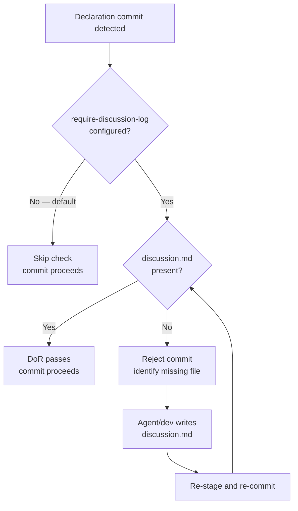

# Behaviour: Verify Discussion Coverage

## Actor
Pre-commit hook — triggered automatically when a contributor commits an `impl.md` without source code (declaration commit), if `require-discussion-log` is configured in `definitionOfReady`.

## Preconditions
- `require-discussion-log: true` is set in `.taproot/settings.yaml` under `definitionOfReady`
- A declaration commit is in progress (staged files include `impl.md` with no matched source files)

## Main Flow
1. Pre-commit hook detects a declaration commit
2. Hook reads `.taproot/settings.yaml` and finds `require-discussion-log: true` in `definitionOfReady`
3. Hook checks whether `discussion.md` exists alongside the staged `impl.md` (in the same folder)
4. `discussion.md` is present — DoR check passes
5. Commit proceeds

## Alternate Flows

### discussion.md is absent
- **Trigger:** Declaration commit is attempted but no `discussion.md` exists in the impl folder
- **Steps:**
  1. Hook reports: `DoR failed: discussion.md missing in <impl-path>/. Record the session rationale before declaring this implementation.`
  2. Commit is rejected
  3. Agent or developer writes `discussion.md`, stages it alongside `impl.md`, and re-commits

### require-discussion-log not configured
- **Trigger:** Project has not set `require-discussion-log: true` (the default)
- **Steps:**
  1. Hook skips the check entirely — no penalty for missing `discussion.md`
  2. Commit proceeds normally

### discussion.md present but empty or skeleton-only
- **Trigger:** `discussion.md` exists but contains only the template headings with no substantive content
- **Steps:**
  1. If `validate-format` is configured to check `discussion.md`, it reports missing content and rejects
  2. If not configured, the empty file satisfies the existence check and the commit proceeds — quality is the developer's responsibility

## Postconditions
- When enforcement is enabled: every declared implementation in the project has a `discussion.md` record committed alongside it
- When enforcement is disabled: `discussion.md` is optional and its presence depends on the agent following the skill

## Error Conditions
- **`settings.yaml` unreadable**: Hook falls back to skipping the check and logs a warning — never blocks commits due to configuration errors

## Flow

## Related
- `./record-decision-rationale/usecase.md` — defines what discussion.md contains; this behaviour enforces its presence
- `../quality-gates/definition-of-ready/usecase.md` — the DoR framework this check runs within
- `../hierarchy-integrity/pre-commit-enforcement/usecase.md` — the hook mechanism this check extends
- `../requirements-hierarchy/configure-hierarchy/usecase.md` — `require-discussion-log` is a settings.yaml option

## Acceptance Criteria

**AC-1: Commit passes when discussion.md is present**
- Given `require-discussion-log: true` is configured and `discussion.md` exists in the impl folder
- When a declaration commit is attempted
- Then the hook passes and the commit succeeds

**AC-2: Commit is rejected when discussion.md is absent and enforcement is enabled**
- Given `require-discussion-log: true` is configured
- When a declaration commit is attempted without `discussion.md` in the impl folder
- Then the hook rejects with a message identifying the missing file and its expected location

**AC-3: No penalty when enforcement is not configured**
- Given `require-discussion-log` is absent from `definitionOfReady` (the default)
- When a declaration commit is attempted without `discussion.md`
- Then the commit succeeds — the check is silently skipped

**AC-4: Settings read error does not block commits**
- Given `.taproot/settings.yaml` cannot be read during the hook
- When a declaration commit is attempted
- Then the hook logs a warning and allows the commit — configuration errors never block work

## Status
- **State:** specified
- **Created:** 2026-03-25
- **Last reviewed:** 2026-03-25

## Notes
- This is opt-in by design. Most teams will start without enforcement and add it once they've established the `discussion.md` habit. The default is intentionally permissive.
- The check is existence-only — it cannot verify content quality. A one-line `discussion.md` passes the hook. Quality review is a human responsibility.
- Pairs with `record-decision-rationale` — that behaviour specifies what to write; this behaviour enforces that something was written.
