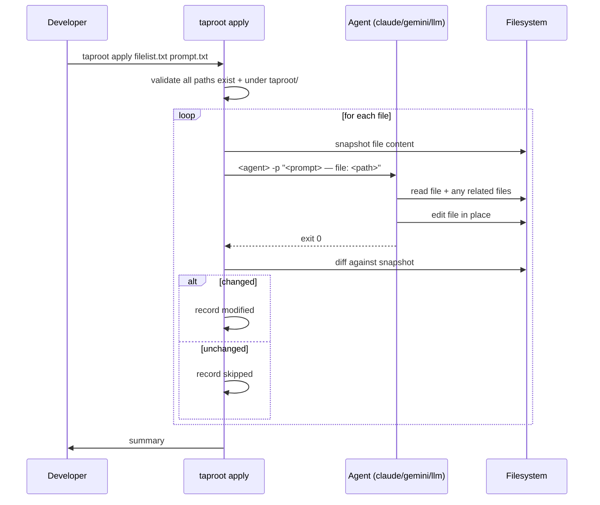

# Behaviour: Apply Task to Hierarchy Files

## Actor
Developer or agent — applying a uniform transformation to a set of hierarchy files using a configured AI agent.

## Preconditions
- A taproot hierarchy exists under `taproot/`
- A filelist file and a prompt file have been prepared
- A CLI agent with filesystem access is configured and available (e.g. `claude`)

## Main Flow
1. Developer runs `taproot apply filelist.txt prompt.txt`
2. System reads `filelist.txt` — one path per line — and `prompt.txt`
3. System validates all paths: each must exist and resolve under `taproot/`
4. For each file in the list:
   a. System snapshots the file content before invocation
   b. System invokes the configured agent: `<agent> -p "<prompt> — file to modify: <filepath>"`
   c. Agent reads the file and any related files it needs, edits the file in place, and terminates
   d. System diffs the file against the snapshot: if changed, records `modified`; if unchanged, records `skipped`
5. System prints a summary:
   ```
   Apply complete — 14 files processed
     ✓ modified:  8
     ○ skipped:   5
     ✗ errors:    1  taproot/foo/bar/usecase.md — <reason>
   ```

## Alternate Flows

### Developer cancels
- **Trigger:** Developer interrupts the process (Ctrl-C)
- **Steps:**
  1. Files processed so far retain their modifications
  2. Remaining files are left untouched
  3. System prints a partial summary showing progress at time of cancellation

## Postconditions
- Each file in the list has been processed: either modified with the agent's output or left unchanged
- Summary reflects the final state of every file

## Error Conditions
- **Path outside `taproot/`**: system aborts before processing with: `"Error: <path> is outside taproot/ — aborting"`
- **Path does not exist**: system aborts before processing with: `"Error: <path> not found"`
- **Agent exits non-zero**: file is restored to its snapshot, result recorded as `error` with the agent's stderr
- **`filelist` or `prompt` file not found**: system exits immediately with a clear usage error

## Flow


## Related
- `../human-integration/hierarchy-sweep/usecase.md` — `/tr-sweep` skill generates the filelist and prompt then calls `taproot apply`
- `./configure-hierarchy/usecase.md` — agent selection comes from `.taproot/settings.yaml`

## Acceptance Criteria

**AC-1: Records modified when agent changes the file**
- Given a filelist with 3 files and a prompt
- When `taproot apply` runs and the agent modifies 2 of the 3 files in place
- Then the summary shows `modified: 2, skipped: 1`

**AC-2: Records skipped when agent leaves file unchanged**
- Given a filelist where the agent exits 0 but makes no change to a file
- When `taproot apply` runs
- Then the file is unchanged and recorded as `skipped`

**AC-3: Aborts on path outside taproot/**
- Given a filelist containing a path outside `taproot/`
- When `taproot apply` is invoked
- Then it aborts before processing any file with a clear error message

**AC-4: Records error on agent non-zero exit**
- Given a file for which the agent exits non-zero
- When `taproot apply` processes it
- Then the file is unchanged, the error is recorded, and processing continues with remaining files

**AC-5: Partial results preserved on cancellation**
- Given a sweep in progress with 5 files, cancelled after 3
- When the developer interrupts
- Then the 3 processed files retain their state and the remaining 2 are untouched

## Implementations <!-- taproot-managed -->
- [CLI Command — taproot apply](./cli-command/impl.md)

## Status
- **State:** specified
- **Created:** 2026-03-20
- **Last reviewed:** 2026-03-20

## Notes
- The agent receives the file path and has full filesystem access — it can read test files, source files, or any related context it needs to complete the task.
- Agent selection: first entry in `agents:` in `.taproot/settings.yaml`, or a future `apply.agent` key. Falls back to `claude` if unset.
- Files are processed sequentially — no parallel execution to avoid concurrent writes to the same file.
- The filelist and prompt files are typically generated by `/tr-sweep` but can be hand-crafted for scripting use cases.
