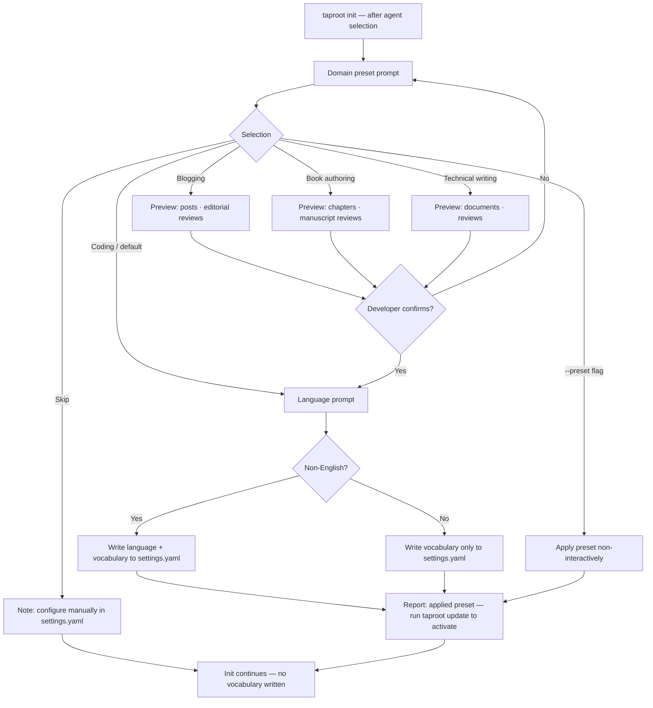

# Behaviour: Apply Domain Preset During Init

## Actor
Developer running `taproot init` for the first time on a new project — including non-coding projects (blogging, book authoring, technical writing) who would not know that vocabulary and language settings exist

## Preconditions
- `taproot` CLI is installed
- A git repository exists (checked before init prompts begin, per `initialise-hierarchy`)

## Main Flow
1. During `taproot init`, after agent adapter selection, system presents a domain preset prompt:
   > "What kind of project is this? (Determines how taproot labels things like 'tests' and 'source files')"
   - **Coding / software** *(default — no changes)*
   - **Blogging** — source files → posts, tests → editorial reviews, implementation → writing, build → publish
   - **Book authoring** — source files → chapters, tests → manuscript reviews, implementation → writing, build → compile draft
   - **Technical writing** — source files → documents, tests → reviews, implementation → writing, build → publish
   - **Skip** — I'll configure manually later
2. If a non-coding preset is selected, system shows a concise preview before writing anything:
   > "This will add to `.taproot/settings.yaml`:
   > `source files: posts` · `tests: editorial reviews` · ..."
3. Developer confirms the preview
4. System asks: "Non-English project?" — presents: No / German / French / Spanish / Japanese / Portuguese
5. System writes the confirmed vocabulary and/or language settings to `.taproot/settings.yaml`
6. System reports the applied preset and reminds the developer to run `taproot update` to activate vocabulary substitution in skill files

## Alternate Flows

### Developer selects coding / default
- **Trigger:** Developer selects "Coding / software" or presses enter
- **Steps:**
  1. No vocabulary block is written to `.taproot/settings.yaml`
  2. Language prompt is still shown (step 4 of main flow)
  3. Init continues normally

### Developer skips preset entirely
- **Trigger:** Developer selects "Skip — I'll configure manually later"
- **Steps:**
  1. No vocabulary or language is written
  2. System notes: "Vocabulary and language can be configured in `.taproot/settings.yaml` — see `.taproot/docs/configuration.md`"
  3. Init continues normally

### Developer cancels preview
- **Trigger:** Developer sees the preview and declines
- **Steps:**
  1. No vocabulary is written
  2. System returns to the preset selection prompt
  3. Developer may choose a different preset or skip

### Non-interactive mode (`--preset` flag)
- **Trigger:** Developer runs `taproot init --preset blogging` (or `--preset book-authoring`, `--preset technical-writing`, `--preset coding`)
- **Steps:**
  1. No domain preset prompt is shown
  2. System applies the named preset directly to `.taproot/settings.yaml`
  3. `taproot update` reminder is included in init output

### Language selected without a vocabulary preset
- **Trigger:** Developer picks "Coding / software" but selects a non-English language
- **Steps:**
  1. `language: <code>` is written to `.taproot/settings.yaml`
  2. No vocabulary block is written
  3. System reminds developer to run `taproot update`

### Project already has vocabulary in settings.yaml
- **Trigger:** Developer runs `taproot init` on a project that already has a `vocabulary` key in `.taproot/settings.yaml` (idempotent re-run)
- **Steps:**
  1. System detects existing `vocabulary` block and skips the preset prompt
  2. Reports: "exists   vocabulary settings (kept — not overwritten)"

## Postconditions
- `.taproot/settings.yaml` contains a `vocabulary` block if a non-coding preset was confirmed
- `.taproot/settings.yaml` contains a `language` field if a non-English language was selected
- Developer knows that `taproot update` must be run to activate vocabulary substitution in skill files
- If coding/default was chosen, `settings.yaml` contains no vocabulary or language keys (minimal config)

## Error Conditions
- **Unknown `--preset` value**: system reports `"Unknown preset: '<value>'. Available: coding, blogging, book-authoring, technical-writing"` and aborts init — no files are written
- **`taproot update` not run after preset**: vocabulary is in `settings.yaml` but skill files still use dev terms — this is a known post-init step; the init output note is the only safeguard

## Implementations <!-- taproot-managed -->
- [CLI Command — domain preset during init](./cli-command/impl.md)

## Flow

## Related
- `./initialise-hierarchy/usecase.md` — domain preset runs as a step within init, after agent adapter selection; structural scaffolding is handled there
- `./configure-hierarchy/usecase.md` — manual post-init settings editing; this behaviour surfaces the same settings at init time for users who don't know they exist
- `taproot/taproot-distribution/update-installation/usecase.md` — `taproot update` must be run after applying a preset to distribute vocabulary substitutions to skill files

## Acceptance Criteria

**AC-1: Domain preset prompt shown during init**
- Given a developer runs `taproot init` on a fresh project
- When agent adapter selection completes
- Then a domain preset prompt is shown with at least: coding, blogging, book-authoring, technical-writing, and skip options

**AC-2: Coding / default writes no vocabulary**
- Given a developer selects "Coding / software" at the domain preset prompt
- When init completes
- Then `.taproot/settings.yaml` contains no `vocabulary` key

**AC-3: Blogging preset writes correct vocabulary**
- Given a developer selects "Blogging" and confirms the preview
- When init completes
- Then `.taproot/settings.yaml` contains `source files: posts` and `tests: editorial reviews`

**AC-4: Book-authoring preset writes correct vocabulary**
- Given a developer selects "Book authoring" and confirms the preview
- When init completes
- Then `.taproot/settings.yaml` contains `source files: chapters` and `tests: manuscript reviews`

**AC-5: Technical-writing preset writes correct vocabulary**
- Given a developer selects "Technical writing" and confirms the preview
- When init completes
- Then `.taproot/settings.yaml` contains `source files: documents` and `tests: reviews`

**AC-6: Preview shown before writing vocabulary**
- Given a developer selects a non-coding preset
- When the vocabulary preview is displayed
- Then the substitution pairs are shown before any changes are written to `.taproot/settings.yaml`

**AC-7: Language selection writes language field**
- Given a developer selects "German" at the language prompt
- When init completes
- Then `.taproot/settings.yaml` contains `language: de`

**AC-8: `taproot update` reminder shown after non-default preset**
- Given a developer selects and confirms a non-coding preset
- When init output is printed
- Then the output includes a note that `taproot update` must be run to apply vocabulary to skill files

**AC-9: Developer can skip without blocking**
- Given a developer selects "Skip"
- When init completes
- Then no vocabulary is written, init completes normally, and the output notes where to configure manually

**AC-10: `--preset` flag applies preset non-interactively**
- Given a developer runs `taproot init --preset blogging`
- When init runs
- Then no domain preset prompt is shown and blogging vocabulary is written to `.taproot/settings.yaml`

**AC-11: Unknown `--preset` value aborts with error**
- Given a developer runs `taproot init --preset unknown-type`
- When init runs
- Then init aborts with an error listing valid preset names and no files are written

**AC-12: Existing vocabulary block not overwritten on re-run**
- Given `.taproot/settings.yaml` already contains a `vocabulary` key
- When the developer runs `taproot init` again
- Then the vocabulary block is preserved and the preset prompt is skipped

## Status
- **State:** implemented
- **Created:** 2026-03-27
- **Last reviewed:** 2026-03-27

## Notes
- Preset vocabulary values: blogging (`source files: posts`, `tests: editorial reviews`, `implementation: writing`, `build: publish`); book-authoring (`source files: chapters`, `tests: manuscript reviews`, `implementation: writing`, `build: compile draft`); technical-writing (`source files: documents`, `tests: reviews`, `implementation: writing`, `build: publish`)
- Language codes: `de` (German), `fr` (French), `es` (Spanish), `ja` (Japanese), `pt` (Portuguese)
- The preset system complements the `--template` flag: templates provide example hierarchy scaffolding; presets configure how taproot labels things. Both can be used together
- `taproot update` is required after preset to apply vocabulary to already-installed skill files — init cannot apply vocabulary to skills that haven't been installed yet (skills are installed by the same init run, but vocabulary substitution is a `taproot update` responsibility)
