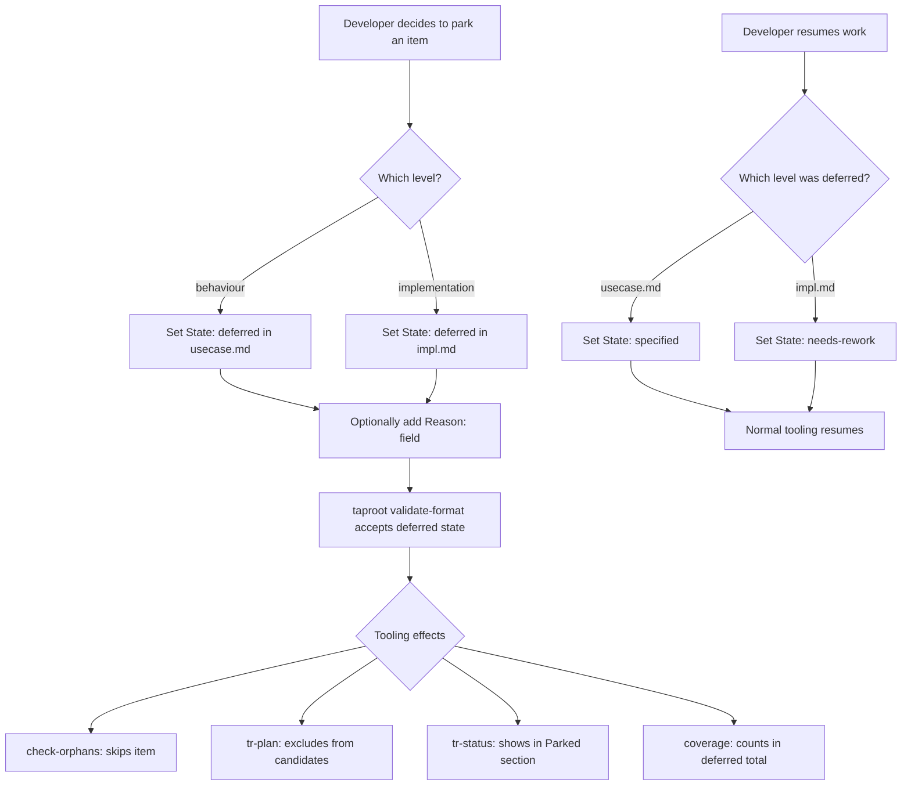

# Behaviour: Park Hierarchy Item

## Actor
Developer — who has decided that a behaviour or implementation is not being pursued for the foreseeable future and wants to formally record that decision in the hierarchy.

## Preconditions
- A `usecase.md` (behaviour) or `impl.md` (implementation) exists in the hierarchy
- The developer has consciously decided not to pursue the item — it is not a temporary pause but a recorded deferral

## Main Flow
1. Developer sets `State: deferred` in the `## Status` block of the `usecase.md` or `impl.md`
2. Developer optionally adds a `Reason:` field in the `## Status` block explaining why the item is parked
3. `taproot validate-format` accepts `deferred` as a valid state for both `usecase.md` and `impl.md`
4. `taproot check-orphans` skips deferred items — MISSING_SOURCE_FILE, MISSING_TEST_FILE, and reference errors are not raised for them
5. `taproot coverage` counts deferred behaviours and implementations in a dedicated `deferred` total, not as gaps or errors
6. `tr-plan` excludes deferred behaviours from candidate next items
7. `tr-status` displays deferred items in a dedicated **Parked** section with their reason (if provided)

## Alternate Flows

### Developer un-parks an item
- **Trigger:** Developer decides to resume work on a previously deferred item
- **Steps:**
  1. Developer sets state back to `specified` (for `usecase.md`) or `needs-rework` (for `impl.md`)
  2. Developer removes or updates the `Reason:` field
  3. All tooling resumes normal validation, planning inclusion, and orphan checking for that item

### Partially deferred — impl deferred, behaviour active
- **Trigger:** Developer parks one implementation attempt but keeps the behaviour `specified` so other implementations can be tried
- **Steps:**
  1. Developer sets `State: deferred` on the `impl.md` only
  2. The parent `usecase.md` remains `specified`
  3. `check-orphans` and `tr-plan` exclude the deferred impl but still treat the behaviour as an open candidate

## Postconditions
- The item's state is `deferred` in the hierarchy
- No false errors or warnings are raised by tooling for the parked item
- The item remains visible in the hierarchy and in `tr-status` (it is not deleted or hidden)
- The deferral decision is git-versioned alongside the reason

## Error Conditions
- **`State: deferred` set on `intent.md`**: `taproot validate-format` rejects with: `"deferred is not a valid state for intent.md — use deprecated instead"`
- **`Reason:` field missing on deferred impl with MISSING_SOURCE_FILE**: tooling emits a hint: `"deferred impl at <path> has no Reason — consider adding one for future context"` (warning, not error)

## Flow

## Related
- `./apply-task/usecase.md` — the immediate motivation: apply-task/cli-command is the first item to be parked using this mechanism
- `../hierarchy-integrity/validate-format/usecase.md` — must be updated to accept `deferred` as a valid state in both document types
- `../requirements-completeness/coverage-report/usecase.md` — coverage output must count deferred items separately
- `../requirements-compliance/check-orphans/usecase.md` — must skip deferred items when checking for missing source and test files
- `../implementation-planning/extract-next-slice/usecase.md` — tr-plan must exclude deferred behaviours from candidate selection
- `../human-integration/human-readable-report/usecase.md` — tr-status must display a Parked section for deferred items

## Acceptance Criteria

**AC-1: Deferred usecase.md is not flagged by check-orphans**
- Given a `usecase.md` with `State: deferred` and no implementations
- When `taproot check-orphans --include-unimplemented` runs
- Then no error or warning is raised for that behaviour

**AC-2: Deferred impl.md with missing source file is not flagged**
- Given an `impl.md` with `State: deferred` whose listed source file does not exist on disk
- When `taproot check-orphans` runs
- Then no MISSING_SOURCE_FILE error is raised for that impl

**AC-3: Deferred behaviour excluded from tr-plan candidates**
- Given a behaviour with `State: deferred`
- When `taproot plan` (or `tr-plan`) selects the next implementable slice
- Then the deferred behaviour is not returned as a candidate

**AC-4: Deferred items visible in tr-status Parked section**
- Given one or more items with `State: deferred`
- When `tr-status` runs
- Then a **Parked** section lists each deferred item with its reason (if provided) and does not count them as errors

**AC-5: deferred is rejected on intent.md**
- Given an `intent.md` with `State: deferred`
- When `taproot validate-format` runs
- Then it exits with an error: `"deferred is not a valid state for intent.md — use deprecated instead"`

**AC-6: Un-parking restores normal tooling behaviour**
- Given an `impl.md` previously set to `deferred` that is changed to `needs-rework`
- When `taproot check-orphans` runs
- Then missing source file errors are raised normally for that impl

**AC-7: Partially deferred — impl parked, behaviour remains active**
- Given a `usecase.md` with `State: specified` whose only `impl.md` has `State: deferred`
- When `taproot plan` runs
- Then the behaviour appears as an open candidate (a new implementation can be attempted)

## Implementations <!-- taproot-managed -->
- [Multi-Surface — config, validation, orphans, plan, coverage](./multi-surface/impl.md)

## Status
- **State:** specified
- **Created:** 2026-03-20
- **Last reviewed:** 2026-03-20

## Notes
- `deferred` is intentional and conscious — it is not a synonym for `proposed` (not started yet) or `needs-rework` (started but broken). It means: "we tried or considered this and decided to stop for now."
- The `Reason:` field in `## Status` is strongly encouraged for impls — it preserves the decision rationale for future readers without needing to dig through git history.
- This mechanism replaces the current workaround of leaving items in `needs-rework` with missing source files, which pollutes `check-orphans` output.
